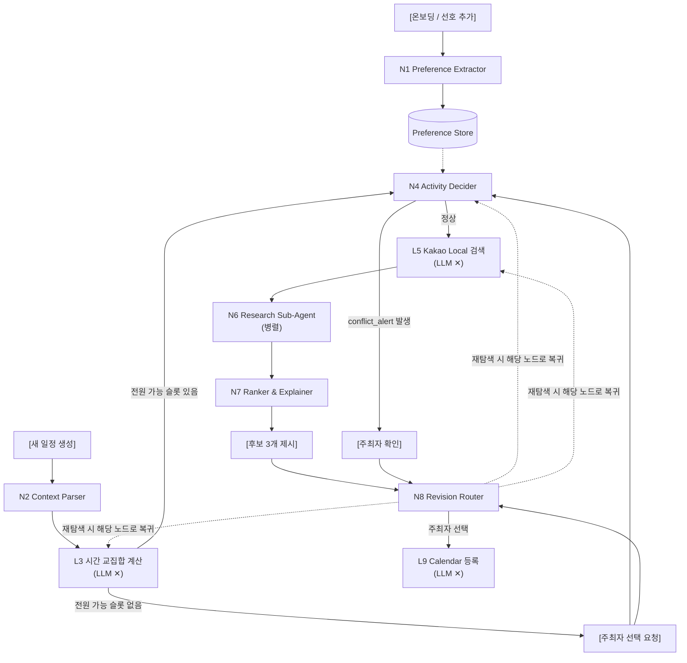

# 다모여 (Damoyeo) AI

모임 일정 조율과 식당 예약을 대신 처리해주는 AI 에이전트 서비스 **다모여**의 AI 파이프라인 저장소입니다.

> 약속 잡기가 번거로운 사람들을 위해 흩어진 일정과 취향 컨텍스트를 모아, 모임 일정 결정부터 캘린더 등록까지 대신 수행하는 에이전트

## 해결하려는 문제

모임을 준비하려면 누군가 총대를 매야 합니다. 이 사람은 "언제 돼?", "뭐 먹을래?"를 단톡방에서 반복해 묻고, 사람 수만큼 흩어진 답을 취합하고, 안 되는 조건을 걸러낸 뒤 식당까지 직접 골라야 합니다. 참가자가 늘수록 조율해야 할 경우의 수는 급격히 커지고, 특히 자주 안 만나는 사이일수록 서로의 취향과 알레르기를 기억하지 못해 모임마다 이 과정을 처음부터 반복하게 됩니다.

## 타깃 사용자

자주 만나지 않는 지인들과 모임을 하는 사용자 — 특히 조율을 도맡는 총대(주최자)가 핵심 사용자입니다. 완전히 모르는 사람이 아닌 회사 동료, 오랜만에 만나는 대학 동기 등 "지인" 관계로 범위를 좁혔으며, 1회성 모임보다 여러 해 이어지는 **정기 모임**의 불편함 해소에 초점을 둡니다.

## 차별점

| 서비스 | 한계 |
| --- | --- |
| Partiful | 초대·RSVP·날짜투표·취향수집은 지원하지만 최종 날짜/장소 결정은 여전히 사람이 함. 여러 명의 상충 조건을 종합해 최적안을 계산해주지 않음 |
| Google AI Mode / Perplexity+OpenTable | 자연어로 조건을 주면 식당 탐색·예약까지 이어주지만 **1인 사용자 조건 기준**으로만 동작. 다자간 조율 기능 없음 |

다모여는 참여자 전원의 캘린더 + 개별 선호 + 모임 맥락을 에이전트가 종합해 시간·지역·장소가 결합된 완성 후보를 생성하고, 캘린더 등록까지 자동으로 수행합니다. 핵심은 인기순 추천이 아니라, 조건이 충돌할 때(고기 선호 vs 비선호, 예산, 알레르기 등) 특정 참여자가 일방적으로 희생되지 않는 그룹 합의안을 계산하는 **다자간 의사결정 알고리즘**이라는 점입니다.

## 핵심 기능 (해커톤 MVP)

1. **개인 선호 관리** — 자연어로 입력한 취향을 구조화해 장기적으로 저장/업데이트. 모임마다 취향을 반복 입력하지 않아도 됩니다.
2. **일정 자동 조율** — 캘린더와 제출된 가능 시간을 분석해 공통 시간과 타협안을 제시합니다.
3. **장소 후보 추천** — 주최자가 지정한 지역에서 적합한 장소와 추천 이유를 제시합니다.
4. **모임 확정 및 실행** — 선택된 시간과 장소로 캘린더 일정을 생성하고 참가자를 초대합니다.

**서비스 범위**: 식사 중심 모임만 지원합니다 (회식/브런치/술자리). 다른 모임 유형(PC방, 배드민턴 등)은 고려사항이 급증해 이번 범위에서 제외했습니다.

## AI 파이프라인 아키텍처

`L` 접두사 노드는 비-LLM(결정론적) 노드, `N` 접두사 노드는 LLM 노드입니다. LLM은 자연어 파싱과 결과 설명만 담당하고, 실제 시간 교집합 계산·식당 필터링·랭킹은 별도의 결정론적 엔진이 수행합니다.



### 노드별 정의

| 노드 | 역할 | 비고 | 파일 |
| --- | --- | --- | --- |
| N1 Preference Extractor | 사용자 발화에서 장기 Preference 추출 | 온보딩 1회 + 선호 추가·수정 시 호출. 출력 스키마는 [Preference ↔ Backend 계약](#preference-저장-구조--backend-계약) 참고 | `app/graph/nodes/n1_preference_extractor.py` |
| N2 Meeting Context Parser | 주최자 자연어 + UI 입력(지역·시간대·날짜)을 파싱 | 지역·시간은 UI 값이 절대 우선, LLM이 지역을 추론하지 않도록 명시. 자연어-UI 불일치는 `conflicts_with_ui`로 되묻기 | `app/graph/nodes/n2_context_parser.py` |
| L3 시간 교집합 계산 | 참여자 free/busy와 희망 시간대로 공통 슬롯 계산 | 비-LLM. 전원 가능 슬롯이 없으면 파이프라인을 멈추고 주최자에게 선택 요청 | `app/graph/nodes/l3_time_intersection.py` |
| N4 Activity Decider | 선호·컨텍스트·확정 슬롯을 종합해 활동 후보와 검색어 결정 | 파이프라인의 핵심 노드. Specificity Wins 규칙 적용, `excluded` 사유 함께 반환, `rationale_group`은 반드시 집단 수준 표현 | `app/graph/nodes/n4_activity_decider.py` |
| L5 Kakao Local 검색 | 활동별 장소 후보 검색 | 비-LLM. Kakao Local API 호출 → 중복 제거 → 활동별 상위 N개 | `app/graph/nodes/l5_kakao_search.py` |
| N6 Research Sub-Agent | 후보별 영업시간/휴무일 검증 (병렬 호출) | `PASS/FAIL/UNKNOWN` 3-state 유지 (UNKNOWN을 FAIL/PASS로 임의 처리 금지). 검증 범위를 영업시간·휴무일로 한정, 전체 타임아웃 필요 | `app/graph/nodes/n6_research_subagent.py` |
| N7 Ranker & Explainer | 최종 후보 3개와 추천 사유 생성 | | `app/graph/nodes/n7_ranker_explainer.py` |
| N8 Revision Router | 사용자 재탐색 요청을 어느 노드로 되돌릴지 판단 | LLM은 판단만, 실제 재실행은 오케스트레이터가 수행 | `app/graph/nodes/n8_revision_router.py` |
| L9 Calendar 등록 | 확정된 일정을 캘린더에 등록 | 비-LLM | `app/graph/nodes/l9_calendar_register.py` |

### MeetingState

```
MeetingState
├─ group_id, schedule_id
├─ participants[]
├─ preferences[]          ← N1 결과 (전역, 조회해서 채움)
├─ meeting_context        ← N2 결과
├─ ui_inputs              { region, time_range, date_range }
├─ time_slots[]           ← L3 결과
├─ confirmed_slot         ← 사용자 확정
├─ activities[]           ← N4 결과
├─ place_candidates[]     ← L5 결과
├─ verified_places[]      ← N6 결과
├─ final_candidates[]     ← N7 결과
├─ revision_history[]     ← N8 누적 제약
└─ pending_user_action    ← 사용자 개입 대기 상태
```

## 프로젝트 구조

파이프라인 노드/역할과 1:1로 대응하도록 구성했습니다.

```
damoyeo-AI/
├── README.md
├── .gitignore
├── app/
│   ├── main.py                       # FastAPI 엔트리포인트 (예정)
│   ├── api/
│   │   └── routes/                   # HTTP 라우터 (preference, meeting, health 등)
│   ├── core/
│   │   ├── config.py                 # Settings — API 키, LangSmith 값 등 전역 환경설정 (예정)
│   │   └── llm.py                    # LLM 클라이언트 팩토리 (get_llm 등, 노드들이 공용으로 사용) (예정)
│   ├── graph/
│   │   ├── state.py                  # MeetingState 정의 (예정)
│   │   ├── build_graph.py            # LangGraph 파이프라인 조립 (예정)
│   │   └── nodes/                    # N1~N9 노드 구현체 (위 표의 "파일" 열 참고)
│   ├── schemas/                      # Pydantic 스키마 (Preference Vocabulary 계약 등)
│   ├── services/                     # 외부 연동 클라이언트 (Kakao Local, Google Calendar, Vocabulary API)
│   └── prompts/                      # 노드별 프롬프트 템플릿
└── tests/
    ├── graph/                        # 노드/그래프 단위 테스트
    └── services/                     # 외부 연동 클라이언트 테스트
```

- `app/graph/nodes/`: 파이프라인의 각 노드(N1~N9, L3/L5/L9)를 파일 단위로 분리. 노드 하나 = 파일 하나 원칙.
- `app/schemas/`: `preference.py`에 [Vocabulary 계약](#preference-저장-구조--backend-계약)의 요청/응답 스키마를 정의할 예정.
- `app/services/`: LLM이 아닌 외부 API 호출(Kakao Local, Google Calendar, 백엔드 Vocabulary API)을 캡슐화해 노드 코드에서 분리.
- `app/core/`: LangSmith 트레이싱, 환경변수 기반 설정(`Settings`) 등 파이프라인 전역 설정.

현재는 각 디렉토리에 `__init__.py`(패키지 구성용) 또는 `.gitkeep`(빈 디렉토리 유지용)만 있는 빈 스캐폴딩 상태이며, 노드/스키마/클라이언트 구현은 이후 채워나갈 예정입니다.

## Preference 저장 구조 & Backend 계약

Preference Agent(N1)와 백엔드 간 역할은 명확히 분리됩니다.

```
Backend → Vocabulary 관리 / 저장 / 검증
Agent   → 자연어 이해 / Preference 추출 / Vocabulary 매핑
```

Agent는 백엔드가 제공하는 Vocabulary 목록(`code`, `domain`, `attribute`, `parentCode`로 계층 표현)을 기준으로 사용자 발화를 매핑합니다.

```json
{
  "preferences": [
    { "vocabularyCode": "MEAT", "rawValue": "고기", "sentiment": "POSITIVE", "strength": 0.7, "mappingType": "EXACT" },
    { "vocabularyCode": "RAW_FISH", "rawValue": "회", "sentiment": "NEGATIVE", "strength": 0.8, "mappingType": "EXACT" },
    { "vocabularyCode": "MEAT", "rawValue": "양고기", "sentiment": "POSITIVE", "strength": 0.9, "mappingType": "GENERALIZED" }
  ]
}
```

- **EXACT**: 사용자 표현이 Vocabulary와 직접 대응 (예: "돼지고기 좋아" → `PORK`)
- **GENERALIZED**: 정확한 Vocabulary가 없어 안전한 상위 개념으로 매핑 (예: `LAMB` 코드가 없으면 "양고기" → `MEAT`, `rawValue`는 보존)
- **UNMAPPED**: 대응 가능한 Vocabulary가 없음 (`vocabularyCode = null`). 장기 저장 여부는 별도 결정 필요

Agent는 Vocabulary에 없는 새로운 code를 절대 임의로 생성하지 않습니다. 백엔드는 저장 전 `vocabularyCode` 실존 여부, `sentiment`/`strength`/`mappingType` 유효성, `UNMAPPED`일 때 `vocabularyCode == null`인지를 검증합니다.

> **핵심 원칙**: Vocabulary는 Agent가 이해할 수 있는 범위를 제한하는 것이 아니라, 장기적으로 구조화해서 저장할 Preference의 범위만 제한합니다. 현재 모임(Room) 컨텍스트의 자연어나 장소 검색 키워드는 Vocabulary 제약 없이 자유롭게 사용됩니다.

## 기술 스택

| 구분 | 기술 |
| --- | --- |
| LLM (파싱·설명) | Gemini 또는 Claude |
| 오케스트레이션 | LangGraph |
| 프롬프트/체인 관리 | LangChain |
| 백엔드 연동 | FastAPI (AI 파이프라인 서버) |
| 외부 데이터 연동 | 카카오 로컬 API |
| 캘린더 연동 | Google Calendar API |
| 로깅/트레이싱 | LangSmith |

## 오픈 이슈

- **자동 예약**: 네이버는 예약 API가 없어 브라우저 자동화가 필요한데 로그인·인증 리스크가 큼. 실제 예약까지 시도할지, 캘린더 등록까지를 완료 지점으로 볼지 미결정.
- **선호도 저장 범위**: 모임별 개인 선호를 저장할지, 컨텍스트 비대화를 막기 위해 주최자 조건에 가중치를 두는 방식으로 우회할지 — 구현해보고 결정.

## 팀

| 이름 | 과정 | 역할 |
| --- | --- | --- |
| hayes.yu (유호찬) | 인공지능 | AI |
| sophia.kim (김민지) | 인공지능 | AI |
| justin.kim (김동원) | 풀스택 | |
| chloe.seo (서예원) | 풀스택 | |
| tobby.kim (김도현) | 클라우드 | |
