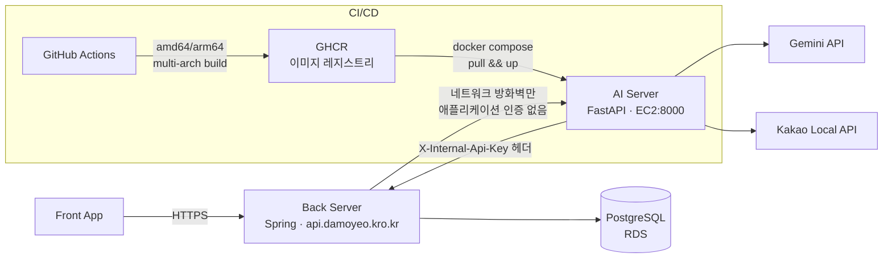
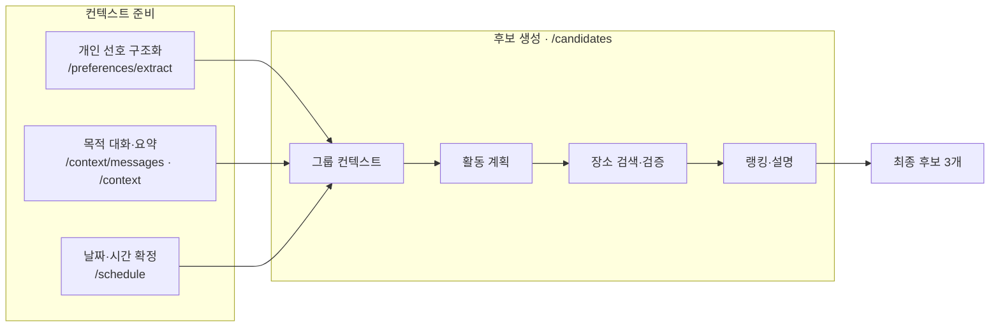
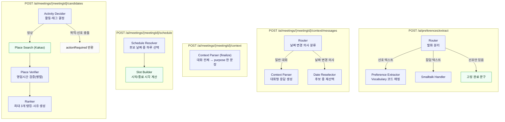

# 다모여 (Damoyeo) AI

모임 일정 조율과 식당 예약을 대신 처리해주는 AI 에이전트 서비스 **다모여**의 AI 파이프라인 저장소입니다.

> 약속 잡기가 번거로운 사람들을 위해 흩어진 일정과 취향 컨텍스트를 모아, 모임 일정 결정부터 장소 추천까지 대신 수행하는 에이전트

## 해결하려는 문제

모임을 준비하려면 누군가 총대를 매야 합니다. 이 사람은 "언제 돼?", "뭐 먹을래?"를 단톡방에서 반복해 묻고, 사람 수만큼 흩어진 답을 취합하고, 안 되는 조건을 걸러낸 뒤 식당까지 직접 골라야 합니다. 참가자가 늘수록 조율해야 할 경우의 수는 급격히 커지고, 특히 자주 안 만나는 사이일수록 서로의 취향과 알레르기를 기억하지 못해 모임마다 이 과정을 처음부터 반복하게 됩니다.

## 타깃 사용자

자주 만나지 않는 지인들과 모임을 하는 사용자 — 특히 조율을 도맡는 총대(주최자)가 핵심 사용자입니다. 완전히 모르는 사람이 아닌 회사 동료, 오랜만에 만나는 대학 동기 등 "지인" 관계로 범위를 좁혔으며, 1회성 모임보다 여러 해 이어지는 **정기 모임**의 불편함 해소에 초점을 둡니다.

## 차별점

| 서비스 | 한계 |
| --- | --- |
| Partiful | 초대·RSVP·날짜투표·취향수집은 지원하지만 최종 날짜/장소 결정은 여전히 사람이 함. 여러 명의 상충 조건을 종합해 최적안을 계산해주지 않음 |
| Google AI Mode / Perplexity+OpenTable | 자연어로 조건을 주면 식당 탐색까지 이어주지만 **1인 사용자 조건 기준**으로만 동작. 다자간 조율 기능 없음 |

다모여는 참여자 전원의 가능 시간 + 개별 선호 + 모임 맥락을 에이전트가 종합해 시간·장소가 결합된 완성 후보를 생성합니다. 핵심은 인기순 추천이 아니라, 조건이 충돌할 때(고기 선호 vs 비선호, 예산, 알레르기 등) 특정 참여자가 일방적으로 희생되지 않는 그룹 합의안을 계산하는 **다자간 의사결정 알고리즘**이라는 점입니다.

## 핵심 기능

| 기능 | 상태 |
| --- | --- |
| 1. 개인 선호 관리 — 자연어로 입력한 취향을 Vocabulary에 매핑해 구조화 저장 | ✅ 구현됨 |
| 2. 모임 목적 대화 — 채팅으로 모임 분위기·목적을 수집해 한 문장으로 요약 | ✅ 구현됨 |
| 3. 일정 자동 조율 — 참여자 전원 가능 날짜 중 하루와 시간대를 확정 | ✅ 구현됨 |
| 4. 장소 후보 추천 — 확정 시간에 맞는 장소를 검색·검증·랭킹해 최대 3개 제시 | ✅ 구현됨 |
| 5. 캘린더 등록 · 자동 예약 | ⏳ 미착수 (오픈 이슈 참고) |

**서비스 범위**: 식사 중심 모임만 지원합니다 (회식/브런치/술자리). 다른 모임 유형(PC방, 배드민턴 등)은 고려사항이 급증해 이번 범위에서 제외했습니다.

## 아키텍처

### 시스템 구조

Front·Back·AI가 완전히 분리된 서버로 배포됩니다. **AI는 DB에 직접 접근하지 않고**, 필요한 데이터(참여자 선호, 가능 날짜 교집합 등)는 전부 Back이 조회해서 요청에 실어 보냅니다.



- **인증**: AI → Back(`/internal/preference-vocabulary`)은 `X-Internal-Api-Key` 헤더로 검증. Back → AI(`/ai/**`)는 애플리케이션 레벨 인증이 없고, 네트워크 방화벽으로 Back만 접근 가능하도록 제한한다.
- **배포**: `main`에 push되면 GitHub Actions가 멀티 아키텍처 이미지를 빌드해 GHCR에 올리고, EC2에 SSH로 접속해 `docker compose pull && up`으로 자동 배포한다.

### AI 파이프라인

파일명은 `{n|l}_{도메인}_{역할}.py` 규칙을 따릅니다. `n_`은 LLM 노드, `l_`은 비-LLM(결정론적) 노드이고, 도메인 단어(`preference`/`context`/`schedule`/`candidate`)는 실제 API 경로와 그대로 맞춥니다 — 번호는 쓰지 않습니다. 기능별 API로 나뉘어 있으며, 각 요청 안에서 필요한 분기·검증만 그래프로 처리합니다. **날짜 교집합 계산, 시간 슬롯 계산, 후보 코드 필터링처럼 "정답이 하나로 정해지는 계산"은 전부 코드가 하고, LLM은 자연어 이해·판단·설명에만 쓰입니다.** LLM이 목록 밖의 값(존재하지 않는 날짜, Vocabulary에 없는 코드 등)을 답하지 못하도록 응답 스키마 자체를 `Literal`로 동적 제약하는 것이 파이프라인 전반의 핵심 안전장치입니다.



#### 상세 파이프라인



### 노드별 정의

| 노드 | 역할 | 비고 | 파일 |
| --- | --- | --- | --- |
| Preference Router | 발화를 "선호 관련"과 "잡담"으로 분리 | 자체 추출/응답 없이 팬아웃만 담당 | `app/graph/nodes/n_preference_router.py` |
| Preference Extractor | 선호 텍스트를 Vocabulary 코드로 매핑 | 응답 스키마의 `vocabulary_code`를 실제 Vocabulary 목록으로 `Literal` 제약 — 없는 코드는 `UNMAPPED`(`null`)로만 나올 수 있음 | `app/graph/nodes/n_preference_extractor.py` |
| Preference Smalltalk | 잡담에 반응하며 어떤 선호를 말하면 되는지 구체적으로 유도 | 실제 등록된 Vocabulary 표시 이름을 예시로 제시 | `app/graph/nodes/n_preference_smalltalk.py` |
| Context Router | 발화가 "날짜 변경 의사"인지 분류 | `candidateDates`가 요청에 없으면(스케줄 확정 전) LLM 호출 자체를 생략 | `app/graph/nodes/n_context_router.py` |
| Context Parser | 목적 채팅 한 턴 응대 / 전체 대화 최종 요약(`purpose`) | 지역·날짜·시간대는 이 대화에서 다루지 않음 | `app/graph/nodes/n_context_parser.py` |
| Context Date Reselector | 확정 날짜를 후보 목록 중 하나로 재선택 | 어떤 날짜인지 불명확하면 바꾸지 않고 되물음. 후보 밖 날짜는 스키마로 원천 차단 | `app/graph/nodes/n_context_date_reselector.py` |
| Schedule Resolver | Back이 계산한 전원 가능 날짜 중 하루를 선택 + 이유 생성 | 고를 수 있는 날짜를 응답 스키마에서 `Literal`로 제약 | `app/graph/nodes/n_schedule_resolver.py` |
| Schedule Slot Builder | 선택된 날짜 + 선호 시간대 + 모임 길이로 시작/종료 시각 계산 | 비-LLM. 시간대 창(윈도우)보다 모임 길이가 길면 에러 반환 | `app/graph/nodes/l_schedule_slot_builder.py` |
| Candidate Activity Decider | 목적·참여자 선호·과거 모임 요약을 종합해 활동·태그·요약 결정 | 목적과 선호가 정면 충돌하면 이후 노드를 실행하지 않고 `actionRequired`로 종료 | `app/graph/nodes/n_candidate_activity_decider.py` |
| Candidate Place Search | 활동별 검색어로 Kakao Local API 호출, 중복/제외 필터링 | 비-LLM. 활동별 상위 N개만 남김 | `app/graph/nodes/l_candidate_place_search.py` |
| Candidate Place Verifier | 후보 장소별 영업시간·휴무일을 실제 확정 시각 기준으로 검증 (병렬) | `PASS/FAIL/UNKNOWN` 3-state 유지 — `UNKNOWN`을 임의로 통과/탈락 처리하지 않음 | `app/graph/nodes/n_candidate_place_verifier.py` |
| Candidate Ranker | 검증 통과 후보 중 최대 3개를 골라 순위·추천 사유 생성 | `AVAILABLE_AT_MEETING_TIME` 태그 등 사실 판정 값은 LLM이 아니라 코드가 검증 결과에서 파생 | `app/graph/nodes/n_candidate_ranker.py` |

### 설계 원칙

- **LLM은 판단, 코드는 계산.** 날짜 교집합·시간 슬롯·태그의 사실 판정처럼 정답이 하나로 정해지는 값은 전부 결정론적 코드가 만든다. LLM은 "왜 이 후보가 적합한가" 같은 자연어 판단·설명에만 관여한다.
- **환각 원천 차단.** LLM이 고를 수 있는 값(날짜, Vocabulary 코드 등)을 매 요청마다 동적으로 만든 `Literal` 타입으로 응답 스키마 자체에 박아 넣는다 — 목록 밖의 값은 파싱 단계에서부터 나올 수 없다.
- **AI는 상태를 저장하지 않는다.** 대화 이력, 이전에 보여준 장소 목록 등 이전 호출의 맥락이 필요한 값은 Back이 매 요청마다 통째로 다시 보낸다.
- **전용 재생성 API 없음.** "재생성"은 제품 흐름상 "뒤로가기"로 단순화됐다 — Back이 `/context/messages`로 되돌아가 다시 대화하고 `/context` → `/schedule` → `/candidates`를 다시 호출한다.

## API 엔드포인트

Back ↔ AI 계약의 단일 기준 문서는 [`docs/api-design2-backend.md`](docs/api-design2-backend.md)입니다.

| Method | Path | 호출 주체 | 기능 |
| --- | --- | --- | --- |
| `GET` | `/health` | Back/운영 인프라 | AI 서버 생존 확인 |
| `GET` | `/internal/preference-vocabulary` | AI → Back | 선호 Vocabulary 조회 |
| `POST` | `/ai/preferences/extract` | Back → AI | 개인 선호 추출 및 답변 생성 |
| `POST` | `/ai/meetings/{meetingId}/context/messages` | Back → AI | 모임 목적 채팅 한 턴 (+ 날짜 재선택) |
| `POST` | `/ai/meetings/{meetingId}/context` | Back → AI | 모임 목적 채팅 최종 요약 |
| `POST` | `/ai/meetings/{meetingId}/schedule` | Back → AI | 전원 가능 날짜 중 하루를 골라 시작/종료 시각 확정 |
| `POST` | `/ai/meetings/{meetingId}/candidates` | Back worker → AI | 확정된 시간에 맞는 장소 후보 생성 |

## 프로젝트 구조

```
damoyeo-AI/
├── README.md
├── Dockerfile / compose.yml           # 프로덕션 이미지 빌드 · 배포
├── .github/workflows/                 # CI(pytest) · Docker 빌드/푸시/배포
├── docs/
│   └── api-design2-backend.md         # Back↔AI 계약 단일 기준 문서
├── app/
│   ├── main.py                        # FastAPI 엔트리포인트, 공통 에러 핸들러
│   ├── api/routes/                    # HTTP 라우터 (preferences, meetings, internal)
│   ├── core/                          # Settings, LLM 팩토리, LangSmith 설정, 공통 에러
│   ├── graph/
│   │   ├── build_preference_graph.py  # /preferences/extract 그래프 조립
│   │   ├── build_context_graph.py     # /context/messages 그래프 조립
│   │   ├── build_graph.py             # /candidates 그래프 조립
│   │   ├── *_state.py                 # 각 그래프의 상태(TypedDict) 정의
│   │   └── nodes/                     # 위 표의 노드 구현체 (노드 하나 = 파일 하나)
│   ├── schemas/                       # Pydantic 요청/응답 스키마 (엔드포인트당 파일 하나)
│   ├── services/                      # 외부 연동 클라이언트 (Kakao Local, Vocabulary API)
│   └── prompts/                       # 노드별 프롬프트 템플릿
└── tests/
    ├── graph/                         # 노드/그래프 단위 테스트
    ├── schemas/                       # 스키마 검증 테스트
    ├── api/                           # 라우트 단위 테스트
    └── services/                      # 외부 연동 클라이언트 테스트
```

## Preference 저장 구조 & Backend 계약

Preference Agent(`n_preference_*` 노드)와 백엔드 간 역할은 명확히 분리됩니다.

```
Backend → Vocabulary 관리 / 저장 / 검증
Agent   → 자연어 이해 / Preference 추출 / Vocabulary 매핑
```

Agent는 백엔드가 제공하는 Vocabulary 목록(`code`, `domain`, `parentCode`로 계층 표현)을 기준으로 사용자 발화를 매핑합니다.

```json
{
  "extractedPreferences": [
    { "vocabularyCode": "MEAT", "displayName": "고기", "domain": "FOOD", "rawValue": "고기", "sentiment": "POSITIVE", "strength": "MODERATE", "mappingType": "EXACT" },
    { "vocabularyCode": "SEAFOOD", "displayName": "회", "domain": "FOOD", "rawValue": "회", "sentiment": "NEGATIVE", "strength": "STRONG", "mappingType": "EXACT" },
    { "vocabularyCode": null, "displayName": null, "domain": null, "rawValue": "말고기", "sentiment": "POSITIVE", "strength": "WEAK", "mappingType": "UNMAPPED" }
  ],
  "reply": "말씀해주신 내용을 선호에 반영했어요."
}
```

- **EXACT**: 사용자 표현이 Vocabulary와 직접 대응 (예: "회 싫어" → `SEAFOOD`)
- **GENERALIZED**: 정확한 Vocabulary가 없어 안전한 상위 개념으로 매핑, `rawValue`는 원문 보존
- **UNMAPPED**: 대응 가능한 Vocabulary가 없음 (`vocabularyCode = null`, 예: "말고기"). 장기 저장 여부는 Back이 결정

Agent는 Vocabulary에 없는 새로운 code를 절대 임의로 생성하지 않습니다 — 응답 스키마 자체가 실제 Vocabulary 코드 목록으로 동적 제약되어 있어 구조적으로 불가능합니다.

## 기술 스택

| 구분 | 기술 |
| --- | --- |
| LLM | Gemini (`langchain-google-genai`) |
| 오케스트레이션 | LangGraph |
| 프롬프트/체인 관리 | LangChain |
| API 서버 | FastAPI + uvicorn |
| 패키지 관리 | uv |
| 외부 데이터 연동 | Kakao Local API |
| 로깅/트레이싱 | LangSmith |
| 배포 | Docker (멀티 아키텍처 이미지) + GitHub Actions CI/CD + EC2 |

## 배포

`main` 브랜치에 push하면 자동으로 배포됩니다.

1. **CI** (`.github/workflows/ci.yml`) — `pytest` 전체 스위트 실행.
2. **Docker 빌드** (`.github/workflows/docker.yml`) — `linux/amd64`/`linux/arm64` 멀티 아키텍처 이미지를 빌드해 `ghcr.io/damoyeo-team20/damoyeo-ai`에 푸시. PR에서는 빌드만 하고 푸시하지 않는다.
3. **배포** — GitHub Actions가 EC2에 SSH로 접속해 `git pull && docker compose pull ai && docker compose up -d ai` 실행.

로컬 실행은 `docker compose up -d ai` 한 번으로 충분합니다 (`.env`에 `GOOGLE_API_KEY`, `KAKAO_REST_API_KEY`, `BACKEND_API_BASE_URL` 등 필요).

## 트러블슈팅

개발·배포 과정에서 실제로 겪고 해결한 문제들입니다.

### 인프라 · 배포

1. **이미지 아키텍처 불일치 (`no matching manifest for linux/arm64/v8`)** — Mac(arm64)에서 backend 이미지를 pull하지 못함. 해당 이미지가 `amd64`로만 빌드돼 있었던 게 원인. 같은 문제를 반복하지 않도록 이 저장소의 이미지는 처음부터 GitHub Actions에서 `amd64`/`arm64` 멀티 아키텍처로 빌드하도록 구성.
2. **EC2 `docker compose build requires buildx 0.17.0 or later`** — EC2에 설치된 buildx가 구버전. GitHub Releases의 `latest/download/` 별칭 URL로 받으면 실제 파일명과 안 맞아 9바이트짜리 에러 페이지만 받아짐 → Releases API로 정확한 버전 파일명(`buildx-v0.36.1.linux-amd64`)을 조회해 직접 받는 방식으로 해결.
3. **`docker compose down --remove-orphans`가 컨테이너를 삭제** — 정지가 아니라 완전 삭제라는 걸 모르고 실행해 `backend`/`postgres` 컨테이너가 사라짐. `docker run`으로 임시 복구했다가, 실제 운영 백엔드(`api.damoyeo.kro.kr`)가 이미 별도 서버로 떠 있다는 걸 확인하고 로컬 컨테이너는 정리 대상으로 정리.
4. **배포 스크립트가 파일을 엉뚱한 경로에 복사** — `scp file1 file2 user@host:~/app/`처럼 서로 다른 하위 경로의 파일 여러 개를 한 디렉터리로 복사하면 원래 경로 구조가 무시되고 flat하게 복사됨. 빌드는 성공했는데 버그가 그대로인 걸 보고 `grep`으로 배포된 파일 내용을 직접 확인해 발견 → 파일별로 목적지 전체 경로를 지정해서 재배포.
5. **`host.docker.internal`이 예상과 다른 게이트웨이로 풀림** — 컨테이너 간 통신 실패를 DNS 문제로 의심(기본 브리지 게이트웨이 `172.17.0.1` vs 실제 네트워크 게이트웨이 `172.20.0.1`). `getent hosts`/`docker inspect`로 직접 확인한 결과 DNS는 정상이었고, 실제 원인은 3번 사고로 컨테이너 자체가 삭제된 것이었음 — 겉보기 증상만으로 원인을 단정하지 않고 직접 확인해 잘못된 진단을 피한 사례.

### 인증 · 외부 연동

6. **AI → Back 인증 완전 누락** — Vocabulary 조회가 계속 실패. `.env`의 `INTERNAL_API_KEY`가 플레이스홀더 값 그대로였고, 애초에 헤더 자체를 코드에서 안 보내고 있었음. 실제 키를 생성(`openssl rand -hex 32`)하고 `X-Internal-Api-Key` 헤더를 추가했으며, 헤더 이름은 Back 컨테이너에 직접 curl로 여러 개 테스트해 확정(다른 이름은 401, 이 이름만 200).
7. **로컬 `BACKEND_API_BASE_URL`에 스킴 누락** — `httpx.UnsupportedProtocol` 에러. `.env`에 프로토콜 없이 IP만 적혀 있던 게 원인. `https://api.damoyeo.kro.kr`로 수정.
8. **Kakao Local API 403** — Kakao Developers 콘솔에서 "카카오맵" 서비스가 활성화돼 있지 않았던 게 원인. 서비스 활성화 후 정상화.
9. **Candidate Place Verifier에서 Gemini `google_search` 429** — 후보 생성 마지막 단계(영업시간 검증)에서 자주 할당량 초과. `google_search` grounding 도구 호출이 일반 텍스트 생성과 별도의, 더 빡빡한 할당량을 갖는다는 걸 A/B 테스트(도구 바인딩 호출 vs 순수 텍스트 호출 격리)로 확인. 테스트를 막지 않도록 `SKIP_BUSINESS_HOURS_VERIFICATION` 플래그로 임시 우회 — 할당량 자체는 아직 미해결.

### 프로덕션 버그

10. **`/schedule`에서 `OutputParserException`** — 날짜 선택 API가 실제 운영 트래픽에서 파싱 에러로 실패. 프롬프트가 후보 날짜를 `"2026-08-28 (Friday)"`처럼 요일을 붙여서 보여줬는데, 모델이 그 문자열 전체를 답으로 냈고 응답 스키마는 순수 ISO 날짜만 허용하는 `Literal`이라 거부됨. 요일 표기를 프롬프트에서 제거하고 "후보 목록과 정확히 같은 문자열이어야 한다"는 규칙을 명시해 해결.

### 관측성(디버깅 기능) 관련

임시 디버깅 기능(`# TEMP DEBUG` 태그, 정식 배포 전 제거 예정)을 만들면서 겪은 문제들입니다.

11. **디버그 응답 설계를 두 번 갈아엎음** — 처음엔 새 최상위 키(`_debug`)를 응답에 추가하는 방식으로 구현했으나, Jackson처럼 엄격한 파서를 쓰는 백엔드가 모르는 필드를 만나면 파싱이 깨질 수 있다는 우려로 전면 재설계. 최종적으로 새 필드를 추가하지 않고 기존 `reply`/`reason`/`summary`/`message` 문자열 값 뒤에 `[DEBUG: ...]`를 그대로 이어붙이는 방식으로 바꾸고, 여러 엔드포인트에서 응답 키 구성이 이전과 100% 동일함을 직접 검증.
12. **디버그 트레이스 기록이 테스트에서 크래시** — `record_debug`가 `AttributeError: 'SimpleNamespace' object has no attribute 'model_dump'`로 실패. 테스트가 LLM 응답을 `SimpleNamespace`로 스텁하는데 무조건 `.model_dump()`를 호출하고 있었던 게 원인. `hasattr` 체크 후 없으면 `repr()`로 폴백하도록 방어적으로 수정.
13. **검증 에러 직렬화 실패** — 요청 검증 실패 응답에 상세 내용을 넣는 과정에서 `TypeError: Object of type ValueError is not JSON serializable`. Pydantic 검증 에러 중 일부가 `ValueError` 인스턴스를 그대로 담고 있던 게 원인. `json.dumps(..., default=str)`로 안전하게 직렬화해 해결.

## 오픈 이슈

- **영업시간 검증(Candidate Place Verifier) 할당량**: Gemini `google_search` grounding 도구가 일반 LLM 호출과 별도의 더 빡빡한 할당량을 가지고 있어, 테스트 중 429가 자주 발생한다. 임시로 `SKIP_BUSINESS_HOURS_VERIFICATION` 플래그로 우회 가능 (`app/core/config.py`).
- **캘린더 등록 · 자동 예약**: 아직 미착수. 네이버는 예약 API가 없어 브라우저 자동화가 필요한데 로그인·인증 리스크가 큼. 실제 예약까지 시도할지, 캘린더 등록까지를 완료 지점으로 볼지 미결정.
- **`meetings` 테이블의 확정 시각 컬럼**: `docs/db_schema.md`에는 `confirmed_start_at`/`confirmed_end_at`만 있으나, 라이브 DB에서 `resolved_*` 컬럼도 별도로 관측된 적이 있어 실제 저장 흐름(2단계 pending→confirmed 구조 여부)을 Back 팀과 재확인이 필요하다.
- **참여자별 가능 날짜 수집 방식**: `docs/db_schema.md` 기준으로 참여자별 캘린더 가능 시간을 담는 테이블이 아직 확정되지 않았다 (`calendarAvailability` 필드 미확정). Back이 `/schedule`·`/context/messages`에 넘기는 `commonAvailableDates`/`candidateDates`를 실제로 어떻게 계산하는지는 Back 구현에 달려 있다.

## 팀

| 이름 | 과정 | 역할 |
| --- | --- | --- |
| hayes.yu (유호찬) | 인공지능 | AI |
| sophia.kim (김민지) | 인공지능 | AI |
| justin.kim (김동원) | 풀스택 | |
| chloe.seo (서예원) | 풀스택 | |
| tobby.kim (김도현) | 클라우드 | |
