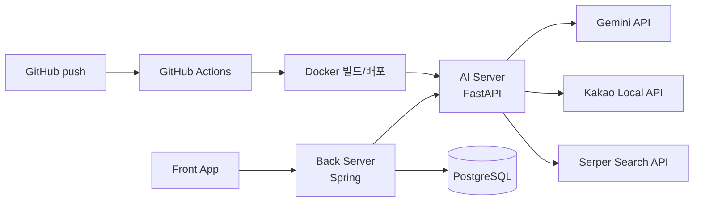
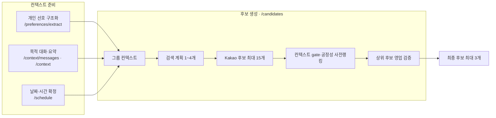

# 다모여 (Damoyeo) AI

모임 일정 조율과 장소 추천을 대신 처리해주는 AI 에이전트 서비스 **다모여**의 AI 파이프라인 저장소입니다.

> 약속 잡기가 번거로운 사람들을 위해 흩어진 일정과 취향 컨텍스트를 모아, 모임 일정 결정부터 장소 추천까지 대신 수행하는 에이전트

## 프로젝트 개요

모임을 준비하려면 누군가 총대를 매야 합니다. "언제 돼?", "뭐 먹을래?"를 반복해 묻고, 사람 수만큼 흩어진 답을 취합하고, 안 되는 조건을 걸러낸 뒤 식당까지 직접 골라야 합니다. 참가자가 늘수록 조율해야 할 경우의 수는 급격히 커지고, 특히 자주 안 만나는 사이일수록 서로의 취향과 알레르기를 기억하지 못해 모임마다 이 과정을 처음부터 반복하게 됩니다.

다모여는 참여자 전원의 가능 시간 + 개별 선호 + 모임 맥락을 에이전트가 종합해 시간·장소가 결합된 완성 후보를 생성합니다. 핵심은 인기순 추천이 아니라, 조건이 충돌할 때(고기 선호 vs 비선호, 알레르기 등) 특정 참여자가 일방적으로 희생되지 않는 그룹 합의안을 계산하는 **다자간 의사결정 알고리즘**이라는 점입니다.

5인 팀 해커톤 프로젝트이며, 이 저장소는 그중 **AI 파이프라인(FastAPI + LangGraph)** 부분을 담당한 코드입니다. Front·Back은 별도 저장소로 분리되어 있습니다.

**서비스 범위**: 식사 중심 모임(회식/브런치/술자리)을 중점적으로 타게팅했습니다.

## 핵심 기능

1. **개인 선호 관리** — 자연어로 입력한 취향을 Vocabulary에 매핑해 구조화 저장
2. **모임 목적 대화** — 채팅으로 모임 분위기·목적을 수집해 한 문장으로 요약
3. **일정 자동 조율** — 참여자 전원 가능 날짜 중 하루와 시간대를 확정, 채팅 중 다른 후보 날짜로 재조정도 가능
4. **장소 후보 추천** — 확정 시간에 맞는 장소를 검색·공정성 기준 랭킹·영업시간 검증해 최대 3개 제시

## 아키텍처

### 시스템 구조

Front·Back·AI가 완전히 분리된 서버로 배포됩니다. **AI는 DB에 직접 접근하지 않고**, 필요한 데이터(참여자 선호, 가능 날짜 교집합 등)는 전부 Back이 조회해서 요청에 실어 보냅니다.



### AI 파이프라인

파일명은 `{n|l}_{도메인}_{역할}.py` 규칙을 따릅니다. `n_`은 LLM 노드, `l_`은 비-LLM(결정론적) 노드이고, 도메인 단어(`preference`/`context`/`schedule`/`candidate`)는 실제 API 경로와 그대로 맞춥니다. **날짜 교집합 계산, 시간 슬롯 계산, 후보 코드 필터링처럼 "정답이 하나로 정해지는 계산"은 전부 코드가 하고, LLM은 자연어 이해·판단·설명에만 쓰입니다.**



### 노드별 정의

| 노드 | 역할 | 파일 |
| --- | --- | --- |
| Preference Scope Router | 개인 선호 입력 범위인지 `IN_SCOPE / OUT_OF_SCOPE`로 분류 | `n_preference_router.py` |
| Preference Extractor | `IN_SCOPE` 입력에서 개인 선호를 Vocabulary 코드로 매핑 | `n_preference_extractor.py` |
| Preference Guardrail | 범위 밖/추출 없음 입력을 다시 유도 (LLM 미사용) | `l_preference_guardrail.py` |
| Context Scope Router | 발화를 `IN_SCOPE / OUT_OF_SCOPE / DATE_CHANGE`로 분류 | `n_context_router.py` |
| Context Parser | 목적 채팅 한 턴 응대 / 전체 대화 최종 요약(`purpose`) | `n_context_parser.py` |
| Context Date Reselector | 이미 확정된 날짜를 채팅 중 다른 후보로 변경 (불명확하면 안 바꾸고 되물음) | `n_context_date_reselector.py` |
| Context Guardrail | 목적 범위 밖 입력을 다시 유도 (LLM 미사용) | `l_context_guardrail.py` |
| Schedule Resolver | 전원 가능 날짜 중 하루를 **최초로** 선택 + 이유 생성 | `n_schedule_resolver.py` |
| Schedule Slot Builder | 선택 날짜 + 선호 시간대 + 모임 길이로 시작/종료 시각 계산 (비-LLM) | `l_schedule_slot_builder.py` |
| Candidate Activity Decider | 목적·참여자 선호를 종합해 검색 계획 1~4개·태그·요약 생성 | `n_candidate_activity_decider.py` |
| Candidate Place Search | 검색 계획별로 Kakao Local API 병렬 호출 (비-LLM) | `l_candidate_place_search.py` |
| Candidate Fairness Pre-Ranker | 목적 적합도 gate + 참여자별 공정성 점수로 검증 우선순위 결정 | `n_candidate_ranker.py` |
| Candidate Place Verifier | 사전랭킹 상위 후보부터 영업시간 단계적 검증 | `n_candidate_place_verifier.py` |
| Candidate Suggestion Builder | 검증된 후보를 최대 3개 최종 DTO로 조립 (비-LLM) | `l_candidate_suggestion_builder.py` |

## 핵심 기술적 의사결정

### 1. Vocabulary 기반 의미 매핑

"연어 좋아해", "사시미 괜찮아", "회 종류는 다 좋아해"처럼 같은 의미를 다른 표현으로 말해도 안정적인 코드로 저장돼야 검색·비교·갱신이 가능합니다. 임베딩 기반 유사도 검색 대신, 계층형 Vocabulary(현재 320개 코드, 카테고리별로 LLM에게 목록 생성을 요청한 뒤 사람이 검토·수정해 구성) 전체를 프롬프트에 텍스트로 넣고 LLM이 문장 전체의 문맥을 읽어 `EXACT`(직접 대응)/`GENERALIZED`(안전한 상위 개념으로 대체)/`UNMAPPED`(대응 불가)로 판정하게 했습니다. "해산물은 별론데 조개는 좋아" 같은 복합·반대 선호를 한 번에 분리해내려면 벡터 거리 계산보다 LLM의 자연어 이해가 더 적합했고, 현재 규모(약 6,700토큰)에서는 별도 벡터 인프라 없이 프롬프트 하나로 충분했습니다. LLM이 만든 코드는 서버가 실제 Vocabulary와 대조해 존재하지 않으면 강제로 `UNMAPPED`로 낮춰, 판단은 LLM에 맡기되 신뢰의 최종 경계는 코드가 쥐도록 설계했습니다.

### 2. 참여자별 만족도와 공정성 점수

다수의 평균만 보면 여러 명의 높은 만족도가 한 명의 낮은 만족도를 가릴 수 있습니다. LLM에게 숫자를 직접 매기게 하는 대신, LLM은 후보와 선호의 의미 관계만 `DIRECT/PARTIAL/NONE`으로 판정하고, 서버가 `sentiment`·`strength`를 결합해 개인 만족도 `u_i(c)`를 계산한 뒤 평균 `S(c)`와 최저 만족도 `F(c)`를 `Score(c) = 100×(0.7×S(c) + 0.3×F(c))`로 집계해 최종 순위를 정합니다. 최저 만족도를 30% 반영해 한 사람이 크게 소외되는 후보의 순위를 자동으로 낮추면서도, 알레르기처럼 안전이 걸린 충돌만 별도로 후보에서 제외(veto)합니다. Back↔AI 응답 스키마는 전혀 바꾸지 않고, 계산 결과는 기존 `rank` 결정 근거로만 사용했습니다.

### 3. 웹 검색 기반 영업시간 검증

Kakao Local 검색 결과만으로는 확정된 모임 시간에 실제로 영업하는지 알 수 없습니다. 처음엔 Gemini의 `google_search` grounding 도구로 검증했지만, 이 도구가 일반 텍스트 생성과는 별도의 훨씬 빡빡한 할당량을 가져 자주 429로 막혔습니다(재시도에만 35초가 걸려 20초 타임아웃 안에 에러 로그도 없이 실패). 검색(Serper API)과 판정(Gemini 구조화 출력)을 분리해 이 문제를 해결했고, 검증 결과는 `PASS/FAIL/UNKNOWN` 3-state로 유지해 "확인 안 됨"과 "확인 후 영업 안 함"을 구분합니다. 비용이 드는 외부 검증은 공정성 기준 상위 후보부터 선별적으로만 실행합니다.

더 자세한 설계 배경과 대안 비교는 [`docs/presentation-notes.md`](docs/presentation-notes.md)에 정리했습니다.

## 기술 스택

| 구분 | 기술 |
| --- | --- |
| LLM | Gemini (`langchain-google-genai`) |
| 오케스트레이션 | LangGraph |
| 프롬프트/체인 관리 | LangChain |
| API 서버 | FastAPI + uvicorn |
| 패키지 관리 | uv |
| 외부 데이터 연동 | Kakao Local API, Serper(웹 검색) |
| 로깅/트레이싱 | LangSmith |
| 배포 | Docker (멀티 아키텍처 이미지) + GitHub Actions CI/CD + EC2 |

## 프로젝트 구조

```
damoyeo-AI/
├── README.md
├── Dockerfile / compose.yml           # 프로덕션 이미지 빌드 · 배포
├── .github/workflows/                 # CI(pytest) · Docker 빌드/푸시/배포
├── docs/
│   ├── api-design2-backend.md         # Back↔AI 계약 단일 기준 문서
│   └── presentation-notes.md          # 핵심 설계 의사결정 정리
├── app/
│   ├── main.py                        # FastAPI 엔트리포인트, 공통 에러 핸들러
│   ├── api/routes/                    # HTTP 라우터 (preferences, meetings, internal)
│   ├── core/                          # Settings, LLM 팩토리, LangSmith 설정, 공통 에러
│   ├── graph/
│   │   ├── build_*_graph.py           # 엔드포인트별 LangGraph 조립
│   │   ├── fairness.py                # 공정성 점수 순수 계산 로직
│   │   └── nodes/                     # 위 표의 노드 구현체 (노드 하나 = 파일 하나)
│   ├── schemas/                       # Pydantic 요청/응답 스키마 (엔드포인트당 파일 하나)
│   ├── services/                      # 외부 연동 클라이언트 (Kakao, Serper, Vocabulary API)
│   └── prompts/                       # 노드별 프롬프트 템플릿
└── tests/
    ├── graph/                         # 노드/그래프 단위 테스트
    ├── schemas/                       # 스키마 검증 테스트
    ├── api/                           # 라우트 단위 테스트
    └── services/                      # 외부 연동 클라이언트 테스트
```

## 설치 및 실행 방법

```bash
git clone <repo-url>
cd damoyeo-AI
cp .env.example .env   # GOOGLE_API_KEY, KAKAO_REST_API_KEY, BACKEND_API_BASE_URL 등 채우기
docker compose up -d ai
curl http://localhost:8000/health   # 정상 기동 확인
```

로컬에서 uv로 직접 실행하려면:

```bash
uv sync
uv run uvicorn app.main:app --reload
```

- `GOOGLE_API_KEY`, `KAKAO_REST_API_KEY`, `BACKEND_API_BASE_URL`은 필수입니다. `BACKEND_API_BASE_URL`이 가리키는 Back 서버가 실제로 떠 있어야 Vocabulary 조회가 필요한 대부분의 엔드포인트가 정상 동작합니다.
- `SERPER_API_KEY`가 없으면 영업시간 검증 단계가 실패합니다. 이를 건너뛰고 항상 `UNKNOWN`으로 두려면 `SKIP_BUSINESS_HOURS_VERIFICATION=true`를 설정하세요.

## API 사용법

전체 요청/응답 필드와 에러 코드는 [`docs/api-design2-backend.md`](docs/api-design2-backend.md)가 단일 기준입니다(중복 방지를 위해 이 문서엔 예시 하나만 둡니다).

```bash
curl -X POST http://localhost:8000/ai/preferences/extract \
  -H "Content-Type: application/json" \
  -d '{"messages": ["매운 음식 좋아하는데 해산물은 별로야"]}'
```

```json
{
  "extractedPreferences": [
    { "vocabularyCode": "SPICY_FOOD", "sentiment": "POSITIVE", "strength": "MODERATE", "mappingType": "EXACT" },
    { "vocabularyCode": "SEAFOOD", "sentiment": "NEGATIVE", "strength": "MODERATE", "mappingType": "EXACT" }
  ],
  "reply": "말씀해주신 내용을 선호에 반영했어요."
}
```

## 트러블슈팅

**1. 영업시간 검증이 이유 없이 타임아웃되던 문제**
Gemini의 `google_search` grounding 도구가 일반 텍스트 생성과는 별도의 훨씬 빡빡한 할당량을 가지고 있어 자주 `429`로 막혔는데, 재시도에만 35초가 걸려 20초 전체 타임아웃 안에 취소되면서 에러 로그도 없이 그냥 "느린 것"처럼 보였습니다. 검색을 직접 호출로 격리해 진짜 원인(429)을 확인한 뒤, 검색(Serper)과 판정(Gemini)을 분리해 해결했습니다.

**2. 날짜에 요일을 붙여 보여줬더니 응답 파싱이 실패하던 문제**
LLM에게 후보 날짜를 `2026-08-28 (Friday)`처럼 요일과 함께 보여줬는데, 응답 스키마는 순수 ISO 날짜만 허용하는 `Literal`이라 LLM이 요일까지 포함해서 답하면 스키마 검증에 실패했습니다. 프롬프트에 날짜만 전달하고 "요일은 날짜로부터 직접 계산하라"는 규칙을 추가해 해결했습니다. 같은 클래스의 버그가 두 노드(`/schedule`, `/context/messages`의 날짜 재선택)에서 각각 발생해, 이후 새 노드를 만들 때 체크리스트로 남겼습니다.

## 문서

- [`docs/api-design2-backend.md`](docs/api-design2-backend.md) — Back↔AI 요청/응답 계약 (단일 기준)
- [`docs/presentation-notes.md`](docs/presentation-notes.md) — 핵심 설계 의사결정과 대안 비교

## 만든 사람

**유호찬 (hayes.yu)** — AI 파이프라인 설계·구현
[GitHub](#) · [블로그](#)
