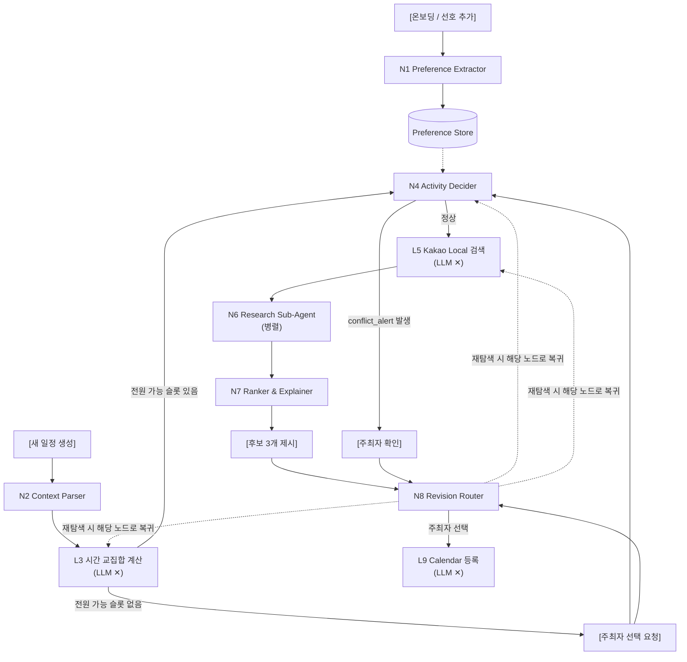

# 다모여 — AI 파트 기획서

이 문서는 `topic-development.md`(브레인스토밍·피드백 히스토리), `service-proposal.md`(공식 기획안), `ai-pipeline-design.md`(파이프라인 설계), `backend-ai-contract.md`(Agent↔Backend API 계약) 네 문서를 종합해 AI 파트의 입장에서 다시 정리한 것이다. `db_schema.md`는 현재 비어있어 이번 버전에는 반영하지 못했다.

네 문서 사이에 서로 다른 내용이 있는 지점은 임의로 하나를 골라 조용히 통일하지 않고, **최종안 + 근거 + 남은 차이**를 그대로 노출했다 (12장 오픈 이슈 참고).

---

## 1. 개요

**한 줄 정의**: 흩어진 일정과 취향 컨텍스트를 모아, 모임 시간·장소 결정부터 캘린더 등록까지 대신 수행하는 에이전트.
(`service-proposal.md`의 기존 문장에서 "약속"이라는 단어를 빼야 한다는 코멘트를 반영했다 — 이 서비스가 다루는 건 1:1 약속이 아니라 다자간 모임이라 "약속"이 스코프를 오해하게 만들 수 있다는 취지로 이해했다.)

**서비스 3분할 구조**와 AI 파트의 경계:

| 영역 | 담당 | 책임 |
| --- | --- | --- |
| 프론트엔드 | React SPA | 화면, 사용자 입력/승인 UI |
| 백엔드 | Spring Boot | Preference/모임/일정 CRUD, Vocabulary 관리, 인증 |
| **AI 파트** | **FastAPI + LangGraph** | 자연어 이해, 다자간 조건 조율 판단, 장소 검증, 실행(캘린더 등록) 오케스트레이션 |

이 표의 경계 자체가 완전히 확정된 건 아니다 — 특히 "시간 교집합 계산"을 백엔드가 하는지 AI 파이프라인(L3)이 하는지가 문서마다 다르게 적혀 있다. 이건 12장에서 별도로 짚는다.

---

## 2. 문제 정의 & 타깃 (요약)

- **문제**: 모임을 잡으려면 누군가 총대를 매야 한다. "언제 돼?", "뭐 먹을래?"를 반복해 묻고, 흩어진 답을 취합하고, 안 되는 조건을 걸러내고, 식당까지 직접 골라야 한다. 인원이 늘수록 조율해야 할 경우의 수가 급증하고, 자주 안 만나는 사이일수록 서로의 취향·알레르기를 몰라 매번 이 과정을 반복한다.
- **타깃**: 자주 만나지 않는 지인(회사 동료, 오랜만에 만나는 대학 동기 등)들과의 모임에서 조율을 떠맡는 총대. 1회성 모임보다 **정기적으로 반복되는 모임**(Kevin 피드백 반영 — N년째 이어지는 동기 모임 등)에 초점.
- **왜 중요한가**: 반복적·보편적인 불편이고, 시간 조율이 점점 어려워지는 추세이며, 부담이 총대 한 사람에게 집중된다.

---

## 3. 차별점과 "왜 AI여야 하는가"

| 서비스 | 한계 |
| --- | --- |
| Partiful | 초대·RSVP·투표·취향수집은 지원하나 **최종 결정은 여전히 사람**이 함. 여러 명의 상충 조건을 종합해 최적안을 계산해주지 않음 |
| Google AI Mode / Perplexity+OpenTable | 자연어로 조건을 주면 식당 탐색·예약까지 이어주지만 **1인 조건 기준**. 다자간 조율 기능 없음 |

**차별점**: 참여자 전원의 캘린더 + 개별 선호 + 모임 맥락을 종합해 시간·지역·장소가 결합된 완성 후보를 만들고, 캘린더 등록까지 자동 수행. 핵심은 인기순 추천이 아니라 조건 충돌 시(고기 선호 vs 비선호, 예산, 알레르기) 특정 참여자가 일방적으로 희생되지 않는 그룹 합의안을 계산하는 **다자간 의사결정 알고리즘**이라는 점.

**"AI 붙인 필터 서비스 아니냐"는 공격에 대한 방어**: 모든 판단을 LLM에 맡기지 않고 역할을 분리한다.

- LLM: 자연어 → 구조화된 조건 변환, 결과·타협 이유 설명
- 결정론적 엔진: 시간 교집합 계산, 식당 필터링/랭킹
- 에이전트: 승인 후 캘린더 등록 실행

이 역할 분리가 4장의 파이프라인에서 `N` 접두사(LLM)와 `L` 접두사(비-LLM) 노드 구분으로 구현된다.

---

## 4. AI 파이프라인 아키텍처



```
MeetingState
├─ group_id, schedule_id
├─ participants[]
├─ preferences[]          ← N1 결과 (전역, 조회해서 채움)
├─ meeting_context        ← N2 결과
├─ ui_inputs              { region, time_range, date_range }
├─ time_slots[]           ← L3 결과
├─ confirmed_slot         ← 사용자 확정
├─ activities[]           ← N4 결과
├─ place_candidates[]     ← L5 결과
├─ verified_places[]      ← N6 결과
├─ final_candidates[]     ← N7 결과
├─ revision_history[]     ← N8 누적 제약
└─ pending_user_action    ← 사용자 개입 대기 상태
```

---

## 5. 노드별 상세 설계

| 노드 | 역할 | LLM |
| --- | --- | --- |
| N1 Preference Extractor | 발화 → 장기 Preference 추출·Vocabulary 매핑 | O |
| N2 Meeting Context Parser | 주최자 요청 + UI 입력 파싱 | O |
| L3 시간 교집합 계산 | 참여자 free/busy → 공통 슬롯 | X |
| N4 Activity Decider | 선호+컨텍스트+슬롯 → 활동 후보 결정 (핵심 노드) | O |
| L5 Kakao Local 검색 | 활동별 장소 후보 검색 | X |
| N6 Research Sub-Agent | 후보별 영업시간/휴무일 검증 (병렬) | O |
| N7 Ranker & Explainer | 최종 후보 3개 + 추천 사유 | O |
| N8 Revision Router | 재탐색 요청을 어느 노드로 되돌릴지 판단 | O |
| L9 Calendar 등록 | 확정 일정 캘린더 등록 | X |

**N1. Preference Extractor**
- 입력: 사용자 발화, 백엔드가 제공하는 Vocabulary 목록
- 출력: **6장의 Vocabulary 계약을 따른다** (`vocabularyCode, rawValue, sentiment, strength, mappingType`). Agent는 Vocabulary에 없는 code를 새로 만들지 않는다.
- 호출 시점: 온보딩 1회 + 선호 추가·수정 시

**N2. Meeting Context Parser**
- 입력: 주최자 자연어 요청, UI 입력(지역·시간대·날짜 범위)
- 출력: `{meeting_tone, activity_hints[], explicit_constraints[], conflicts_with_ui}`
- 지역·시간은 **UI 값이 절대 우선** — LLM이 지역을 추론하지 않도록 프롬프트에 명시. 자연어-UI 불일치는 `conflicts_with_ui`로 되묻기.

**L3. 시간 교집합 계산**
- 입력: 참여자 free/busy, 희망 시간대. 출력: `[{slot, available_count, unavailable_participants[]}]`
- 전원 가능 슬롯이 없으면 파이프라인을 멈추고 주최자에게 선택 요청.
- ⚠️ 이 계산을 AI 파이프라인 노드로 둘지, Spring Boot 백엔드가 계산해서 결과만 넘겨줄지는 미확정 (12장 참고).

**N4. Activity Decider — 파이프라인의 핵심**
- 입력: 관련 category의 preferences(+원문), meeting_context, confirmed_slot, region, blocked_domains
- 출력: `{activities:[{type, rationale_group, search_queries}], excluded:[{type, reason}], conflict_alert}`
- **Specificity Wins** 규칙: 넓은 범주 선호(예: 해산물 싫음)와 구체적 선호(예: 조개는 좋음)가 충돌하면 구체적인 쪽이 이긴다 — 프롬프트에 명시.
- `excluded`를 함께 반환하면 디버깅과 발표 시연 양쪽에 유용.
- `rationale_group`은 반드시 집단 수준 표현 — "A가 술을 좋아해서"류 개인 지목 금지.
- 검색어 생성은 별도 노드로 쪼개지 않는다 (지연만 늘고 품질 차이 없음).

**L5. Kakao Local 검색**: API 호출 → 중복 제거 → 활동별 상위 N개.

**N6. Research Sub-Agent**
- 입력: `{place_name, address, target_datetime}` (병렬 호출). 출력: `{verdict: PASS|FAIL|UNKNOWN, evidence, source, confidence}`
- 검증 범위는 영업시간·휴무일로 한정 (주차/웨이팅/가격까지 넓히면 시간 안에 못 끝남).
- `UNKNOWN`은 별도 상태로 유지 — FAIL 처리하면 후보가 사라지고 PASS 처리하면 거짓 정보가 됨. "확인 필요" 라벨로 후보에 포함.
- 전체 타임아웃, 초과 시 검증된 것까지만 반환.

**N7. Ranker & Explainer**: 후보 3개 + 집단 수준 추천 사유.

**N8. Revision Router**: 사용자 피드백 → `{revise: "place_only|activity|time", added_constraints[]}`. LLM은 어디로 되돌아갈지만 판단, 실제 재실행은 오케스트레이터가 수행.

**L9. Calendar 등록**: 확정 일정을 Google Calendar에 등록.

---

## 6. Preference 저장 & Vocabulary 연동 (최종 계약)

초기 설계(`ai-pipeline-design.md`)는 "자유 target + scope(broad/specific) + parent_hint" 방식을 검토했으나, 이후 백엔드 팀과 **고정 Vocabulary + mappingType** 방식으로 최종 합의했다. 아래가 실제로 구현해야 할 계약이다.

**역할 분리**: 백엔드는 Vocabulary 관리/저장/검증, Agent는 자연어 이해·Preference 추출·Vocabulary 매핑만 한다.

**Backend → Agent**: 사용자 텍스트 + Vocabulary 목록(`GET /internal/preference-vocabulary`, `{code, domain, attribute, parentCode}`로 계층 표현).

**Agent → Backend** 응답 필드:

| 필드 | 의미 |
| --- | --- |
| `vocabularyCode` | 표준 코드 (없으면 null) |
| `rawValue` | 사용자가 실제 언급한 표현 |
| `sentiment` | `POSITIVE` / `NEGATIVE` |
| `strength` | `LOW` / `MEDIUM` / `HIGH` (2026-08-19 재논의로 3단계 확정 — 12장 오픈 이슈 #2 참고) |
| `mappingType` | `EXACT` / `GENERALIZED` / `UNMAPPED` |

- **EXACT**: 표현이 Vocabulary와 직접 대응 ("돼지고기 좋아" → `PORK`)
- **GENERALIZED**: 정확한 코드가 없어 안전한 상위 개념으로 매핑 ("양고기 좋아"인데 `LAMB` 없으면 → `MEAT`, `rawValue`는 보존)
- **UNMAPPED**: 대응 코드 없음 (`vocabularyCode=null`). 장기 저장 여부는 미정.

**핵심 규칙**: Agent는 Vocabulary에 없는 code를 절대 새로 만들지 않는다. 백엔드는 저장 전 코드 실존 여부·`sentiment`/`strength`/`mappingType` 유효성·`UNMAPPED`일 때 `vocabularyCode==null`인지 검증한다.

**가장 중요한 원칙**: Vocabulary는 Agent가 이해할 수 있는 범위가 아니라 **장기 저장할 Preference의 범위만** 제한한다. 지금 모임(Room)의 자연어("오늘 양고기 먹고 싶어")나 장소 검색 키워드는 Vocabulary 제약 없이 자유롭게 쓴다.

---

## 7. Backend 연동 개요

| 방향 | 내용 |
| --- | --- |
| Backend → Agent | 사용자 자연어, Vocabulary 목록 |
| Agent → Backend | 구조화된 Preference (6장 스키마) |

DB 테이블은 `preference_vocabulary`(id, domain, attribute, code, display_name, parent_id), `user_preference`(id, user_id, vocabulary_id, raw_value, sentiment, strength, mapping_type, source_text, created_at, updated_at) 두 개가 이 계약과 직결된다. 그 외 모임/일정/캘린더 관련 테이블은 `db_schema.md`가 채워지는 대로 이 문서에 반영한다.

---

## 8. 기술 스택 및 선택 이유

| 구분 | 기술 | 선택 이유 |
| --- | --- | --- |
| LLM (파싱·설명) | Gemini 또는 Claude | 자연어 이해·구조화·설명 생성 |
| 오케스트레이션 | LangGraph | 노드 간 조건부 분기(전원 가능 슬롯 없음, conflict_alert 등)와 N8의 재탐색 루프를 그래프로 표현하기 적합 |
| 프롬프트/체인 관리 | LangChain | 프롬프트 템플릿·모델 클라이언트 추상화 |
| AI 백엔드 | FastAPI | 경량 파이프라인 서버, Spring Boot 백엔드와 REST로 통신 |
| 장소 데이터 | 카카오 로컬 API | 국내 장소 검색·영업정보 |
| 캘린더 | Google Calendar API | Free/Busy 조회, 이벤트 생성 |
| 로깅/트레이싱 | LangSmith | 노드별 LLM 호출 추적, 디버깅·시연 로그 |

**구현 방법 (제안)**: LLM 노드는 `app/graph/nodes/`에 노드 하나당 파일 하나로 구현하고, `app/core/llm.py`의 공용 팩토리로 모델 클라이언트를 받는다. LangGraph의 조건부 엣지로 L3의 "전원 가능 슬롯 없음", N4의 `conflict_alert`, N8의 재탐색 라우팅을 표현한다.

---

## 9. 리스크 및 대응 전략

| 리스크 | 근거 | 대응 |
| --- | --- | --- |
| "AI 붙인 필터 아니냐" 공격 | 심사위원 예상 질문 | LLM/결정론적 엔진 역할 분리를 명시적으로 설계·발표 (3장) |
| 컨텍스트 과다 (모임별 선호 저장 시) | 0819 오전 회의: "컨텍스트가 너무 커질 수 있음" | category 5~6개 고정으로 N4에 관련 카테고리만 프롬프트에 주입 (6장) |
| 자동 예약 증명 불가 | "예약 어떻게 할지…" (service-proposal.md), AI 피드백의 "가장 위험한 질문" | 아직 미해결 — 12장 오픈 이슈 |
| 전원 가입/캘린더 연동 강제 시 서비스 실패 | AI 피드백: "전원 가입과 권한 허용을 전제로 하면 서비스가 실패" | 연결 사용자는 Free/Busy만 제공, 미연결 참가자는 링크에서 수동 입력 — 단, 0819 이후 "가입을 무조건 해야 되는 상황"이라는 팀 논의도 있어 최종 확정 필요 (12장) |
| Vocabulary 없는 표현 처리 | 신조어·방언 등 | GENERALIZED/UNMAPPED로 안전하게 처리, 임의 코드 생성 금지 (6장) |
| N6 영업시간 검증 타임아웃 | 외부 API 응답 지연 시 전체 파이프라인 지연 | 전체 타임아웃 + UNKNOWN 상태로 부분 반환 (5장) |

---

## 10. MVP 범위

**핵심 기능 4개** (`service-proposal.md` 기준):

1. 개인 선호 관리 — 자연어 취향을 구조화해 장기 저장/업데이트
2. 일정 자동 조율 — 캘린더+제출 시간 분석, 공통시간·타협안 제시
3. 장소 후보 추천 — 지정 지역 내 적합 장소 + 추천 이유
4. 모임 확정 및 실행 — 캘린더 일정 생성 + 참가자 초대

**성공 시나리오 (1개면 충분)**: 회식 조건 입력 → N명의 일정·제약 수집 → 시간/식당 하나 확정 → 승인 → 캘린더 등록.

**MVP 제외**: 가입 시 밸런스 게임 온보딩, 비용 정산, 단체 채팅, 식사 외 모임 도메인(PC방·배드민턴 등).

**도메인 범위**: 식사 중심 모임만 (회식/브런치/술자리) — 0819 오전 회의 결정.

---

## 11. 기대효과 / 성공 지표

측정 가능한 목표로 제시 (아직 검증 안 된 숫자는 "성과"가 아니라 "목표"로 표기):

- 모임 확정까지 걸리는 시간
- 총무의 주요 조작 횟수 (조건 입력 + 승인 정도로 최소화)
- 참가자 1인 입력 소요 시간
- 예약·캘린더 실행 성공률
- 실패 후 복구 성공률

---

## 12. 오픈 이슈

이 기획서를 작성하며 문서 간에 서로 다르게 적혀 있거나 아직 결정되지 않은 것들.

1. **자동 예약 방식 미정** (`service-proposal.md`: "예약 어떻게 할지…..ㅠ"). 네이버는 예약 API가 없어 브라우저 자동화가 필요한데 로그인·캡차 리스크가 큼. 세 가지 선택지 중 결정 필요: ① 실제 예약 API/샌드박스 확보 ② 제휴 식당 한정 자체 예약 콘솔 ③ "예약 요청까지만" 수행하고 과장하지 않기. 최소한 Google Calendar 등록은 실제로 동작해야 한다는 게 공통 의견.
2. **`strength` 타입**: `ai-pipeline-design.md`(N1 설계)는 `LOW/MEDIUM/HIGH` 3단계를 권고했고, 백엔드 계약(6장) 초안은 `0.0~1.0` 연속값이었다. 한 차례 연속값을 최종으로 채택했으나, 이후 팀 논의를 거쳐 **`LOW/MEDIUM/HIGH` 3단계로 재확정**했다 (2026-08-19). LLM이 연속값을 얼마나 일관되게 뽑는지는 정량 검증하지 않았다 — 3단계로 되돌린 것은 검증 결과가 아니라 논의를 통한 재결정이다. 저장 시 수치 변환이 필요하면 Back이 담당한다 — AI는 3단계 값을 그대로 반환한다.
3. **L3(시간 교집합) 계산 주체**: `ai-pipeline-design.md`는 이걸 AI 파이프라인의 비-LLM 노드로 그렸지만, `service-proposal.md`의 기술 스택 표는 "백엔드(Spring Boot): 캘린더 시간 교집합 계산"이라고 되어 있다. AI 서비스가 직접 계산하는지, 백엔드가 계산한 결과를 받아오기만 하는지 확정 필요.
4. **모임별 개인 선호 저장 여부**: 0819 오전 회의에서 "구현해보고 안되면 수정"으로 결론 — 아직 최종 결정 아님.
5. **참가자 가입 필수 여부**: AI 피드백은 "가입 없이 응답 가능"을 권고했으나, 이후 팀 논의에서 "가입을 무조건 해야 되는 상황"이라는 이야기도 나왔음 — 최종 확정 필요.
6. **UNMAPPED를 장기 Preference로 저장할지**: 백엔드 계약(6장)에서 미정으로 남겨둔 사항.
7. **`db_schema.md` 미작성**: 엔티티 설계가 채워지면 6~7장에 반영 필요.
8. **재탐색(N8) 중간 상태의 영속화 위치**: 후보 제시 → 피드백 → 재탐색이 여러 API 호출에 걸쳐 일어난다면 `MeetingState`가 요청 사이에 어디 남아있는지 명시 필요 (예: LangGraph checkpointer를 `schedule_id` 기준으로 사용).
