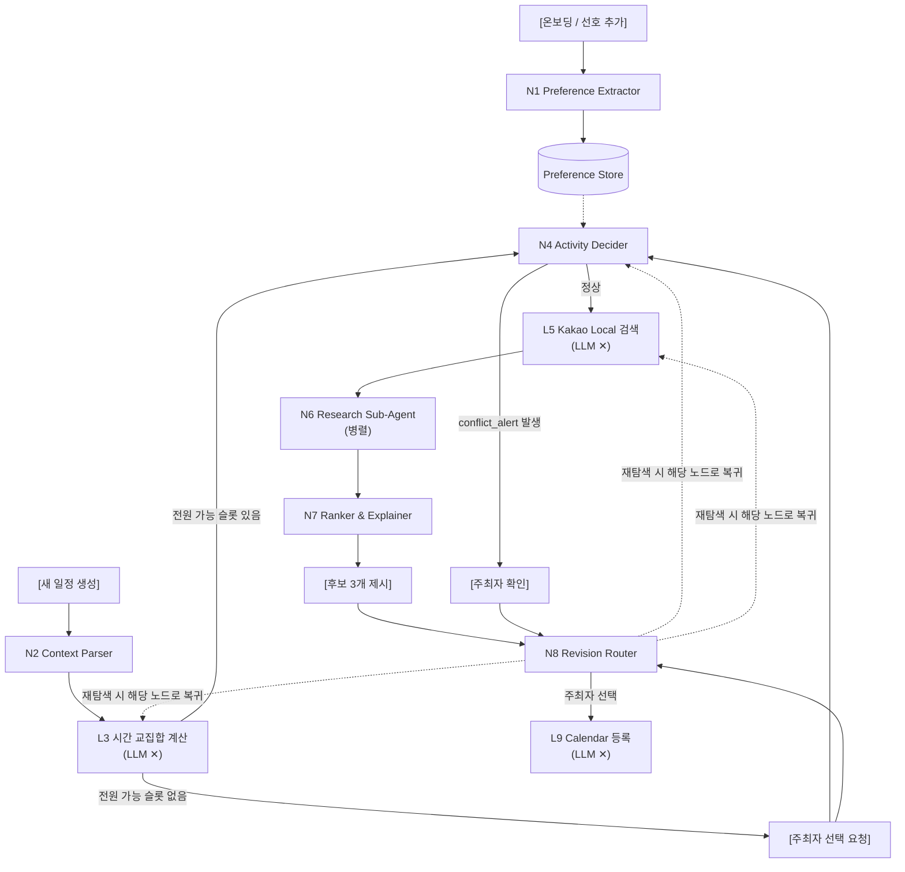

# AI Pipeline Design

> ⚠️ **기획 단계 문서.** 설계 배경 참고용이며 현재 API 계약의 기준이 아니다.
> 실제 Back↔AI 계약은 [`api-design2-backend.md`](api-design2-backend.md)를 본다.
## 1. 선호 저장 구조: 어떻게 할 것인가

### 결론부터

**고정 항목 리스트에서 고르게 하는 방식은 쓰지 마세요.** 대신 **자유 target + 얕은 계층 표시 + 구체성 우선 규칙**으로 갑니다.

### 왜 고정 리스트가 안 되는가

"음식 종류 30개 중 고르기"를 시키면 당장은 깔끔해 보이지만 세 가지가 무너집니다.

- **리스트 밖 개념이 사라짐**: "시끄러운 곳 싫어", "많이 걷는 건 별로"는 어느 항목에도 안 들어갑니다. 억지로 매핑하면 원래 의미가 왜곡됩니다.
- **도메인 확장이 막힘**: 볼링·방탈출·카페까지 열어둔 서비스인데, 새 활동이 추가될 때마다 리스트를 갱신해야 합니다. 기획서 4장에서 고정 컬럼 방식을 버린 이유와 같습니다.
- **예외 표현 불가**: 지금 질문하신 "해산물은 싫은데 조개는 좋아"가 정확히 이 케이스입니다. 리스트 방식으로는 둘 중 하나만 남습니다.

### 그럼 예외를 어떻게 저장하나

**두 개의 독립된 레코드로 저장하고, 적용 시점에 구체성이 높은 쪽이 이긴다**는 규칙 하나만 두면 됩니다.

> "해산물은 싫은데 조개는 좋아"
> 

json

```json
[
  {"target":"해산물","category":"food","scope":"broad",
   "sentiment":"negative","strength":"medium",
   "original_text":"해산물은 싫은데"},

  {"target":"조개","category":"food","scope":"specific",
   "sentiment":"positive","strength":"medium",
   "parent_hint":"해산물",
   "original_text":"조개는 좋아"}
]
```

> "해산물 좋은데 광어는 안 먹어"
> 

json

```json
[
  {"target":"해산물","scope":"broad","sentiment":"positive", ...},
  {"target":"광어","scope":"specific","sentiment":"negative",
   "parent_hint":"해산물", ...}
]
```

**핵심 규칙 — Specificity Wins**

```
판단 대상이 "조개구이집"일 때
  → 매칭되는 선호: 해산물(broad, -), 조개(specific, +)
  → specific이 broad를 덮어씀 → 긍정으로 판단
```

이게 실무에서 예외를 다루는 표준 방식입니다. 계층 전체를 트리로 관리할 필요 없이 **`scope` 2단계(broad/specific)와 `parent_hint` 하나**만 있으면 대부분의 예외가 표현됩니다. 3단계 이상 계층(해산물 > 조개류 > 바지락)까지 가려 하면 복잡도만 폭발하고 실제 판단 품질은 거의 안 올라갑니다.

### 그래도 고정해도 되는 것: category

`target`은 자유롭게 두되, **`category`는 5~6개로 고정**하세요. 이건 판단이 아니라 필터링·조회용이라 고정해도 위 문제가 안 생깁니다.

```
food      음식 종류
activity  활동 (볼링, 보드게임, 걷기)
place     장소 유형 (술집, 카페, 노래방)
mood      분위기 (조용한, 시끌벅적한)
budget    가격대
etc       그 외
```

이렇게 두면 N4(활동 결정)에서 **관련 category만 뽑아 프롬프트에 넣을 수 있어** 컨텍스트가 줄어듭니다. 5-1절에서 걱정하셨던 "컨텍스트 과다" 문제의 실질적 해법이기도 합니다.

### target 정규화

같은 개념이 "해산물"/"해물"/"수산물"로 갈리면 매칭이 깨집니다. 해커톤 규모에서 가장 저렴한 해법은 **프롬프트에 기존 target 목록을 넣어주고 재사용을 유도**하는 것입니다.

```
[기존에 저장된 target 목록]
해산물, 활동적인 모임, 술, 조용한 분위기, ...

위 목록에 같은 의미가 있으면 그 표현을 그대로 사용하고,
없을 때만 새 target을 만들어라.
```

임베딩 유사도 매칭까지 붙이면 정확도는 오르지만, 이틀짜리 일정에서는 위 방식으로 충분합니다. **필요해지면 그때 붙이세요.**

### 한 가지 더: 판단은 SQL이 아니라 LLM이 한다

중요한 전제입니다. 이 데이터는 `WHERE likes_seafood = true`로 조회하려고 만드는 게 아닙니다. **최종 소비자가 LLM**이에요. 그래서 `original_text`를 반드시 함께 넘겨야 합니다. 구조화 과정에서 잃어버린 뉘앙스("좀 별로", "웬만하면", "죽어도 못 먹어")를 LLM이 원문에서 다시 읽어냅니다. 구조는 필터링과 압축을 위한 것이고, 최종 판단 근거는 원문입니다.

---

## 전체 AI 파이프라인



```
MeetingState
├─ group_id, schedule_id
├─ participants[]
├─ preferences[]          ← N1 결과 (전역, 조회해서 채움)
├─ meeting_context        ← N2 결과
├─ ui_inputs              { region, time_range, date_range }
├─ time_slots[]           ← L3 결과
├─ confirmed_slot         ← 사용자 확정
├─ activities[]           ← N4 결과
├─ place_candidates[]     ← L5 결과
├─ verified_places[]      ← N6 결과
├─ final_candidates[]     ← N7 결과
├─ revision_history[]     ← N8 누적 제약
└─ pending_user_action    ← 사용자 개입 대기 상태
```

---

## 3. 노드별 정의

#### N1. Preference Extractor

- **입력**: 사용자 발화, 기존 target 목록
- **출력**: `[{target, category, scope, parent_hint, sentiment, strength, context, original_text}]`
- **호출 시점**: 온보딩 1회 + 선호 추가·수정 시
- **주의**: `strength`는 `low/medium/high` 3단계. 0.0~1.0 연속값은 LLM이 일관되게 못 뽑습니다.

#### N2. Meeting Context Parser

- **입력**: 주최자 자연어 요청, UI 입력(지역·시간대·날짜 범위)
- **출력**: `{meeting_tone, activity_hints[], explicit_constraints[], conflicts_with_ui}`
- **주의**: 지역·시간은 **UI 값이 절대 우선**. LLM이 지역을 추론하지 않도록 프롬프트에 명시. 자연어와 UI가 다르면 `conflicts_with_ui`에 담아 되묻기.

#### L3. 시간 교집합 (LLM 없음)

- **입력**: 참여자 캘린더 free/busy, 희망 시간대
- **출력**: `[{slot, available_count, unavailable_participants[]}]`
- 전원 가능 슬롯이 없으면 파이프라인을 멈추고 주최자에게 선택 요청.

#### N4. Activity Decider — 파이프라인의 핵심

- **입력**: 관련 category의 preferences(+원문), meeting_context, confirmed_slot, region, blocked_domains
- **출력**

json

```json
{
  "activities": [
    {"type":"볼링장","rationale_group":"활동적인 모임 선호 다수",
     "search_queries":["건대 볼링장"]}
  ],
  "excluded": [{"type":"횟집","reason":"참여자 중 해산물 비선호"}],
  "conflict_alert": null
}
```

- **여기서 Specificity Wins 규칙이 적용됩니다.** 프롬프트에 명시하세요: *"broad와 specific이 충돌하면 specific을 우선한다."*
- `excluded`를 함께 뱉게 하면 디버깅과 발표 시연 양쪽에 쓸모가 큽니다.
- `rationale_group`은 반드시 집단 수준 표현. "A가 술을 좋아해서"류 금지를 프롬프트에 명시.
- 검색어 생성을 별도 노드로 쪼개지 마세요. 지연만 늘고 품질 차이가 없습니다.

#### L5. 장소 검색 (LLM 없음)

- Kakao Local API 호출 → 중복 제거 → 활동별 상위 N개

#### N6. Research Sub-Agent

- **입력**: `{place_name, address, target_datetime}` (후보별 병렬 호출)
- **출력**: `{verdict: PASS|FAIL|UNKNOWN, evidence, source, confidence}`
- **범위를 영업시간·휴무일 두 가지로만 한정.** 주차·웨이팅·가격까지 넓히면 시간 안에 못 끝냅니다.
- **`UNKNOWN`을 반드시 별도 상태로 유지.** FAIL 처리하면 후보가 다 사라지고, PASS 처리하면 거짓말이 됩니다. "영업시간 확인 필요" 라벨을 달아 후보에 포함시키는 게 실용적입니다.
- 전체 타임아웃을 걸고, 초과 시 검증된 것까지만 반환.

#### N7. Ranker & Explainer

- **입력**: verified_places, activities, preferences 요약
- **출력**: 후보 3개 + 집단 수준 추천 사유

#### N8. Revision Router

- **입력**: 이전 상태 + 사용자 피드백("좀 더 조용한 곳으로")
- **출력**: `{revise: "place_only|activity|time", added_constraints[]}`
- LLM은 **어디로 되돌아갈지만 판단**하고, 실제 재실행은 오케스트레이터가 합니다.

#### L9. Calendar 등록 (LLM 없음)