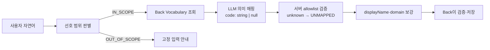
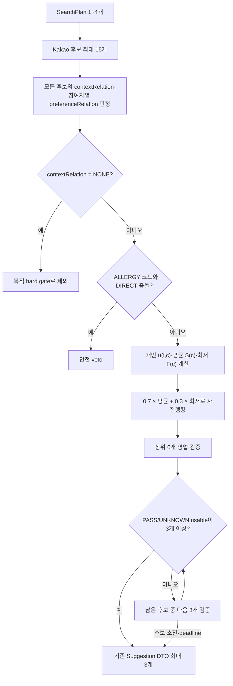
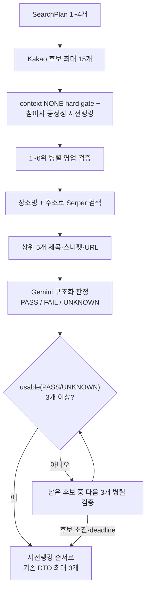

# 발표용 AI 설계 정리

이 문서는 API 명세서가 아니라, 발표에서 **어떤 문제를 발견했고 어떤 기준으로 AI 파이프라인을 설계했는지** 설명하기 위한 자료다. 실제 Back↔AI 요청·응답 계약은 [`api-design2-backend.md`](api-design2-backend.md)를 기준으로 한다.

발표의 세 가지 핵심 주제는 다음과 같다.

1. **카테고리 사전 구성과 의미 기반 매핑** — 자유로운 자연어를 안정적인 서비스 코드로 바꾸는 방법
2. **참여자별 만족도와 공정성 점수** — 다수의 평균뿐 아니라 가장 불리한 참여자까지 고려하는 방법
3. **웹 검색 기반 영업시간 검증** — 장소가 실제 모임 시간에 영업하는지 외부 근거로 확인하는 방법

---

## 1. 카테고리 사전 구성과 의미 기반 매핑

### 발표용 설명 대본 (전체 버전, 약 1분)

**문제 상황부터**

사용자는 같은 취향을 정말 다양하게 표현한다. "연어 좋아해", "사시미 괜찮아", "회 종류는 다 좋아하는 편"이라는 세 문장은 사람이 보면 다 같은 의미인데, 이걸 원문 그대로만 저장하면 시스템은 이게 같은 선호라는 걸 알 방법이 없다. 나중에 "이 사용자가 연어를 좋아하는지" 조회하거나, 같은 선호를 다시 말했을 때 갱신하거나, 여러 참여자의 취향을 비교하는 게 다 어려워진다.

그렇다고 반대로 LLM한테 카테고리 이름까지 자유롭게 만들라고 하면, 이번엔 `SALMON`, `SALMON_FOOD`, `RAW_SALMON`처럼 같은 의미인데 매번 다른 코드가 나온다. 이러면 DB에 외래키로 쓸 수 있는 안정적인 값이 안 된다.

**택한 방식 — 그리고 "수학적 유사도가 아니다"라는 부분**

이 둘 사이에서, 음식·활동·분위기·음료 네 영역에 미리 320개 코드로 계층형 사전(Vocabulary)을 만들어뒀다. 예를 들면 `FOOD` 밑에 `SEAFOOD`, 그 밑에 `RAW_FISH`, 그 밑에 `SALMON`처럼 상위-하위 개념이 계층으로 연결돼 있다.

여기서 많이들 오해하는 부분이, "가장 가까운 항목을 찾는다"고 하면 보통 임베딩 벡터로 바꿔서 코사인 유사도로 제일 가까운 걸 찾는 방식(RAG에서 흔히 쓰는 방식)을 떠올리는데, 여기서는 그렇게 하지 않는다. 벡터 DB도, 임베딩 검색도 없다. 대신 이 320개 목록 전체를 프롬프트에 텍스트로 그대로 넣고, LLM이 문장 전체의 문맥을 읽어서 의미로 판단하게 한다. 즉 숫자 거리 계산이 아니라 LLM의 자연어 이해 자체가 "가까움"을 판단하는 방식이다.

**검토했던 다른 계산 방식들**

"가장 가까운 걸 고른다"고 하면 떠올릴 수 있는 방식이 몇 가지 더 있다.

| 방식 | 방법 | 한계 |
| --- | --- | --- |
| 임베딩 + 코사인 유사도 | 문장·사전 항목을 벡터로 바꿔 거리를 계산 | 문장 전체를 벡터 하나로 압축하기 때문에, "해산물은 별론데 조개는 좋아"처럼 반대되는 선호 두 개가 한 문장에 있으면 자연스럽게 분리되지 않는다 |
| 편집 거리·문자열 유사도 | 철자가 얼마나 비슷한지 계산 | 동의어("포크" ≠ "돼지고기")를 전혀 못 잡는다 |
| 키워드/규칙 기반 매칭 | 미리 정의한 키워드 표로 문자열 매칭 | 새 표현·부정문·복합문이 늘수록 규칙이 기하급수적으로 복잡해진다 |
| 별도 분류 모델 학습 | 문장 → 카테고리를 예측하도록 모델을 별도로 학습 | 학습 데이터가 필요하고, 카테고리를 추가할 때마다 재학습해야 한다 |

**그래서 LLM 통짜 프롬프트를 선택했다** — 이유는 네 가지다.

1. **부정·복합문 처리**: "해산물은 별로인데 조개는 좋아"처럼 반대되는 선호 두 개가 한 문장에 있어도, LLM은 문맥을 읽고 두 개를 따로 뽑아 각각 다른 감정을 붙일 수 있다.
2. **강도·감정 판단**: "정말 좋아해"와 "그냥 그럭저럭 괜찮아"의 차이(`STRONG`/`WEAK`)는 숫자 거리로 정의되는 값이 아니라 문장을 이해해야 나오는 값이다.
3. **"부재 확인"이 필요한 EXACT/GENERALIZED 판단**: "사슴고기"를 `MEAT`로 일반화해도 되는지 판단하려면 "더 구체적인 코드(`VENISON`)가 사전에 없다"는 걸 확인해야 한다. 목록 전체를 한 번에 보여주기 때문에 이 판단이 가능하다 — 일부 후보만 검색해서 보여주는 방식으로는 "없다"는 걸 확인하기 어렵다.
4. **인프라 단순함**: 지금 사전 크기(320개, 토큰으로 약 6,700개)에서는 벡터 DB나 임베딩 파이프라인 없이 프롬프트 하나로 끝난다.

이때 LLM은 세 가지 중 하나로 답한다.

- **EXACT** — "연어 좋아해" → `SALMON`. 표현이 기존 코드와 직접 대응하는 경우
- **GENERALIZED** — 사전에 정확한 항목은 없지만 안전한 상위 범주가 있을 때. 예를 들어 "사슴고기 좋아해"인데 `VENISON` 코드가 없으면 상위 개념인 `MEAT`로 묶고, 원래 표현("사슴고기")은 `rawValue`에 그대로 남겨서 정보를 잃지 않는다
- **UNMAPPED** — 억지로 묶으면 의미가 왜곡될 것 같을 때. "고수는 절대 못 먹어요"를 `VEGETABLE`로 묶으면 "채소를 다 못 먹는다"는 뜻이 돼버리니까, 이럴 땐 그냥 코드 없이 원문만 남긴다

**마지막 안전장치**

LLM이 혹시 목록에도 없는 코드를 지어내더라도, AI 서버가 응답을 받자마자 실제 사전과 하나하나 대조한다. 존재하지 않는 코드는 전부 `UNMAPPED`/`null`로 강제로 바뀌기 때문에, 사전에 없는 값이 밖으로 새어나갈 수가 없다. 화면에 보여줄 표시 이름이나 카테고리도 LLM이 만드는 게 아니라, 검증된 코드를 기준으로 서버가 원본 사전에서 다시 가져와 붙여준다.

**정리**

"의미를 이해하는 유연함은 LLM한테 맡기고, 실제로 저장 가능한 값의 범위는 시스템이 끝까지 통제한다"는 게 핵심이다. 그래서 같은 취향을 다시 말해도 같은 코드로 쌓이고, LLM이 뭔가 지어내더라도 그게 실제로 DB까지 들어갈 위험은 서버 검증 단계에서 차단된다.

### 발표에서 먼저 말할 한 문장

> 생성형 AI에는 미리 관리하는 계층형 Vocabulary를 기준으로 코드를 선택하게 하고, 최종 결과는 AI 서버가 실제 사전과 대조해 미등록 코드를 `UNMAPPED`/`null`로 정규화한다.

여기서 중요한 점은 **“가장 가까운 단어”를 수학적으로 검색하는 방식은 아니라는 것**이다. 현재 구현에는 임베딩, 코사인 유사도, 편집거리, 벡터 데이터베이스가 없다. 정확한 표현은 다음과 같다.

> 고정 Vocabulary를 후보군으로 제공한 뒤 LLM이 문맥을 해석해 문자열 코드를 선택하고, AI 서버가 allowlist 검증으로 후보군 밖의 코드를 `UNMAPPED`로 정규화하는 **폐쇄형 의미 분류** 방식이다.

LLM이 의미를 판단하는 능력은 사용하되, DB에 저장할 수 있는 값의 범위는 서비스가 통제하는 구조다.

### 1.1 해결하려던 문제

사용자는 같은 취향도 서로 다르게 표현한다.

- “연어 좋아해.”
- “사시미 괜찮아.”
- “날것도 잘 먹어.”
- “회 종류는 다 좋아하는 편이야.”

이 문장들을 원문 그대로만 저장하면 사람은 비슷한 의미라는 것을 알 수 있지만, 시스템은 다음 작업을 안정적으로 수행하기 어렵다.

- 같은 선호를 하나의 기준으로 묶어 조회하기
- 사용자가 같은 선호를 다시 말했을 때 기존 값을 갱신하기
- 여러 참여자의 선호를 같은 기준으로 비교하기
- 추천 결과에 어떤 선호가 반영됐는지 설명하기
- 넓은 선호와 구체적인 예외를 구분하기

반대로 LLM에게 카테고리 이름까지 자유롭게 생성하게 하면 같은 의미가 호출할 때마다 다르게 나올 수 있다.

```text
SALMON
SALMON_FOOD
RAW_SALMON
FISH_SALMON
```

이 값들은 문맥상 모두 이해할 수 있지만, DB의 외래 키나 사용자별 UPSERT 기준으로 사용할 수 있는 안정적인 식별자는 아니다. 그래서 자연어는 유연하게 이해하되, 최종 저장 단위는 미리 합의한 표준 코드로 고정했다.

### 1.2 검토 가능한 방식과 현재 선택

| 방식 | 장점 | 한계 |
| --- | --- | --- |
| 사용자 원문만 저장 | 구현이 단순하고 정보 손실이 적음 | 같은 의미를 집계·비교·갱신하기 어려움 |
| 키워드/동의어 규칙 | 결과가 결정론적이고 설명하기 쉬움 | 부정, 강도, 복합문, 신조어가 늘수록 규칙이 급격히 복잡해짐 |
| 임베딩 최근접 검색 | 큰 사전에서 후보를 빠르게 좁히기 좋음 | 유사하다는 이유만으로 안전하지 않은 카테고리에 강제 매핑될 수 있으며 현재 프로젝트에는 구현돼 있지 않음 |
| LLM이 카테고리도 자유 생성 | 새로운 표현에 유연함 | 저장 코드가 흔들리고 DB·Back·Front 계약을 보장하기 어려움 |
| **고정 Vocabulary + LLM 의미 판단** | 자연어 문맥은 이해하면서 저장값은 통제 가능 | 의미상 올바른 코드 선택은 여전히 LLM 품질에 의존 |

현재 프로젝트는 마지막 방식을 택했다. 초기 기획에서는 자유로운 `target`, 범위 정보, 상위 개념 힌트를 LLM이 함께 만드는 방식도 검토했지만, Back과 안정적으로 연동하고 동일한 선호를 누적하기 위해 **고정 Vocabulary + `mappingType` + 원문 보존** 구조로 정리했다.

### 1.3 Vocabulary를 어떻게 구성했는가

Vocabulary 한 항목은 네 가지 정보로 구성된다.

| 구성 요소 | 역할 | 예시 |
| --- | --- | --- |
| `code` | DB 저장과 서비스 간 연동에 사용하는 안정적인 식별자 | `SALMON` |
| `displayName` | 사용자 화면과 설명에 사용하는 표시명 | `연어` |
| `domain` | 선호의 큰 영역 | `FOOD` |
| `parentCode` | 더 넓은 상위 개념 | `RAW_FISH` |

각 필드를 분리한 이유는 분명하다.

- `code`는 화면 문구가 바뀌어도 유지할 수 있는 기계용 계약이다.
- `displayName`은 사람이 읽는 값이며 저장 기준으로 사용하지 않는다.
- `domain`은 음식, 활동, 분위기처럼 서로 다른 종류의 선호를 1차로 구분한다.
- `parentCode`는 넓은 선호와 구체적인 선호를 같은 계층 안에서 표현한다.

로컬 seed 파일은 총 320개 항목을 목표로 구성돼 있다.

| Domain | 로컬 seed 기준 항목 수 | 다루는 범위 |
| --- | ---: | --- |
| `FOOD` | 200 | 음식 종류, 식재료, 조리 방식, 식단, 알레르기·회피 조건 |
| `ACTIVITY` | 50 | 모임에서 할 수 있는 활동 |
| `MOOD` | 50 | 장소의 분위기와 공간 특성 |
| `DRINK` | 20 | 음주와 음료 종류 |

이 숫자는 저장소의 초기 seed 기준이며, 운영 Back DB에 현재 정확히 320개가 들어 있다는 뜻은 아니다. 런타임의 진짜 기준은 Back이 반환하는 Vocabulary 목록이다.

계층은 다음처럼 여러 단계가 될 수 있다.

```text
FOOD
├─ MEAT (육류)
│  └─ CHICKEN (닭고기)
│     └─ FRIED_CHICKEN (치킨)
├─ SEAFOOD (해산물)
│  ├─ RAW_FISH (회)
│  │  └─ SALMON (연어)
│  └─ SHELLFISH (조개류)
│     └─ OYSTER (굴)
└─ KOREAN_FOOD (한식)
   └─ SAMGYEOPSAL (삼겹살)

DRINK
└─ ALCOHOL (음주)
   ├─ BEER (맥주)
   ├─ SOJU (소주)
   └─ WINE (와인)
```

현재 사전에서 보이는 구성 원칙은 다음과 같다.

1. **추천에 사용할 수 있는 단위인가**: 단순한 감상보다 장소 검색이나 후보 필터링에 연결할 수 있는 항목을 둔다.
2. **넓은 범주와 구체 항목을 함께 둔다**: `SEAFOOD`와 `SALMON`을 모두 둬 “해산물 전반”과 “연어만”을 구분한다.
3. **제약도 선호와 같은 표준 구조에 담는다**: 알레르기, 비건, 매운맛을 못 먹는 조건처럼 추천에서 중요한 회피 조건도 코드화한다.
4. **무한히 세분화하지 않는다**: 모든 표현을 leaf로 만들지 않고, 안전한 상위 범주나 `UNMAPPED`로 빠질 수 있게 한다.

다만 이 원칙이 정량적인 데이터 분석이나 사용자 발화 코퍼스로 검증된 것은 아니다. 현재 사전은 제품 가설을 기준으로 사람이 먼저 구성한 초기 taxonomy다.

### 1.4 실제 매핑 흐름



#### 1단계: 입력을 하나의 발화로 정리한다

`POST /ai/preferences/extract`는 `messages[]`를 받고, AI API 경계에서 공백 항목을 제외한 뒤 하나의 문자열로 합친다. 사용자 식별과 저장은 이 단계에서 하지 않는다.

#### 2단계: 먼저 개인 선호 범위인지 판별한다

Preference Scope Router가 입력을 다음 두 가지로만 분류한다.

- `IN_SCOPE`: 음식, 음료, 음주, 분위기, 활동, 알레르기, 회피 조건 등 개인 선호가 하나라도 있음
- `OUT_OF_SCOPE`: 인사, 날씨, 일반 질문처럼 개인 선호가 없음

여러 문장이 섞여 있어도 선호가 하나라도 명확하면 `IN_SCOPE`로 보내고, Extractor가 그 안에서 선호 부분만 추출한다. 범위 밖 입력에는 잡담을 이어가지 않고 고정 안내를 반환한다.

#### 3단계: Back이 관리하는 Vocabulary를 가져온다

AI는 seed SQL이나 DB를 직접 읽지 않는다. Back의 내부 Vocabulary API를 호출해 그 시점의 `code`, `displayName`, `domain`, `parentCode` 목록을 받고 프로세스 메모리에 캐시한다.

이 역할 분리는 다음과 같다.

| 주체 | 책임 |
| --- | --- |
| Back | Vocabulary의 원본 관리, 사용자 식별, 검증, DB 저장·UPSERT |
| LLM | 자연어에서 선호를 찾고 의미상 적절한 코드·감정·강도·매핑 유형 판단 |
| AI 서버 코드 | 모델 code의 allowlist 검증·정규화, `displayName`·`domain` 파생 |

#### 4단계: 거대한 enum 대신 고정 크기 스키마로 받는다

초기 구현은 Back이 반환한 전체 code를 Gemini 구조화 출력의 enum으로 만들었다.

```python
Literal[전체 Vocabulary 320개] | None
```

Vocabulary가 작을 때는 모델이 목록 밖 코드를 생성하지 못하게 하는 간단한 방식이었다. 하지만 Back에서 사전을 320개로 확장하자 동일한 320개 code가 프롬프트뿐 아니라 JSON Schema enum에도 모두 들어가 스키마가 불필요하게 커졌다. 해결 방법은 RDS의 사전을 줄이는 것이 아니라 **모델 스키마와 최종 검증의 책임을 분리하는 것**이다.

현재 Gemini 내부 DTO는 고정 크기로 유지한다.

```python
vocabulary_code: str | None
```

320개 Vocabulary 목록은 의미 판단을 위해 프롬프트에 그대로 유지한다. 제거한 것은 데이터가 아니라 JSON Schema에 중복되던 거대한 enum이다.

이제 LLM이 `SALMON_FOOD`나 `FISH_CATEGORY`처럼 미등록 코드를 내부 응답으로 만들 가능성은 있다. 대신 AI 서버가 응답 직후 `vocabulary_by_code`에서 정확히 조회하고, 없는 code를 외부 API로 내보내지 않는다.

#### 5단계: LLM이 문맥을 해석한다

LLM은 전체 Vocabulary의 표시명·domain·계층을 보고 다음 값을 판단한다.

- 어떤 표현이 실제 선호인지
- 긍정인지 부정인지: `POSITIVE / NEGATIVE`
- 표현 강도: `WEAK / MODERATE / STRONG`
- 어떤 표준 코드가 의미상 적합한지
- 직접 대응인지, 상위 범주로 일반화한 것인지, 매핑 불가인지

이 때문에 단순 문자열 일치보다 다음과 같은 문장을 다루기 쉽다.

```text
“연어는 진짜 좋아해.”
“매운 건 잘 못 먹어요.”
“해산물은 별론데 조개는 괜찮아.”
```

부정 표현, 강도, 넓은 선호와 구체적인 예외를 문장 전체의 의미로 해석하는 부분은 LLM이 담당한다.

#### 6단계: 서버가 실존 여부를 검증하고 기준 데이터를 붙인다

LLM은 `displayName`과 `domain`을 직접 생성하지 않는다. LLM이 고른 `vocabularyCode`로 AI 서버가 캐시된 원본 Vocabulary를 조회한다.

```text
LLM 선택: SALMON
→ 실제 사전에 존재
→ vocabularyCode=SALMON, displayName=연어, domain=FOOD 유지

LLM 선택: SALMON_FOOD
→ 실제 사전에 없음
→ vocabularyCode=null, displayName=null, domain=null,
  mappingType=UNMAPPED로 정규화
```

모델이 code를 `null`로 반환했거나, 실존 code와 `mappingType=UNMAPPED`를 함께 반환한 경우도 동일하게 `UNMAPPED`/`null`로 정규화한다. 서버가 `EXACT`와 `GENERALIZED` 중 하나를 임의로 추측하지 않는 fail-closed 정책이다.

이렇게 하면 모델이 `SALMON`을 골라 놓고 표시명은 “광어”, domain은 `ACTIVITY`라고 답하는 식의 필드 간 흔들림을 막고, 미등록 non-null code가 AI API 경계를 통과하지 않게 할 수 있다.

#### 7단계: Back이 최종 검증하고 저장한다

AI는 추출 결과만 반환한다. 어떤 사용자의 선호인지 식별하고, Vocabulary 코드의 실존 여부를 다시 확인하고, `(user_id, vocabulary_code)` 기준으로 저장하거나 갱신하는 작업은 Back의 책임이다.

### 1.5 “가장 가까운 항목”을 고르는 실제 원리

현재 구현에서 “가까움”은 숫자로 계산한 거리가 아니라 **문맥상 의미의 포함 관계와 구체성**이다. LLM은 프롬프트에 주어진 목록을 보고 다음 세 가지 중 하나를 선택한다.

#### `EXACT`: 직접 대응하는 기존 코드가 있을 때

문자열이 완전히 같다는 뜻이 아니라, 사용자 표현의 의미가 기존 코드와 직접 대응한다는 뜻이다.

```text
“연어 좋아해”
→ SALMON
→ POSITIVE / MODERATE / EXACT
```

```text
“회는 완전 싫어”
→ RAW_FISH
→ NEGATIVE / STRONG / EXACT
```

#### `GENERALIZED`: 정확한 leaf는 없지만 안전한 상위 범주가 있을 때

사전에 사용자의 구체 표현과 직접 대응하는 코드가 없더라도, 의미를 왜곡하지 않는 상위 범주가 있으면 그 코드로 일반화한다. 원래 표현은 `rawValue`에 그대로 보존한다.

```text
“사슴고기 좋아해”
→ 사전에 VENISON 코드가 없다고 가정
→ 육류라는 상위 의미는 명확함
→ MEAT / GENERALIZED
→ rawValue = “사슴고기”
```

여기서 코드가 존재하지 않는 `VENISON` 노드를 만든 뒤 `parentCode`를 따라 올라가는 것은 아니다. LLM이 전체 목록을 보고 `MEAT`가 안전한 상위 의미라고 판단한다.

#### `UNMAPPED`: 안전하게 대응할 코드가 없을 때

가까워 보이는 항목에 억지로 넣으면 의미가 달라질 수 있는 경우에는 코드 없이 원문만 반환한다.

```text
“고수는 절대 못 먹어요”
→ CORIANDER 코드 없음
→ VEGETABLE로 일반화하면 모든 채소를 싫어한다는 뜻으로 왜곡될 수 있음
→ vocabularyCode = null
→ NEGATIVE / STRONG / UNMAPPED
→ rawValue = “고수”
```

최신 계약에서는 Back이 `UNMAPPED` 항목을 일반 선호 DB와 Front 응답에서 제외한다. AI가 원문을 반환하는 이유는 “매핑에 실패했다”는 사실과 사용자의 실제 표현을 호출 경계까지 잃지 않기 위해서다.

### 1.6 계층 구조가 중요한 이유

다음 문장은 하나의 `SEAFOOD` 값만으로는 정확히 표현할 수 없다.

```text
“해산물은 별로지만 조개는 좋아해.”
```

의도된 추출 결과는 두 선호를 따로 보존하는 것이다.

| 코드 | 원문 | 감정 | 의미 |
| --- | --- | --- | --- |
| `SEAFOOD` | 해산물 | `NEGATIVE` | 넓은 범주의 비선호 |
| `SHELLFISH` | 조개 | `POSITIVE` | 구체적인 예외 선호 |

이 구조 덕분에 후속 후보 판단 단계는 “해산물 비선호” 하나로 조개까지 일괄 제외하지 않고, 더 구체적인 예외가 있다는 사실을 구분할 수 있다. 다만 현재 구현에서 이런 충돌을 수학적으로 해소하는 공정성 알고리즘까지 완성된 것은 아니다. 여기서 확보한 것은 **그 알고리즘이 사용할 수 있는 구조화된 입력**이다.

### 1.7 이 설계로 얻은 효과

#### 1. 저장값이 안정된다

동일한 의미가 표준 코드 하나로 모이기 때문에 Back은 자유 문자열이 아니라 외래 키로 검증하고 저장할 수 있다.

#### 2. 같은 선호를 갱신할 수 있다

사용자와 Vocabulary 코드 조합을 기준으로 UPSERT할 수 있어, 같은 사용자가 선호를 다시 말해도 중복 행을 계속 만들 필요가 없다.

#### 3. 여러 사람의 선호를 같은 기준으로 비교할 수 있다

각자 다른 자연어 표현을 그대로 비교하지 않고 공통 코드와 계층을 기준으로 그룹 선호를 조합할 수 있다.

#### 4. LLM의 환각 범위를 줄인다

LLM이 미등록 코드를 제안하더라도 서버가 `UNMAPPED`로 정규화하고, 표시명과 domain은 원본 사전에서 파생한다.

#### 5. 정보 손실을 완화한다

표준 코드 외에 `rawValue`를 보존하고 `GENERALIZED / UNMAPPED`를 구분해, 정규화 과정에서 어떤 정보가 축약됐는지 알 수 있다.

#### 6. 서비스 간 책임이 명확해진다

자연어 이해는 LLM, allowlist 검증·정규화와 메타데이터 보강은 AI 서버 코드, 원본 관리와 영속화는 Back이 담당한다.

### 1.8 현재 구현의 한계와 개선 방향

이 부분은 발표에서 숨기기보다 “구조적 안전성과 의미 정확도를 구분했다”고 설명하는 편이 좋다.

#### 1. 의미 매핑 정확도는 아직 정량 검증하지 않았다

서버 후처리는 미등록 code가 외부로 나가는 것은 막지만, `SALMON`과 `RAW_FISH`처럼 둘 다 실존하는 code 중 어느 것이 문맥상 더 적합한지는 LLM 판단이다. 현재 테스트는 mock LLM 결과를 중심으로 하며, 실제 사용자 발화 데이터셋으로 code 정확도·감정·강도를 측정하지 않았다.

개선하려면 최소한 다음 평가셋이 필요하다.

- 동의어와 구어체
- 부정문과 이중 부정
- 한 문장 안의 여러 선호
- 넓은 비선호와 구체적인 예외
- 알레르기와 단순 비선호 구분
- 애매해서 `UNMAPPED`여야 하는 문장
- 같은 입력을 반복했을 때 결과 안정성

측정 지표는 code 정확도, `UNMAPPED` 정밀도·재현율, sentiment/strength 정확도, 반복 호출 일치율로 나눌 수 있다.

#### 2. `parentCode`는 현재 강제 규칙이 아니라 LLM의 힌트다

코드가 트리를 탐색해 “가장 가까운 상위 노드”를 계산하지 않는다. `GENERALIZED`가 실제 상위 코드인지, 더 정확한 leaf가 있는데 상위를 골랐는지는 서버가 검증하지 않는다.

다음 단계에서는 선택 코드와 `mappingType`의 관계를 검증하거나, leaf 후보를 먼저 찾고 실패했을 때 실제 ancestor만 허용하는 규칙을 코드로 옮길 수 있다.

#### 3. Vocabulary가 비면 모든 code가 `UNMAPPED`가 된다

새 구조에서는 Vocabulary가 비어 있으면 모델이 어떤 code를 반환해도 서버 조회에 실패하므로 최종 결과는 모두 `UNMAPPED`가 된다. 미등록 code가 유출되지는 않지만, 사전 조회 장애가 정상적인 “매핑 불가” 결과처럼 보일 수 있다.

운영 계약은 최소 한 개의 Vocabulary를 요구하므로, 더 명확한 방식은 빈 목록을 의존성 장애로 보고 Extractor 호출 전에 `VOCABULARY_UNAVAILABLE`로 종료하는 것이다.

#### 4. 필드 간 불변식 검증이 충분하지 않다

서버 정규화로 code와 `UNMAPPED` 사이의 모순은 해소한다. 다만 다음 문제는 아직 남는다.

- 같은 `vocabularyCode`가 한 응답에 여러 번 등장함
- `GENERALIZED`인데 선택 코드가 실제 상위 범주가 아님

이 부분은 LLM 프롬프트가 아니라 Pydantic validator와 후처리 코드로 강제하는 것이 맞다.

#### 5. Vocabulary 캐시 갱신 정책이 없다

Back에서 한 번 받은 목록을 프로세스 메모리에 캐시하지만 TTL, 버전, ETag, 변경 알림이 없다. Back이 사전을 수정해도 실행 중인 AI 프로세스가 이전 목록을 계속 사용할 수 있다.

향후에는 Vocabulary 버전을 응답에 포함하고, 버전 변경 시 캐시를 무효화하거나 짧은 TTL을 두는 방식이 필요하다.

#### 6. 사전이 커질수록 프롬프트 비용이 증가한다

HTTP 조회 결과는 캐시하지만 전체 Vocabulary 텍스트는 Extractor 호출마다 프롬프트에 들어간다. 실제 seed 데이터(`data/vocabulary_seed*.sql`)로 프롬프트에 들어가는 형식 그대로 만들어 Gemini 토크나이저로 실측한 결과는 다음과 같다.

| 항목 수 | 텍스트 길이 | 토큰 수 |
| --- | --- | --- |
| 50개 | 2,422자 | 약 986개 |
| 100개 | 5,085자 | 약 2,113개 |
| 200개 | 10,193자 | 약 4,231개 |
| 320개(현재 전체) | 16,312자 | 약 6,728개 |

항목 수와 거의 정비례로 늘어난다(100개→300개면 토큰도 약 3배). 절대량 자체는 Gemini 컨텍스트 윈도우(수십만~백만 토큰)의 1%도 안 돼서 "모델이 못 담는다"는 문제는 아니다. 진짜 문제는 "시끄러운 곳 싫어요"처럼 사전과 거의 무관한 입력에도 매번 이 전체 텍스트를 다시 보낸다는 비용·지연 낭비 쪽이다. 현재 seed 수준에서는 단순하고 투명한 방식이지만, 항목이 더 늘어나면 다음 2단계 구조를 검토할 수 있다.

```text
1차: domain 또는 관련 상위 범주 선택
2차: 해당 범주의 leaf만 프롬프트 후보로 제공
```

이때 임베딩은 최종 결정을 대신하는 것이 아니라, 큰 사전에서 후보를 좁히는 검색 단계로 사용할 수 있다. 최종 코드 선택과 allowlist 검증은 그대로 유지해야 한다.

#### 7. 추출된 선호가 후보 계산까지 이어져야 한다

Extractor가 만든 `sentiment`와 `strength`는 후보 생성 단계의 개인 만족도 계산에 사용된다. `STRONG + NEGATIVE`가 후보와 직접 관련되면 개인 만족도는 `0.0`까지 내려가지만 자동 veto하지 않는다. `_ALLERGY` 코드와 후보가 직접 충돌할 때만 안전 조건으로 제외한다. 자세한 계산은 2장에서 설명한다.

#### 8. 사전 범위와 현재 MVP 범위가 완전히 일치하지 않는다

현재 README는 식사 중심 MVP를 설명하지만 seed에는 스포츠·캠핑 같은 활동 코드도 포함돼 있다. “320개 항목이 현재 추천에 모두 활용된다”고 말하기보다, **확장을 염두에 둔 사전이며 현재 흐름에서 실제 사용하는 범위는 더 좁다**고 설명해야 한다.

### 1.9 발표 시연 예시

한 화면에는 다음 세 입력만 보여주는 것이 가장 이해하기 쉽다.

| 사용자 입력 | 결과 | 보여주는 설계 |
| --- | --- | --- |
| “연어를 정말 좋아해요” | `SALMON / POSITIVE / STRONG / EXACT` | 직접 대응 + 강도 추출 |
| “사슴고기를 좋아해요” | `MEAT / POSITIVE / MODERATE / GENERALIZED` | 안전한 상위 범주 + 원문 보존 |
| “고수는 절대 못 먹어요” | `null / NEGATIVE / STRONG / UNMAPPED` | 억지 매핑 거부 |

두 번째와 세 번째는 LLM의 의미 판단 결과이므로, 실제 데모 전에 사용 모델에서 반복 실행해 의도한 결과가 안정적으로 나오는지 확인해야 한다. 발표 화면에 기대 결과를 고정해서 보여주는 것과 실제 모델 정확도를 검증했다는 주장은 구분해야 한다.

### 1.10 발표용 1분 설명 초안

> 사용자는 같은 선호를 매우 다르게 표현하지만, 그 원문을 그대로 저장하면 여러 사람의 취향을 비교하거나 같은 선호를 갱신하기 어렵습니다. 반대로 카테고리까지 LLM이 자유롭게 만들게 하면 매번 다른 코드가 생겨 Back과 DB가 안정적으로 사용할 수 없습니다. 그래서 음식·활동·분위기·음료 영역의 계층형 Vocabulary를 먼저 구성하고, LLM은 그 목록을 기준으로 의미상 적합한 코드를 고르게 했습니다. 직접 대응하면 EXACT, 정확한 항목은 없지만 안전한 상위 개념이 있으면 GENERALIZED, 억지로 묶으면 의미가 달라지는 경우에는 UNMAPPED로 남깁니다. 320개를 거대한 enum 스키마로 중복하지 않고 code는 문자열로 받은 뒤, AI 서버가 실제 사전과 대조해 미등록 값을 UNMAPPED와 null로 정규화합니다. 표시명과 domain도 LLM이 아니라 서버가 원본 사전에서 붙입니다. 즉 자연어 판단은 AI에 맡기되, 저장 가능한 값과 기준 데이터는 시스템이 통제한 설계입니다.

### 1.11 예상 질문과 답변

**Q. 결국 LLM이 고르는 거라면 잘못 매핑할 수도 있지 않나요?**

그렇다. 서버 allowlist 검증은 미등록 코드 유출을 막는 장치이지 의미 정확도를 100% 보장하는 장치는 아니다. 그래서 구조적 안전성과 의미 정확도를 분리해 보고, 다음 단계로 실제 발화 평가셋과 계층 검증이 필요하다.

**Q. 320개를 그대로 두면서 왜 `Literal`만 제거했나요?**

문제는 RDS의 데이터 수가 아니라 320개 code가 Gemini JSON Schema enum에 한 번 더 들어가는 구조였다. 의미 판단에 필요한 목록은 프롬프트에 유지하고, 스키마는 `string | null`로 고정한 뒤 서버의 딕셔너리 조회로 외부 API 경계의 allowlist 보장을 수행한다. 사전 확장성과 모델 스키마 안정성을 분리한 것이다.

**Q. 왜 임베딩으로 가장 가까운 카테고리를 찾지 않았나요?**

현재 규모에서는 전체 계층과 표시명을 LLM에 제공하는 방식이 구현이 단순하고, 부정·강도·복합문까지 한 번에 해석할 수 있었다. 다만 사전이 더 커지면 임베딩이나 domain 분류를 후보 축소 단계에 사용할 수 있다. 임베딩 결과를 그대로 저장하지 않고 최종 allowlist 검증은 유지하는 것이 안전하다.

**Q. 사전에 없는 신조어나 음식은 어떻게 하나요?**

안전한 상위 범주가 있으면 `GENERALIZED`, 그렇지 않으면 `UNMAPPED`로 두고 `rawValue`에 원문을 남긴다. 잘못된 기존 코드에 강제로 넣는 것보다 매핑하지 못했다는 사실을 명시하는 편이 낫다고 판단했다.

**Q. 카테고리 320개는 어떤 데이터로 검증했나요?**

현재는 제품 사용 범위를 바탕으로 사람이 구성한 초기 seed이며 사용자 코퍼스로 coverage를 검증한 결과는 아니다. 발표에서는 “검증된 완성 taxonomy”가 아니라 “안정적인 저장과 비교를 위해 먼저 정의한 서비스 Vocabulary”라고 표현해야 한다.

**Q. 넓은 비선호와 구체적인 선호가 충돌하면 어떻게 하나요?**

Extractor는 두 값을 서로 다른 계층 코드로 보존하고, 후보 단계는 참여자별 경계를 유지한 채 각각의 의미 관계를 평가한다. 일반적인 강한 비선호는 개인 만족도를 최대 `0.0`까지 낮춰 공정성 점수에 반영하고, `_ALLERGY` 코드의 직접 충돌만 안전 조건으로 제외한다.

### 1.12 코드 근거

- Vocabulary seed와 계층: `data/vocabulary_seed.sql`, `data/vocabulary_seed_additions.sql`, `data/vocabulary_seed_additions_2.sql`
- Back Vocabulary 조회·캐시: `app/services/vocabulary_client.py`
- 입력 범위 판별: `app/graph/nodes/n_preference_router.py`, `app/prompts/n_preference_router.py`
- allowlist 검증·정규화와 메타데이터 보강: `app/graph/nodes/n_preference_extractor.py`
- 매핑 지침: `app/prompts/n_preference_extractor.py`
- 출력 DTO와 고정 Enum(`sentiment`, `strength`, `mappingType`): `app/schemas/preference.py`
- 그래프 분기: `app/graph/build_preference_graph.py`
- Back↔AI 최종 계약: `docs/api-design2-backend.md`
- 현재 테스트: `tests/graph/test_preference_extractor.py`, `tests/graph/test_preference_graph.py`, `tests/graph/test_preference_router.py`, `tests/api/test_preferences_route.py`

---

## 2. 참여자별 만족도와 공정성 점수

> **구현 완료.** Back 요청·응답 계약은 바꾸지 않고, AI 내부에서 참여자별 선호 경계를 보존해 개인 만족도와 공정성 점수를 계산한다. LLM은 의미 관계만 판정하고, Python 코드가 모임 목적 hard gate와 공정성 사전랭킹을 수행해 영업 검증 우선순위를 결정한다.

### 발표에서 먼저 말할 한 문장

> 모임 목적과 무관한 후보는 먼저 hard gate로 제외하고, 남은 후보에서 참여자별 평균 만족도 70%와 최저 만족도 30%를 결합해 영업 검증 순서를 정한다.

여기서 “수학적으로 공정함을 증명했다”는 표현은 정확하지 않다. 정확한 표현은 다음과 같다.

> 서비스가 선택한 공정성 정책을 수식으로 고정하고, 같은 의미 판정 결과에는 같은 점수와 순위가 나오도록 결정론적으로 집계하는 방식이다.

### 2.1 해결하려던 문제

여러 사람의 선호를 단순히 한 목록으로 합치면 어떤 선호가 어느 참여자의 것인지 사라진다. 이 상태에서는 세 명 중 두 명이 매우 좋아하고 한 명은 전혀 만족하지 못하는 장소와, 세 명 모두가 적당히 만족하는 장소를 구분하기 어렵다.

현재 `/candidates` 요청은 참여자별 선호를 이미 구분해서 전달한다.

```json
{
  "participants": [
    {
      "userId": 1,
      "preferences": [
        {
          "vocabularyCode": "SPICY_FOOD",
          "sentiment": "POSITIVE",
          "strength": "MODERATE",
          "rawValue": "매운 음식"
        }
      ]
    },
    {
      "userId": 2,
      "preferences": [
        {
          "vocabularyCode": "SPICY_INTOLERANT",
          "sentiment": "NEGATIVE",
          "strength": "STRONG",
          "rawValue": "매운 음식은 못 먹음"
        }
      ]
    }
  ]
}
```

과거 AI 라우트는 각 참여자의 `preferences[]`를 하나의 배열로 합쳐 참여자 경계를 잃었다.

```text
참여자 1의 선호 ─┐
참여자 2의 선호 ─┼─→ 참여자 구분 없는 선호 목록
참여자 3의 선호 ─┘
```

이렇게 되면 다음 정보를 계산할 수 없다.

- 한 후보가 몇 명을 만족시키는지
- 누구의 만족도가 가장 낮은지
- 다수의 높은 선호가 한 명의 강한 비선호를 가리는지
- 모든 사람에게 고르게 괜찮은 후보인지

구현에서는 새로운 Back 필드를 추가하지 않고, **이미 받은 참여자 구분을 AI 내부에서 버리지 않도록** 라우트와 그래프 상태를 변경했다.

### 2.2 검토할 수 있는 집계 방식과 현재 선택

| 방식 | 장점 | 한계 |
| --- | --- | --- |
| 선호를 모두 합쳐 LLM이 순위 결정 | 구현이 단순하고 자연어 맥락을 활용하기 쉬움 | 참여자별 만족도와 계산 근거가 사라지고 호출마다 순위가 흔들릴 수 있음 |
| 긍정 선호 개수만 합산 | 코드로 쉽게 계산 가능 | 참여자 수, 부정 선호, 선호 강도와 소외되는 사람을 반영하기 어려움 |
| 개인 만족도의 단순 평균 | 전체적인 만족 수준을 한 숫자로 표현 가능 | 여러 명의 높은 점수가 한 명의 매우 낮은 만족도를 가릴 수 있음 |
| 최저 만족도만 최대화 | 가장 불리한 참여자를 강하게 보호 | 한 명의 약한 선호가 전체 선택을 지나치게 보수적으로 만들 수 있음 |
| **평균 만족도 + 최저 만족도 + 알레르기 veto** | 전체 만족과 소외 방지를 함께 반영하고 안전 조건을 점수 경쟁에서 분리 | 가중치와 공정성 정의가 서비스 정책이며 실제 데이터로 조정이 필요 |

현재 선택은 마지막 방식이다. 전체 평균을 주축으로 두되 최저 만족도를 보완한다. 강한 비선호는 개인 만족도에 강하게 반영하고, 알레르기 직접 충돌만 별도 veto한다.

### 2.3 요청·응답 스키마를 바꾸지 않는 방법

Back이 보내는 현재 요청만으로 계산에 필요한 정보가 이미 있다.

| 필요한 정보 | 현재 요청 필드 |
| --- | --- |
| 참여자 구분 | `participants[].userId` |
| 개인별 선호 | `participants[].preferences[]` |
| 표준 선호 코드 | `vocabularyCode` |
| 긍정·부정 방향 | `sentiment` |
| 선호 강도 | `strength` |
| 후보 ID·이름·카테고리 | Kakao 검색 이후 AI 내부 장소 객체 |

변경된 것은 AI 내부 상태와 정렬 로직뿐이다.

```text
과거
participants[]
→ 선호를 하나의 배열로 평탄화
→ LLM이 후보 순서를 직접 결정

현재
participants[]
→ 참여자별 선호 구조 보존
→ Kakao 후보 최대 15개의 컨텍스트·선호 의미 관계 판정
→ contextRelation=NONE hard gate
→ 개인별 만족도 행렬 계산
→ 공정성 점수로 사전랭킹
→ 상위 6개부터 영업 검증, usable 부족 시 다음 3개씩 반복
→ 기존 응답 형식으로 반환
```

응답에도 `fairnessScore`, `participantScores`, `contextRelation` 같은 새 필드를 추가하지 않는다. 계산 결과는 웹 검증 우선순위와 usable 후보의 기존 `suggestions[].rank`를 결정하는 AI 내부 근거로만 사용한다. `reasons`와 일반 태그는 사전랭킹 LLM 호출이 후보별로 생성하고, `summary`는 앞 단계인 Activity Decider가 만든다. 따라서 Back과 Front는 수정하지 않아도 된다.

발표에서 숫자 계산을 보여줄 때는 API 응답이 아니라 고정된 테스트 fixture나 LangSmith의 후보별 `fairness_score` trace를 사용한다. 이 trace에는 개인 만족도 배열, 평균 `S`, 최저 `F`, 최종 점수와 veto 여부가 남는다.

### 2.4 모임 목적 gate와 선호 관계를 분리한다

Kakao 후보에는 장소명·카테고리와 이 후보를 만든 SearchPlan이 있고, 요청에는 명시적인 모임 목적과 참여자별 Vocabulary 선호가 있다. 여기서 **모임 목적 적합성**과 **개인 선호 관련성**은 역할이 다르므로 한 점수에 섞지 않는다.

먼저 후보가 모임 목적과 얼마나 관련 있는지 `contextRelation`을 판정한다.

| `contextRelation` | 의미 | 처리 |
| --- | --- | --- |
| `DIRECT` | 명시적인 목적·활동·조건에 직접 부합 | 공정성 계산 대상으로 유지 |
| `PARTIAL` | 함께 고려할 수 있지만 직접 대응은 아님 | 공정성 계산 대상으로 유지 |
| `NONE` | 모임 목적과 관련 있다는 근거가 없음 | **영업 검증 전에 hard gate로 제외** |

`NONE`을 `0.0`으로 바꿔 공정성 공식에 더하는 방식이 아니다. 예를 들어 참여자들이 카페를 좋아하더라도 모임의 명시적 목적이 “저녁 회식”이고 후보가 식사와 무관한 카페라면, 개인 선호 점수로 목적 위반을 상쇄하지 않는다. 공정성은 목적을 만족한 후보끼리 비교하는 두 번째 기준이다.

그다음 각 후보와 참여자 선호가 얼마나 관련 있는지 `preferenceRelation`을 판정한다. LLM이 만족도 숫자를 직접 만들게 하지 않고 다음 세 값 중 하나만 고르게 한다.

| `preferenceRelation` | 수치 `m(i,p,c)` | 예시 |
| --- | ---: | --- |
| `DIRECT` | `1.0` | 마라탕 후보와 `SPICY_FOOD` |
| `PARTIAL` | `0.5` | 일반 중식당과 `SPICY_FOOD` |
| `NONE` | `0.0` | 카페 후보와 `SPICY_FOOD` |

최대 15개 후보를 구조화 출력 한 번에 넣지 않고 5개씩 최대 3 batch로 나눠 병렬 평가한다. batch별 결과를 merge한 뒤에도 전체 후보가 빠짐없이 한 번씩 평가됐는지 검증한다. LLM은 후보 ID와 참여자별 선호 코드를 포함한 구조화 결과만 반환하며, AI 서버는 다음을 다시 검증한다.

- 반환된 후보 ID가 실제 Kakao 후보에 있는지
- `userId`가 요청의 참여자인지
- 선호 코드가 해당 참여자의 실제 선호 목록에 있는지
- 두 관계 값이 각각 `DIRECT / PARTIAL / NONE` 중 하나인지

후보·참여자·선호 중 하나라도 입력에 없거나 중복됐거나 누락되면 서버는 `502 MODEL_RESPONSE_INVALID`로 처리한다. 불완전한 관계 행렬을 조용히 점수 계산에 섞지 않는다. LLM은 의미 관계만 판단하고, enum을 숫자로 변환하는 작업부터 점수 집계와 정렬까지는 서버 코드가 수행한다.

이 역할 분리의 목적은 다음과 같다.

- 장소명·카테고리와 선호의 의미 연결은 LLM이 처리하기 적합하다.
- 모임 목적과 무관한 `NONE` 후보의 제외는 서버가 hard gate로 강제한다.
- 강도 가중치, 평균, 최솟값, 정렬은 코드로 계산해야 재현 가능하다.
- LLM이 직접 만든 임의의 “공정성 점수”나 후보 순서를 신뢰하지 않아도 된다.

### 2.5 알레르기만 점수 경쟁에서 제외한다

최신 정책에서는 일반적인 `STRONG + NEGATIVE`를 veto하지 않는다. 후보와 직접 관련되면 해당 개인의 만족도가 `0.0`까지 내려가고, 이후 `F(c)`를 통해 그룹 점수에도 반영된다. 그래야 발표 예시의 `[1.0, 1.0, 0.0] → 46.7점`을 실제 계산할 수 있다.

알레르기는 취향과 달리 평균 점수로 상쇄하면 안 되므로 별도로 처리한다.

```text
Veto(c) = 어떤 참여자의 vocabularyCode가 `_ALLERGY`로 끝나고
          후보와 그 선호의 relation이 DIRECT인 경우
```

```text
참여자 A: SHELLFISH_ALLERGY
후보: 조개구이 전문점
관계: DIRECT
→ 다른 참여자들이 모두 좋아해도 강제 제외
```

프롬프트에는 일반 음식점이라는 이유만으로 알레르기 관계를 `DIRECT`로 단정하지 말라고 명시했다. 장소명·카테고리·활동에서 알레르기 유발 음식 전문점임이 명확할 때만 직접 충돌로 본다. 다만 메뉴 원문과 교차 오염 정보까지 확인하는 의료 안전 기능은 아니다.

### 2.6 개인별 만족도 계산

알레르기 직접 충돌이 없는 후보의 순위를 비교하기 위해 개인 만족도를 계산한다.

선호 방향은 다음처럼 숫자로 바꾼다.

```text
POSITIVE → d(p) = +1
NEGATIVE → d(p) = -1
```

선호 강도는 고정된 정책 가중치로 바꾼다.

```text
WEAK     → w(p) = 1
MODERATE → w(p) = 2
STRONG   → w(p) = 3
```

후보 `c`가 참여자 `i`의 선호 `p`와 관련된 정도를 `m(i,p,c)`라고 하면, 선호 하나에 대한 만족도는 다음과 같다.

```text
q(i,p,c) = 0.5 + 0.5 × d(p) × m(i,p,c)
```

결과 범위는 항상 `0~1`이다.

| 상황 | 계산 결과 |
| --- | ---: |
| 긍정 선호와 직접 일치 | `1.0` |
| 긍정 선호와 부분 일치 | `0.75` |
| 관련 없음 | `0.5` |
| 부정 선호와 부분 충돌 | `0.25` |
| 부정 선호와 직접 충돌 | `0.0` |

참여자 한 명의 최종 만족도는 그 사람이 가진 선호들의 강도 가중평균이다.

```text
         Σ [w(p) × q(i,p,c)]
u(i,c) = ────────────────────
                Σ w(p)
```

선호가 전혀 없는 참여자는 후보에 대한 근거가 없으므로 `u(i,c)=0.5`의 중립값을 사용한다. 선호가 없다는 이유로 만족이나 불만을 추측하지 않기 위해서다.

`WEAK=1`, `MODERATE=2`, `STRONG=3`은 학습으로 발견한 값이 아니라 서비스가 정한 초기 정책 가중치다. 실제 사용자 데이터로 검증하기 전까지 객관적인 최적값이라고 표현하지 않는다.

### 2.7 평균과 최저 만족도를 결합한다

참여자가 `n`명일 때 후보 `c`의 평균 만족도는 다음과 같다.

```text
S(c) = [Σ u(i,c)] / n
```

가장 만족도가 낮은 참여자의 점수는 다음과 같다.

```text
F(c) = min u(i,c)
```

최종 점수는 다음과 같다.

```text
Score(c) = 100 × [0.7 × S(c) + 0.3 × F(c)]
```

- `S(c)`의 70%는 그룹 전체의 만족도를 반영한다.
- `F(c)`의 30%는 가장 불리한 참여자를 보호한다.
- 최종 점수는 `0~100` 범위다.
- 알레르기 직접 충돌은 점수 경쟁에서 제외된다. 강한 비선호는 만족도 `0.0`까지 내려가 계산에 남는다.

동점이면 다음 순서로 정렬한다.

1. 최저 만족도 `F(c)`가 높은 후보
2. 평균 만족도 `S(c)`가 높은 후보
3. `contextRelation`이 `DIRECT`인 후보
4. 그래도 같으면 원래 Kakao 후보 순서

`contextRelation`은 공정성 점수에 가중치로 들어가지 않는다. `NONE`은 계산 전에 제외하고, `DIRECT/PARTIAL`은 공정성 값이 모두 같을 때만 tie-break로 사용한다. 마지막 Kakao 순서까지 고정해야 같은 입력에 대한 후보 순서가 흔들리지 않는다.

### 2.8 단순 평균과 결과가 달라지는 예시

세 명의 참여자가 있다고 가정한다.

| 후보 | 참여자 A | 참여자 B | 참여자 C | 평균 `S(c)` | 최저 `F(c)` | 최종 점수 |
| --- | ---: | ---: | ---: | ---: | ---: | ---: |
| 장소 1 | 1.0 | 1.0 | 0.0 | 0.667 | 0.0 | 46.7 |
| 장소 2 | 0.6 | 0.6 | 0.6 | 0.6 | 0.6 | 60.0 |

```text
장소 1
100 × (0.7 × 0.667 + 0.3 × 0.0)
= 46.7

장소 2
100 × (0.7 × 0.6 + 0.3 × 0.6)
= 60.0
```

여기서 `[0.6, 0.6, 0.6]`은 **집계식의 차이를 설명하기 위해 이미 계산됐다고 가정한 개인 만족도**다. 현재 단일 선호의 관계값만으로 바로 나오는 값은 `1.0 / 0.75 / 0.5 / 0.25 / 0.0`이며, 여러 선호의 강도 가중평균에서는 그 사이 값도 나올 수 있다.

단순 평균만 보면 장소 1이 더 높지만, 장소 1은 한 명을 완전히 소외시킨다. 최저 만족도를 함께 반영하면 모두가 비슷하게 만족하는 장소 2가 먼저 추천된다.

강제 제외 후보는 점수표에 넣지 않는다.

| 후보 | 조건 | 처리 |
| --- | --- | --- |
| 조개구이 전문점 | 참여자 중 한 명이 갑각류 알레르기 | `VETO`, 순위 경쟁에서 제외 |

### 2.9 전체 처리 흐름



역할 경계는 다음과 같다.

| 단계 | 담당 |
| --- | --- |
| 후보와 선호의 의미 관계 판정 | 후보 5개씩 최대 3개 병렬 LLM batch의 제한된 구조화 출력 |
| `contextRelation=NONE` hard gate | AI 서버 코드 |
| 후보 ID·사용자 ID·Vocabulary 코드 검증 | AI 서버 코드 |
| 직접 확인된 알레르기 충돌 veto | AI 서버 코드 |
| 개인 효용·평균·최솟값·최종 점수 | AI 서버 코드 |
| 후보별 추천 설명 문장 | LLM |
| 상위 6개·fallback 3개씩 반복하는 영업 검증 제어 | AI 서버 코드 + Serper/Gemini |
| 최대 3개 기존 DTO 조립 | 비-LLM Suggestion Builder |
| 응답 저장·Front 전달 | 기존 Back 계약 |

LLM은 최대 15개 후보를 5개씩 병렬 평가해 의미 관계와 후보별 집단 수준 추천 사유를 반환한다. 서버는 batch 결과를 merge·검증하고 LLM 배열 순서를 무시한 채 gate와 공정성 수식으로 사전랭킹한다. 이때 아직 최종 3개를 확정하지 않는다. 상위 후보부터 영업 검증한 뒤 `PASS/UNKNOWN`인 usable 후보만 사전랭킹 순서대로 최대 3개 조립한다.

### 2.10 응답에는 점수를 추가하지 않는다

최종 API 응답은 현재 계약을 그대로 사용한다.

```json
{
  "suggestions": [
    {
      "rank": 1,
      "name": "후보 장소",
      "reasons": [
        "모임에서 정한 저녁 식사 활동과 잘 맞는 장소예요."
      ],
      "tags": [
        {
          "code": "MATCHES_ACTIVITY",
          "label": "정한 활동에 적합"
        }
      ]
    }
  ]
}
```

내부 계산값은 다음처럼 랭킹 근거로만 유지할 수 있다.

```python
{
    "kakaoPlaceId": "12345678",
    "participantSatisfaction": {
        1: 0.8,
        2: 0.7,
        3: 0.6
    },
    "S": 0.7,
    "F": 0.6,
    "score": 67.0,
    "vetoed": False
}
```

발표에서는 고정된 테스트 데이터로 이 내부 계산표를 보여준다. 운영 로그에 실제 사용자별 선호와 점수를 그대로 남길지는 개인정보와 디버그 정책을 별도로 검토해야 한다.

### 2.11 기대 효과

1. **다수 의견과 개인별 만족도를 구분한다.** 선호가 몇 번 등장했는지만 세지 않고 각 참여자의 만족도를 먼저 계산한다.
2. **한 사람의 극단적인 불만이 평균에 숨지 않는다.** 최저 만족도를 별도로 반영해 특정 참여자가 지나치게 희생되는 후보의 순위를 낮춘다.
3. **안전 조건을 평균 점수로 상쇄하지 않는다.** 직접 확인된 알레르기 충돌만 veto로 분리한다.
4. **결과가 재현 가능해진다.** 의미 판정 이후의 가중치, 평균, 최솟값, 정렬은 고정 코드로 계산한다.
5. **Back 계약을 바꾸지 않는다.** 기존 참여자 요청 구조와 기존 추천 응답을 그대로 사용한다.

### 2.12 실제 구현 상태

현재 코드에는 다음이 반영돼 있다.

1. `/candidates` 라우트가 `participants[]`를 평탄화하지 않고 그래프에 그대로 전달한다.
2. Candidates state가 `userId`별 선호 경계를 유지한다.
3. Activity Decider가 최종 활동이 아니라 `SearchPlan` 1~4개를 만들고 목적→선호→메모리 순으로 정렬한다. Place Search는 query별·계획별 round-robin으로 최대 15개를 수집한다.
4. Candidate Pre-Ranker는 후보를 5개씩 최대 3 batch로 병렬 평가하며, LLM은 순위를 만들지 않고 모든 후보의 `contextRelation`과 모든 참여자·선호의 `preferenceRelation`을 반환한다.
5. 서버가 `contextRelation=NONE`을 공정성 수식 전에 hard gate로 제외한다.
6. `app/graph/fairness.py`가 `q`, `u`, `S`, `F`, 최종 점수를 순수 Python으로 계산한다.
7. 일반 `STRONG + NEGATIVE`는 만족도에 반영하고, `_ALLERGY + DIRECT`만 veto한다.
8. 생존 후보는 `Score → F → S → contextRelation → Kakao 원래 순서`로 사전랭킹한다.
9. Verifier가 상위 6개를 먼저 검증하고 usable 후보가 3개 미만이면 3개씩 추가하며, usable 3개 확보·후보 소진·공통 deadline 중 하나에서 멈춘다.
10. 비-LLM Suggestion Builder가 `PASS/UNKNOWN`을 사전랭킹 순서대로 최대 3개 조립하며 기존 응답 계약을 유지한다.

### 2.13 구현을 고정하는 테스트

- `[1.0, 1.0, 0.0] → 46.7점`, `[0.6, 0.6, 0.6] → 60점` 계산
- 긍정·부정 방향과 `WEAK / MODERATE / STRONG` 가중치 계산
- 선호 없는 참여자의 중립 만족도 `0.5`
- `STRONG + NEGATIVE + DIRECT`가 만족도 `0.0`이지만 veto는 아닌지
- `_ALLERGY + DIRECT` 후보가 veto되는지
- 참여자 구분이 라우트에서 그래프까지 보존되는지
- 최대 15개 후보가 5개씩 병렬 batch로 평가되고 merge 뒤에도 완전성이 유지되는지
- `contextRelation=NONE`이 높은 선호 점수와 무관하게 영업 검증 전에 제외되는지
- LLM 배열 순서와 관계없이 서버 점수로 재정렬되는지
- 입력에 없는 장소 ID나 누락된 선호 관계가 `MODEL_RESPONSE_INVALID`인지
- 상위 6개에서 usable 3개를 확보하면 fallback을 호출하지 않는지
- usable이 부족할 때만 다음 3개씩 반복 검증하고 모든 batch가 공통 20초 예산을 쓰는지
- `PASS / FAIL / UNKNOWN`과 기존 태그·응답 필드가 유지되는지
- 최종 OpenAPI 스키마가 구현 전과 동일한지

### 2.14 한계와 발표에서 구분할 점

#### 1. 공정성의 정의 자체는 서비스 정책이다

`0.7`과 `0.3`, 강도 가중치 `1/2/3`은 데이터에서 학습된 최적값이 아니다. 전체 만족과 최저 만족을 함께 보겠다는 제품 정책을 숫자로 명시한 것이다.

#### 2. 의미 관계 판정에는 여전히 LLM이 관여한다

최종 집계는 수학적으로 결정되지만, 장소와 선호가 `DIRECT / PARTIAL / NONE` 중 무엇인지는 LLM 판단이다. 따라서 “전체 과정이 객관적인 수학 계산”이 아니라 **의미 판정 결과를 결정론적 공식으로 집계하는 구조**라고 설명해야 한다.

#### 3. 알레르기 안전을 완전히 보증하지 않는다

Kakao 장소명과 카테고리만으로 실제 재료나 교차 오염까지 확인할 수 없다. 현재 정보로 충돌이 확인된 후보는 강제 제외할 수 있지만, 의료적 안전을 보증하는 기능이라고 표현하면 안 된다. 메뉴·알레르겐 근거를 별도로 수집하지 않는 이상 이 한계가 남는다.

#### 4. 최저 만족도는 보완 장치다

최저 만족도 비중을 너무 높이면 한 명의 약한 선호가 전체 추천을 과도하게 제한할 수 있다. 평균을 70%, 최저를 30%로 두되 실제 사용자 평가로 조정할 필요가 있다.

#### 5. 실제 모델의 의미 판정 품질은 별도로 평가해야 한다

점수 계산과 정렬은 구현 및 단위 테스트로 고정했지만, 실제 장소가 모임 목적이나 선호와 `DIRECT / PARTIAL / NONE` 중 어디에 해당하는지는 Gemini가 판정한다. 발표에서는 수식의 재현성과 의미 판정 정확도를 구분하고, 후자는 실제 발화·장소 평가셋으로 추가 검증할 과제로 설명한다.

특히 `contextRelation=NONE`은 hard gate이므로 오판하면 좋은 후보가 영업 검증 전에 사라지는 false negative가 생길 수 있다. gate 정책이 결정론적이라는 것과 gate에 들어가는 의미 판정이 완벽하다는 주장은 구분해야 한다.

#### 6. 후보·참여자와 선호 수가 커지면 출력 행렬도 커진다

현재 LLM은 후보를 5개씩 나눠 병렬 호출하지만, 전체적으로는 최대 15개 후보 각각에 대해 `전체 참여자 선호 수`만큼 관계를 빠짐없이 반환한다. batching은 호출 하나의 구조화 출력 크기와 지연 누적을 줄이지만 총 출력 토큰의 증가 자체를 없애지는 않는다. 큰 모임에서는 참여자·선호 요청 상한이나 관계 평가 방식의 추가 축소가 필요하다.

#### 7. 모델에 전달하는 참여자 식별자는 요청 내부 별칭으로 바꿀 수 있다

현재는 관계 행렬의 완전성을 대조하기 위해 `userId`를 구조화 출력에 사용한다. 모델이 실제 DB 식별자를 알 필요는 없으므로 향후 `P1`, `P2` 같은 요청 내부 별칭으로 치환하면 기능은 유지하면서 외부 모델과 trace에 노출되는 식별 정보를 줄일 수 있다.

### 2.15 발표 시연 예시

한 화면에는 다음 세 단계만 보여주면 이해하기 쉽다.

```text
1. 참여자별 선호 입력
A: 매운 음식 선호
B: 조용한 분위기 선호
C: 매운 음식 강한 비선호

2. 후보별 개인 만족도
후보 1: [1.0, 1.0, 0.0] → 46.7점
후보 2: [0.6, 0.6, 0.6] → 60.0점

3. 최종 결과
후보 2가 사전랭킹 1순위
→ 영업 검증이 PASS 또는 UNKNOWN이면 최종 후보 1순위
```

알레르기는 점수표에 넣지 않고 다음처럼 별도로 보여준다.

```text
갑각류 알레르기 참여자 존재
+ 조개구이 전문점 후보
→ VETO
→ 순위 경쟁에서 제외
```

이 계산은 고정 단위 테스트로 검증돼 있다. 발표에서는 테스트 실행 결과나 LangSmith의 `fairness_score` trace와 함께 보여주되, `[0.6, 0.6, 0.6]`은 집계식 설명용 입력값임을 밝힌다.

### 2.16 발표용 1분 설명 초안

> 기존 요청에는 이미 참여자별 사용자 ID와 개인 선호가 구분돼 들어옵니다. 지금은 요청·응답 스키마를 바꾸지 않고 그 경계를 후보 평가까지 보존합니다. 먼저 최대 15개 Kakao 후보에 대해 LLM이 모임 목적 적합도와 각 선호의 관계를 `DIRECT / PARTIAL / NONE`으로 판정합니다. 목적과 무관한 `contextRelation=NONE`은 공정성 점수로 타협하지 않고 hard gate로 제외합니다. 남은 후보에서는 Python 코드가 참여자별 만족도를 계산하고 평균 70%와 가장 낮은 만족도 30%를 결합합니다. 일반적인 강한 비선호는 만족도를 최대 0까지 낮춰 계산에 남기고, 직접 확인된 알레르기 충돌만 veto합니다. 이 점수는 최종 API에 노출하지 않고 영업 검증 순서를 정하는 사전랭킹으로 사용합니다. 상위 6개부터 검증하고 usable 후보가 부족할 때만 다음 3개씩 확장해, 기존 응답 DTO로 최대 3개를 조립합니다. 의미 관계는 LLM이 판단하지만 gate, 개인별 집계, 평균, 최솟값과 정렬은 서버의 고정 코드가 수행합니다.

### 2.17 예상 질문과 답변

**Q. 왜 단순 평균만 사용하지 않았나요?**

단순 평균은 여러 명의 높은 만족도가 한 명의 매우 낮은 만족도를 가릴 수 있다. 평균에 최저 만족도를 함께 넣어 전체 만족과 소외 방지를 동시에 반영하려는 것이다.

**Q. 왜 최저 만족도만 최대화하지 않나요?**

최솟값만 보면 한 명의 약한 선호가 전체 선택을 지나치게 보수적으로 만들 수 있다. 평균 70%, 최저 30%로 전체 만족을 주축으로 두고 최저 만족도를 보완 장치로 사용한다.

**Q. 0.7과 0.3은 어떻게 나온 값인가요?**

학습 데이터로 최적화한 값이 아니라 제품 정책의 초기값이다. 전체 만족을 더 크게 보되 최저 만족도도 무시하지 않겠다는 기준이며, 실제 사용자 평가를 통해 조정해야 한다.

**Q. LLM이 만족도를 직접 숫자로 만드는 건가요?**

아니다. LLM은 후보와 선호의 의미 관계를 `DIRECT / PARTIAL / NONE` 중 하나로 판정하고, 서버가 이를 `1.0 / 0.5 / 0.0`으로 변환한다. 개인 효용과 평균, 최솟값, 최종 점수는 서버 코드가 계산한다.

**Q. 알레르기도 다른 선호처럼 점수에 넣나요?**

아니다. 알레르기와 직접 충돌하는 후보는 점수 경쟁에서 제외한다. 안전 조건은 다른 사람들의 높은 만족도로 상쇄할 수 있는 선호가 아니라고 판단했다.

**Q. 모임 목적 적합도도 공정성 점수에 가중치로 더하나요?**

아니다. `contextRelation=NONE`은 수식에 0점으로 넣는 것이 아니라 후보 자격을 제거하는 hard gate다. `DIRECT/PARTIAL` 후보 안에서만 참여자별 공정성을 비교하고, 둘의 공정성 값이 모두 같을 때만 `DIRECT`를 tie-break로 우선한다.

**Q. Back 수정 없이 정말 가능한가요?**

가능하다. 현재 요청에 `participants[].userId`와 각 참여자의 `preferences[]`가 이미 들어온다. AI 내부에서 이 구조를 평탄화하지 않고 보존하며, 점수는 응답에 추가하지 않고 기존 후보의 선택과 `rank`에만 반영한다. 기존 응답 필드는 그대로다.

**Q. 그렇다면 공정성을 수학적으로 증명한 건가요?**

아니다. 공정성에 대한 서비스의 기준을 평균과 최저 만족도의 가중합으로 명시하고 결정론적으로 계산하는 것이다. 이 정의가 모든 상황에서 객관적으로 가장 공정하다는 증명은 아니다.

### 2.18 현재 코드와 테스트 근거

현재 동작 근거:

- 참여자별 요청 스키마: `app/schemas/candidates.py`
- 참여자 구조를 보존하는 라우트: `app/api/routes/meetings.py`
- 참여자별 선호를 보관하는 그래프 상태: `app/graph/candidates_state.py`
- SearchPlan 1~4개 생성: `app/graph/nodes/n_candidate_activity_decider.py`, `app/prompts/n_candidate_activity_decider.py`
- 계획별 후보를 균형 있게 합쳐 최대 15개로 제한: `app/graph/nodes/l_candidate_place_search.py`
- `q`, `u`, `S`, `F`, 최종 점수를 계산하는 순수 Python 모듈: `app/graph/fairness.py`
- context hard gate와 모든 후보의 공정성 사전랭킹: `app/graph/nodes/n_candidate_ranker.py`
- LLM의 역할을 관계 판정과 후보 설명으로 제한한 프롬프트: `app/prompts/n_candidate_ranker.py`
- 상위 6개와 fallback 3개씩 반복하는 영업 검증: `app/graph/nodes/n_candidate_place_verifier.py`
- 기존 DTO 최대 3개 조립: `app/graph/nodes/l_candidate_suggestion_builder.py`
- 수식·veto 단위 테스트: `tests/graph/test_fairness.py`
- 랭킹·완전성 검증 테스트: `tests/graph/test_ranker_explainer.py`
- 참여자 경계 보존 API 테스트: `tests/api/test_candidates_route.py`
- Back↔AI 요청·응답 계약: `docs/api-design2-backend.md`

---

## 3. 웹 검색 기반 영업시간 검증

### 발표에서 먼저 말할 한 문장

> Kakao 후보 최대 15개를 먼저 컨텍스트·공정성으로 사전랭킹하고, 상위 6개부터 Serper와 Gemini로 영업을 확인해 usable 후보 3개를 확보할 때까지 다음 3개씩 확장한다.

정확한 기술 표현은 다음과 같다.

> Gemini가 직접 웹을 탐색하는 것이 아니라, Serper가 수집한 검색 결과를 Gemini가 구조화 분류하고 서버가 `PASS / FAIL / UNKNOWN`을 후보 정책으로 바꾸는 **우선순위 기반 검색 증강 3-state 사실 검증 파이프라인**이다.

### 3.1 해결하려던 문제

Kakao Local API로 장소를 찾으면 장소 ID, 상호명, 주소, 카테고리, 좌표처럼 “어디에 있는 어떤 장소인지”는 안정적으로 얻을 수 있다. 하지만 현재 사용하는 응답만으로는 그 장소가 우리가 정한 날짜와 시간에 실제로 영업하는지 알 수 없다.

```text
Kakao 검색 성공
≠ 해당 날짜에 영업함
≠ 모임 시간 전체에 이용 가능함
```

예를 들어 저녁 7시부터 9시까지 모이기로 했는데 추천된 식당이 8시에 닫거나 그날 정기휴무라면, 장소 자체는 실제로 존재해도 모임 후보로는 사용할 수 없다.

Kakao 단계에서 현재 확보하는 정보는 다음과 같다.

- Kakao 장소 ID
- 상호명과 주소
- 카테고리
- 장소 상세 URL
- 위도·경도

이 정보만으로는 다음 상황을 판별하기 어렵다.

- 정기휴무일 또는 임시휴무
- 폐업 여부
- 모임 시작 전에 영업 종료
- 모임 도중 영업 종료
- 검색 결과끼리 영업시간 정보가 다른 경우
- 영업시간은 보이지만 특정 날짜에 적용되는지 불명확한 경우

따라서 장소 검색 뒤에 별도의 외부 사실 검증 단계가 필요했다. 다만 Kakao 후보 최대 15개를 전부 `Serper 1회 + Gemini 1회`로 확인하면 비용과 지연이 커진다. 그래서 컨텍스트 hard gate와 공정성 사전랭킹을 먼저 적용하고, 최종 3개를 확보하는 데 필요한 상위 후보만 단계적으로 검증한다.

### 3.2 검토한 방식과 현재 선택

| 방식 | 장점 | 한계 |
| --- | --- | --- |
| Kakao 장소 정보만 사용 | 호출 수가 적고 장소 식별이 안정적 | 현재 사용하는 응답에는 확정된 모임 시간의 영업 여부가 없음 |
| Gemini의 사전 지식만 사용 | 추가 검색 없이 자연어로 판단 가능 | 최신 영업시간을 기억한다고 보장할 수 없고 출처 없는 환각 위험이 큼 |
| Gemini `google_search` grounding으로 검색·판정 | 모델이 직접 검색 근거를 활용해 흐름이 단순함 | 일반 생성 호출과 별도의 빡빡한 할당량 때문에 실제 실행에서 `429`가 자주 발생 |
| 검색 스니펫을 규칙으로만 파싱 | 결정론적이며 판정 LLM 호출이 없음 | 요일·공휴일·브레이크타임·자정 넘김·자연어 표현이 다양해 규칙이 빠르게 복잡해짐 |
| Kakao 후보 최대 15개를 모두 웹 검증 | 이후 선택 가능한 정보가 가장 많음 | 후보마다 Serper와 Gemini 호출이 필요해 비용·지연이 불필요하게 커짐 |
| 공정성 상위 3개만 검증 | 외부 호출 수가 가장 적음 | 하나라도 `FAIL`이면 최종 후보 3개를 채울 수 없음 |
| 확인 실패 후보를 모두 제거 | 닫힌 장소를 추천할 위험을 줄임 | 검색 장애나 정보 부족만으로 정상 후보까지 사라지는 false negative가 커짐 |
| 확인 실패 후보를 영업 중으로 간주 | 후보 수를 유지하기 쉬움 | 확인하지 않은 사실을 사용자에게 확정적으로 주장하게 됨 |
| **공정성 사전랭킹 + initial 6/fallback 3개씩 + 3-state 판정** | 상위 후보에 외부 호출을 집중하면서 불확실성을 보존 | usable 후보가 계속 부족하면 최대 15개까지 검증해 호출 절약 폭이 줄어듦 |

초기에는 Gemini의 검색 grounding 도구를 사용했다. 하지만 grounding 검색 할당량이 일반 Gemini 생성 호출과 별도로 제한돼 실제 후보 여러 개를 동시에 검증할 때 `429`가 발생했다. 그래서 검색을 Serper로 분리하고, Gemini는 전달받은 근거의 판정만 담당하게 했다.

### 3.3 Kakao·Serper·Gemini·서버의 역할을 분리한다

| 구성 요소 | 담당하는 일 | 담당하지 않는 일 |
| --- | --- | --- |
| SearchPlan·Kakao Local API | 검색 계획별 실제 장소 후보를 모아 최대 15개 풀 구성 | 최종 순위와 특정 모임 시간의 영업 여부 판정 |
| Context/Fairness Pre-Ranker | 목적 `NONE` gate와 참여자별 공정성으로 웹 검증 우선순위 생성 | 영업 여부 판정, 최종 DTO 확정 |
| Serper API | 웹 검색 결과의 제목·스니펫·URL 수집 | 결과의 의미 해석과 최종 판정 |
| Gemini | 검색 근거와 모임 시간 비교, `PASS/FAIL/UNKNOWN` 구조화 판정 | 웹 직접 탐색, 장소 생성, 최종 태그 부착 |
| Verifier 서버 코드 | initial 6 이후 fallback 3개씩 반복, 공통 timeout, 근거 정규화와 `UNKNOWN` 보존 | 근거에 없는 영업시간 생성 |
| Suggestion Builder | usable 후보를 사전랭킹 순서대로 최대 3개 기존 DTO로 조립 | 새로운 점수·상태 필드를 Back에 추가 |

이렇게 분리하면 검색 제공자를 바꾸더라도 판정과 Back 응답 계약을 유지할 수 있고, LLM이 장소 ID나 영업 확인 태그를 자유롭게 만들지 못하게 할 수 있다.

### 3.4 실제 검증 흐름



#### 1단계: Kakao에서 실제 장소 후보를 찾는다

Activity Decider가 내부 SearchPlan 1~4개와 계획별 검색어 1~3개를 만든다. 같은 축의 상반된 meetingTag는 서버가 거부하고, 계획은 `MEETING_PURPOSE → PARTICIPANT_PREFERENCE → MEETING_MEMORY` 순으로 정렬한다. 같은 장소가 여러 계획에서 검색될 때 명시적 목적에서 나온 provenance를 우선 보존하기 위해서다.

모임 지역과 검색어를 결합해 Kakao Local API를 호출하고, 이전 generation에서 이미 보여준 장소를 제거한다. 한 계획 안에서는 query별 결과를 번갈아 섞어 첫 검색어가 후보를 독점하지 않게 하고, 다시 계획별 후보를 round-robin으로 합치면서 전역 중복을 제거한다. 계획별 최대 5개, 전체 최대 15개다.

이 15개를 바로 웹 검색하지 않는다. Pre-Ranker는 후보를 5개씩 최대 3 batch로 나눠 Gemini에서 병렬 평가한 뒤 merge한다. 서버가 `contextRelation=NONE`과 알레르기 직접 충돌을 제외하고 참여자별 공정성 점수로 순서를 만든다. 웹 검증은 그 순서의 1~6위부터 시작한다. 여기서 얻은 `kakaoPlaceId`가 검색·사전랭킹·검증·응답 조립이 공유하는 식별자다.

#### 2단계: 장소명과 주소로 Serper를 검색한다

검색어는 LLM이 생성하지 않고 코드의 고정 템플릿으로 만든다.

```text
{place_name} {address} 영업시간 휴무일
```

예시:

```text
다모여식당 서울 광진구 능동로 123 영업시간 휴무일
```

주소를 함께 넣는 이유는 같은 상호명의 다른 지점을 혼동할 가능성을 줄이기 위해서다. Serper 요청은 국내 장소에 맞게 `gl=kr`, `hl=ko`로 고정하고, 상위 5개 organic 결과를 사용한다.

각 결과에서 사용하는 값은 세 가지다.

```python
{
    "title": "검색 결과 제목",
    "snippet": "영업시간과 휴무일이 포함될 수 있는 요약 문구",
    "link": "근거 페이지 URL"
}
```

Serper 단일 요청 제한 시간은 10초다.

#### 3단계: Gemini가 검색 결과와 모임 시간을 비교한다

Gemini에는 다음 정보만 전달한다.

- 확정된 모임 날짜
- 확정된 시작 시각
- 확정된 종료 시각
- Serper 검색 결과의 제목·스니펫·URL

Back이 확정 시각을 UTC(`Z`)로 보내는 경우, 서버는 Gemini에 전달하기 직전에
`Asia/Seoul` 현지 시각으로 변환한다. 예를 들어 `09:00Z~11:00Z`는 한국 매장 영업시간과
비교할 때 `18:00~20:00`이다. 이 변환은 표현 기준만 바꾸며 실제 시점이나 Back 응답
스키마를 바꾸지 않는다.

출력은 Pydantic 구조화 스키마로 제한한다.

```python
{
    "status": "PASS | FAIL | UNKNOWN",
    "business_hours": "표시용 영업시간 문구 | null",
    "source": "근거 URL | null"
}
```

Gemini는 새로운 장소를 추천하거나 순위를 매기지 않는다. 제공받은 검색 결과만 근거로 해당 장소가 정해진 시간 전체에 이용 가능한지 분류한다.

구조화 출력 뒤에는 서버 정규화가 한 번 더 있다. `source`가 실제 Serper 검색 결과 URL 중 하나인지 allowlist로 대조하고, 모델이 목록 밖 URL을 만들면 버린다. `PASS/FAIL`인데 유효한 source가 없거나 `PASS`인데 `businessHours`가 없으면 확정 판정에 필요한 최소 근거가 부족하다고 보고 `UNKNOWN`으로 낮춘다.

#### 4단계: 서버가 판정 결과를 후보 정책으로 바꾼다

Gemini의 상태를 그대로 Front에 새 enum으로 노출하지 않는다. 서버는 `PASS/UNKNOWN`을 usable로 세고 `FAIL`을 제외한다. initial batch 1~6위에서 usable 후보를 3개 이상 확보하면 검증을 종료한다. 3개 미만이면 같은 20초 deadline의 남은 시간으로 다음 순위 후보를 3개씩 반복 검증한다. usable 3개 확보, ranked 후보 최대 15개 소진, deadline 도달 중 하나에서 멈춘다.

마지막 비-LLM Suggestion Builder가 검증된 usable 후보를 사전랭킹 순서대로 최대 3개 골라 기존 응답 필드와 태그로 변환한다.

### 3.5 Boolean이 아니라 세 상태로 관리하는 이유

“문을 닫는다”와 “확인하지 못했다”는 전혀 다른 상태이므로 영업 검증을 단순한 `true/false`로 표현하지 않는다.

| 상태 | 의미 | usable | 최종 응답 |
| --- | --- | --- | --- |
| `PASS` | 해당 날짜에 영업하고 모임 시간 전체가 영업시간 안에 있음 | 예 | `businessHoursVerified=true`, `openAtMeetingTime=true`, 이용 가능 태그 |
| `FAIL` | 휴무·폐업 또는 모임 시간대가 영업시간을 벗어남 | 아니오 | 최종 후보에 포함하지 않음 |
| `UNKNOWN` | 결과 없음, 정보 부족, 충돌, 검색·판정 오류, timeout | 예 | `businessHoursVerified=false`, `openAtMeetingTime=null`, 이용 가능 태그 없음 |

모임 시간이 18:00~20:00일 때 예시는 다음과 같다.

| 검색 근거 | 판정 | 이유 |
| --- | --- | --- |
| “매일 11:30~22:00” | `PASS` | 모임 시간 전체가 영업시간 안에 포함 |
| “영업시간 11:00~19:00” | `FAIL` | 모임 종료 전에 폐점 |
| “일요일 정기휴무”이고 모임일이 일요일 | `FAIL` | 해당 날짜에 휴무 |
| “오늘 영업 중”만 있고 종료 시각 없음 | `UNKNOWN` | 20시까지 이용 가능한지 알 수 없음 |
| 출처별 영업시간이 서로 다름 | `UNKNOWN` | 어느 정보를 신뢰해야 할지 확정할 수 없음 |

`UNKNOWN`은 실패를 완곡하게 표현한 값이 아니라 정보가 부족하다는 사실을 별도로 보존한 상태다. 여기서 usable이라는 말은 “영업 확인 완료”가 아니라 “추천 후보로 보존 가능”이라는 뜻이다. 그래서 `UNKNOWN`도 후보 수에는 포함하지만 `PASS` 표시를 붙이지 않는다.

### 3.6 병렬 실행과 timeout·오류 복구

장소 하나마다 다음 작업이 필요하다.

```text
Serper 검색 1회 + Gemini 판정 1회
```

이를 최대 15개에 한꺼번에 실행하지 않고 사전랭킹 상위 후보에 집중한다. 1차로 1~6위를 `asyncio` task로 병렬 실행하고, usable 후보가 3개보다 적을 때만 남은 후보를 3개씩 병렬 실행한다. usable 3개를 확보하거나 후보를 모두 소진할 때까지 반복할 수 있지만, 모든 batch의 검증 제한 시간은 합쳐서 20초다. 각 fallback이 새 20초를 받는 구조가 아니다.

```text
initial batch:  1~6위 ─ Serper + Gemini 병렬 ┐
                                                 ├─ 공통 20초 deadline
fallback: 다음 3개씩 ─ usable<3일 때만 반복 ┘
```

20초 안에 끝난 장소는 판정 결과를 사용한다. 끝나지 않은 task는 취소하지만 Kakao에서 얻은 장소 정보 자체는 삭제하지 않고 `UNKNOWN` 상태로 복원한다. 최종 조립에서도 사전랭킹 순서를 유지한다.

예를 들어 1~6위 결과가 `PASS, FAIL, FAIL, UNKNOWN, FAIL, FAIL`이면 usable은 2개이므로 7~9위를 추가 검증한다. 그 batch에서도 usable이 늘지 않으면 10~12위처럼 다음 3개로 계속 진행할 수 있다. 반대로 1~6위가 모두 `UNKNOWN`이면 영업 확인은 하나도 성공하지 않았지만 usable 후보는 6개이므로 fallback은 실행하지 않는다. 불확실한 후보 보존과 영업 확인 성공을 같은 뜻으로 취급하지 않는 것이 중요하다.

오류 종류별 처리는 다음과 같다.

| 상황 | 처리 |
| --- | --- |
| Serper API 오류 | 해당 장소를 `UNKNOWN`으로 유지 |
| Serper API key 누락 | 해당 장소를 `UNKNOWN`으로 유지하고 서버 로그에 설정 오류 기록 |
| 검색 결과 없음 | 근거 부족이므로 일반적으로 `UNKNOWN` 판정 |
| Gemini 호출·구조화 출력 오류 | 해당 장소를 `UNKNOWN`으로 유지 |
| 공통 20초 deadline 도달 | 실행 중 후보를 `UNKNOWN`으로 복원하고 `verificationTimedOut=true`; 시작하지 않은 후순위 후보는 검증하지 않음 |
| 로컬 테스트에서 검증 생략 플래그 사용 | 검색 없이 즉시 `UNKNOWN` |

정책을 한 문장으로 표현하면 다음과 같다.

> 후보 보존에는 fail-soft이고, “영업한다”는 사실 주장에는 fail-closed다.

외부 장애가 추천 전체를 무너뜨리지는 않지만, 확인되지 않은 후보에 `PASS` 표시를 붙이지도 않는다.

### 3.7 사전랭킹과 Suggestion Builder의 역할

순서는 **Ranker 다음 Verifier**다. 공정성 Ranker가 최대 15개 후보의 검증 우선순위를 먼저 만들고, Verifier가 1~6위부터 시작해 필요할 때만 다음 3개씩 확인한다. 마지막 Suggestion Builder가 다음처럼 조립한다.

```python
usable = [
    place
    for place in verified_places
    if place["verification_status"] != "FAIL"
][:3]
```

따라서 다음 규칙이 보장된다.

- `FAIL`은 사전랭킹에는 존재했지만 최종 `suggestions`에서 제외된다.
- `PASS`와 `UNKNOWN`만 usable이며 사전랭킹 순서를 그대로 유지한다.
- 최종 최대 3개를 조립하는 Builder는 비-LLM이다.
- Pre-Ranker는 아직 영업 검증 전이므로 `verificationStatus`를 보거나 영업 가능 사유를 만들지 않는다.

`AVAILABLE_AT_MEETING_TIME`은 Pre-Ranker LLM이 선택할 수 있는 태그 목록에서 제외돼 있다. 최종 응답은 Builder가 다음처럼 파생한다.

```text
verification_status == PASS
→ businessHoursVerified = true
→ openAtMeetingTime = true
→ AVAILABLE_AT_MEETING_TIME 태그 추가

verification_status == UNKNOWN
→ businessHoursVerified = false
→ openAtMeetingTime = null
→ AVAILABLE_AT_MEETING_TIME 태그 없음
```

`businessHours` 문자열이 채워졌더라도 `UNKNOWN`이면 확인 완료로 간주하지 않는다. 참고할 만한 영업시간 문구를 찾았지만 특정 모임 시간에 실제로 영업하는지까지 확신하지 못할 수 있기 때문이다.

출처 URL은 Kakao 장소 상세 URL과 영업시간 근거 URL을 중복 제거해 `sourceUrls`에 담고, 확인 시점을 `checkedAt`으로 남긴다. Kakao 응답의 장소 URL이 비어 있어도 신뢰한 `kakaoPlaceId`로 `https://place.map.kakao.com/{id}`를 파생하므로 `externalUrl`과 `sourceUrls` 최소 1개를 유지한다.

### 3.8 Back 스키마를 변경하지 않고 반영되는 이유

3-state는 AI 내부의 `verification_status`로 관리하며 Back에 새로운 enum 필드를 요구하지 않는다.

| AI 내부 상태 | 기존 응답 필드 |
| --- | --- |
| `PASS` | `businessHoursVerified=true`, `openAtMeetingTime=true` |
| `UNKNOWN` | `businessHoursVerified=false`, `openAtMeetingTime=null` |
| `FAIL` | `suggestions[]`에서 제외 |
| 일부 timeout 발생 | 최상위 `verificationTimedOut=true` |

따라서 검색 제공자를 Gemini grounding에서 Serper로 바꾸거나 내부 판정 방식을 개선해도 Back과의 응답 계약은 유지된다.

### 3.9 이 설계로 얻은 효과

1. **실제 모임 시간 기준 검증** — 단순히 “오늘 영업한다”가 아니라 확정된 시작·종료 시각 전체를 비교한다.
2. **장소 검색과 사실 검증의 책임 분리** — Kakao는 장소 식별, Serper는 근거 수집, Gemini는 의미 판정, 서버는 후보 정책과 응답 생성을 담당한다.
3. **불확실성 보존** — 확인 실패를 거짓 `PASS`나 거짓 `FAIL`로 바꾸지 않고 `UNKNOWN`으로 유지한다.
4. **외부 장애 격리** — 일부 장소의 검색 실패나 지연이 전체 후보 생성 실패로 번지지 않는다.
5. **LLM 권한 제한** — Gemini는 세 상태와 부가 정보만 반환하며 최종 제외 규칙과 이용 가능 태그는 서버 코드가 결정한다.
6. **응답 계약 안정성** — 내부 검색 제공자나 구현이 바뀌어도 기존 후보 응답 스키마를 유지한다.
7. **외부 호출의 조건부 절약** — 사전랭킹 상위 6개를 우선 검증하고, usable 후보가 부족할 때만 3개씩 확장한다. 좋은 후보를 일찍 확보하면 15개 전체 호출을 피한다.

### 3.10 현재 구현의 한계와 개선 방향

#### 1. 웹 검색 결과가 공식 최신 정보라는 보장은 없다

현재는 Serper의 검색 결과 제목과 스니펫을 사용하며 원문 페이지를 직접 열어 검증하지 않는다. 오래된 블로그나 캐시된 정보가 상위에 노출될 수 있다. 따라서 “실시간 영업정보를 보장한다”가 아니라 **“검색 시점의 웹 근거로 확인한다”**고 표현해야 한다.

향후에는 공식 홈페이지, 지도 사업자 페이지, 최근성이 높은 출처에 가중치를 주거나 원문 페이지를 직접 확인할 수 있다.

#### 2. Serper 응답의 일부만 사용한다

현재는 `organic` 상위 5개의 제목·스니펫·URL만 읽는다. Serper의 knowledge graph나 places 같은 구조화 영역에 더 좋은 영업정보가 있어도 사용하지 않는다. 우선순위가 높은 구조화 정보를 먼저 읽고 organic 결과를 fallback으로 사용하는 개선이 가능하다.

#### 3. 같은 상호명의 다른 지점이 섞일 수 있다

주소를 검색어에 포함해 위험을 줄이지만, 검색 결과가 정확히 같은 지점인지 서버가 주소 정규화로 재검증하지는 않는다.

#### 4. 출처 URL allowlist는 출처 품질까지 보장하지 않는다

서버는 Gemini의 `source`를 Serper 결과 URL 집합과 정확히 대조해 목록 밖 URL을 버린다. 따라서 모델이 새 URL을 지어내는 것은 막지만, 그 URL이 공식 사이트인지, 최신 정보인지, 스니펫이 실제 판정을 충분히 뒷받침하는지까지 증명하는 장치는 아니다.

#### 5. 복잡한 영업시간은 LLM 판단에 의존한다

브레이크타임, 라스트오더, 공휴일 예외, 자정을 넘기는 영업시간처럼 복잡한 경우를 서버가 결정론적으로 계산하지 않는다. 구조화 출력은 형식을 통제하지만 의미 판정 정확도까지 보장하지는 않는다.

#### 6. 잘못된 `FAIL`은 좋은 후보를 제거할 수 있다

`FAIL`은 사전랭킹 뒤 최종 Suggestion 조립에서 제외되므로 Gemini가 검색 근거를 잘못 해석하면 false negative가 발생할 수 있다. 실제 운영 전에는 날짜·요일·브레이크타임·상충 출처가 포함된 평가셋으로 `PASS / FAIL / UNKNOWN` 정확도를 검증해야 한다.

#### 7. 최소 근거 불변식이 의미 정확도를 보장하지는 않는다

서버는 `PASS/FAIL`에 유효한 Serper source를 요구하고, `PASS`에는 `businessHours`도 요구한다. 이 조건이 빠지면 `UNKNOWN`으로 낮춘다. 다만 필드가 존재한다는 형식적 조건은 Gemini가 날짜·요일·브레이크타임을 올바르게 해석했다는 의미 정확도까지 보장하지 않는다.

#### 8. 재시도·캐시 정책이 없다

현재 장소별 검색 실패는 즉시 `UNKNOWN`으로 처리하며 동일 장소의 최근 검증 결과를 재사용하지 않는다. 재시도, 짧은 TTL 캐시, 제공자 장애 시 대체 검색원을 추가하면 비용과 안정성을 개선할 수 있다.

#### 9. batching은 최악의 경우 외부 호출 수를 줄이지 못한다

initial 6개에서 usable 후보를 충분히 확보하면 호출을 크게 줄일 수 있다. 하지만 `FAIL`이 계속되면 3개씩 확장해 최대 15개 후보를 모두 검증할 수 있다. 따라서 batching은 평균적인 비용·지연을 줄이려는 전략이지 외부 호출 수를 항상 9개 이하로 보장하는 상한은 아니다. `6`과 `3`도 학습으로 최적화한 값이 아니라 현재 서비스의 초기 정책이다.

### 3.11 발표 시연 예시

같은 모임 시간에 사전랭킹 상위 후보들이 서로 다른 상태가 되고 fallback이 조건부로 실행되는 화면이 가장 이해하기 쉽다.

```text
모임 시간: 2026-08-30 18:00~20:00
```

| 후보 | 검색 근거 | 내부 판정 | 최종 처리 |
| --- | --- | --- | --- |
| 장소 A | “매일 11:30~22:00” | `PASS` | 후보 유지 + “모임 시간에 이용 가능” |
| 장소 B | “일요일 정기휴무” | `FAIL` | 추천 후보에서 제외 |
| 장소 C | 종료 시각 정보 없음 | `UNKNOWN` | 후보 유지 + 영업 확인 안 됨 |

배치 동작은 다음처럼 함께 보여준다.

```text
사전랭킹 1~6위 검증 결과 usable 2개
→ 목표 3개 미달
→ 다음 3개 추가 검증
→ 여전히 부족하면 다음 3개 반복
→ usable 후보를 사전랭킹 순서대로 최대 3개 조립
```

시연에서는 다음 두 점을 같이 보여준다.

- `UNKNOWN` 장소가 후보에서는 사라지지 않는다.
- `UNKNOWN` 장소에는 `openAtMeetingTime=true`나 이용 가능 태그가 붙지 않는다.
- initial batch에서 usable 3개를 확보하면 fallback 호출이 발생하지 않는다.

실제 Serper 검색 결과를 시연한다면 외부 검색 결과는 시점에 따라 달라질 수 있으므로, 발표 전에 결과를 캡처하거나 고정 fixture를 함께 준비하는 편이 안전하다.

### 3.12 발표용 1분 설명 초안

> Kakao Local API는 실제 장소 ID와 주소를 찾는 데는 적합하지만, 그 장소가 확정된 모임 시간에 영업하는지까지는 알 수 없습니다. 그렇다고 최대 15개 후보를 한꺼번에 웹 검증하면 호출 비용과 지연이 커집니다. 그래서 먼저 모임 목적 hard gate와 참여자별 공정성으로 후보 순서를 만든 뒤 1~6위를 병렬 검증합니다. 장소명과 주소로 Serper에 영업시간과 휴무일을 검색하고, Gemini는 이 근거와 한국 현지 모임 시간을 비교해 PASS, FAIL, UNKNOWN 중 하나로 구조화 판정합니다. 서버는 출처 URL을 실제 검색 결과와 대조하고, 확정 판정에 필요한 근거가 빠지면 UNKNOWN으로 낮춥니다. PASS와 UNKNOWN을 usable로 보며, usable 후보가 3개보다 적을 때만 다음 3개씩 확장합니다. 모든 batch는 하나의 20초 deadline을 공유합니다. 검색 오류나 timeout은 후보를 삭제하지 않고 UNKNOWN으로 보존하지만, PASS일 때만 서버가 영업 확인 필드와 ‘모임 시간에 이용 가능’ 태그를 붙입니다. 마지막에는 비-LLM Builder가 FAIL을 제외하고 사전랭킹 순서대로 기존 DTO 최대 3개를 조립합니다.

### 3.13 예상 질문과 답변

**Q. Gemini가 직접 Google 검색을 하는 건가요?**

아니다. 현재 검색은 Serper API가 담당하고 Gemini는 전달받은 검색 결과 텍스트만 판정한다. 검색과 의미 판단을 분리한 구조다.

**Q. 왜 Kakao 검색 결과만 사용하지 않았나요?**

현재 사용하는 Kakao Local 키워드 검색 결과에는 장소 식별 정보는 있지만 확정된 날짜와 시간대 전체에 영업하는지 판정할 정보가 충분하지 않다. 그래서 별도 웹 검증 단계를 둔다.

**Q. 왜 최대 15개를 한꺼번에 검증하지 않고 6개와 3개 batch로 나누나요?**

장소 하나마다 Serper와 Gemini 호출이 필요하다. 최종 응답 목표는 3개이므로 공정성 상위 6개를 먼저 병렬 검증하고, `FAIL` 때문에 usable 후보가 부족할 때만 다음 3개씩 확장한다. 상황에 따라 최대 15개를 모두 확인할 수 있으므로 항상 호출 수가 줄어드는 것은 아니다. initial 6과 fallback 3은 학습으로 최적화한 값이 아니라 현재 서비스의 초기 정책이다.

**Q. 검색이 실패하면 그 장소를 왜 제거하지 않나요?**

검색 실패는 장소가 닫았다는 증거가 아니다. 무조건 제거하면 외부 서비스 장애 때문에 정상 후보가 사라진다. 대신 `UNKNOWN`으로 후보는 보존하고 사용자에게 영업이 확인됐다는 표시는 하지 않는다.

**Q. `UNKNOWN` 후보를 추천하면 위험하지 않나요?**

영업 확인 측면에서는 불확실성이 남는다. 그래서 `businessHoursVerified=false`, `openAtMeetingTime=null`로 구분하고 이용 가능 태그도 붙이지 않는다. 후보 부족 방지와 사실의 확정적 표현을 분리한 선택이다.

**Q. `UNKNOWN`도 fallback 여부를 셀 때 usable에 포함하나요?**

포함한다. `UNKNOWN`은 닫혔다는 증거가 아니기 때문에 추천 후보로 보존한다. 다만 usable과 검증 성공은 다른 개념이며, `UNKNOWN`에는 영업 확인 필드나 이용 가능 태그를 붙이지 않는다.

**Q. 구조화 출력이면 판정이 정확하다는 뜻인가요?**

아니다. 구조화 출력은 `PASS / FAIL / UNKNOWN` 이외의 형식 오류를 줄이는 장치다. 검색 결과의 최신성과 Gemini의 의미 해석 정확도는 별도의 평가가 필요하다.

**Q. 실시간 영업시간 검증이라고 말해도 되나요?**

엄밀히는 어렵다. 검색 시점의 웹 결과로 확인하는 방식이지 매장 시스템이나 공식 실시간 영업 API와 직접 연결된 것은 아니다. “웹 검색 근거 기반 영업시간 검증”이라고 표현하는 것이 정확하다.

**Q. `AVAILABLE_AT_MEETING_TIME` 태그도 Gemini가 만드나요?**

아니다. 이 태그는 Gemini의 선택지에서 제외돼 있다. Verifier 결과가 `PASS`일 때만 서버 코드가 결정론적으로 붙인다.

### 3.14 코드 근거

- SearchPlan 생성과 Kakao 후보 최대 15개 수집: `app/graph/nodes/n_candidate_activity_decider.py`, `app/graph/nodes/l_candidate_place_search.py`
- context hard gate와 공정성 사전랭킹: `app/graph/nodes/n_candidate_ranker.py`, `app/graph/fairness.py`
- Serper API 클라이언트: `app/services/serper_client.py`
- 검색어와 Gemini 판정 프롬프트: `app/prompts/n_candidate_place_verifier.py`
- initial 6/fallback 3개씩·근거 정규화·3-state·공통 20초 deadline: `app/graph/nodes/n_candidate_place_verifier.py`
- `FAIL` 제외와 기존 DTO 조립: `app/graph/nodes/l_candidate_suggestion_builder.py`
- 후보 응답 DTO: `app/schemas/candidates.py`
- 그래프 연결: `app/graph/build_candidates_graph.py`
- Back↔AI 최종 계약: `docs/api-design2-backend.md`
- 검증 fallback 테스트: `tests/graph/test_candidate_place_verifier.py`
- Pre-Ranker 테스트: `tests/graph/test_ranker_explainer.py`
- Suggestion Builder 테스트: `tests/graph/test_candidate_suggestion_builder.py`
- Serper 클라이언트 테스트: `tests/services/test_serper_client.py`

---

## 4. 발표에서 실제로 받은 질문

위 1~3장은 발표 전에 준비한 예상 질문이고, 이 장은 실제 발표 후에 받은 질문을 기록한다. 성격이 다른 질문이 섞여 있다 — AI 설계에 관한 것도 있고, 제품 전략 자체에 대한 것도 있다.

### 4.1 카카오맵 API의 오래되거나 잘못된 정보를 LLM에 보내기 전에 걸러내는가

**아니다.** `app/services/kakao_client.py`는 Kakao 응답의 `id`/`place_name`/`address`/`category_name`/`place_url`/좌표를 그대로 파싱해서 넘긴다. 폐업 여부나 정보 최신성을 판별하는 전처리가 없다. 파이프라인에서 유일한 사실 검증은 Place Verifier의 **영업시간 전용** 웹 검색·판정뿐이라, "장소가 아예 폐업했다"거나 "주소·카테고리가 잘못됐다" 같은 문제는 걸러지지 않은 채 Ranker(LLM)까지 그대로 전달된다. 실제 한계로 인정해야 한다.

### 4.2 네이버지도가 정보가 더 많은데 왜 카카오맵 API를 선택했는가

실제 팀 결정 근거가 이 저장소의 기록에는 남아있지 않다. 일반적으로 알려진 이유(카카오 Local API가 개인/소규모 프로젝트 기준으로 발급과 무료 할당량 접근이 쉽고 REST API 문서화가 잘 되어 있음)는 있지만, 이것이 실제 선택 이유였는지는 별도 확인이 필요하다. 지어내서 답하지 않는다.

### 4.3 개인 선호도 입력에 AI를 쓰는 게 오버엔지니어링 아닌가

1장에서 다룬 트레이드오프 자체가 이 질문에 대한 답이다. 드롭다운·체크박스 같은 고정 UI로도 선호를 받을 수 있지만, 그러면 사전에 없는 표현("사슴고기 좋아해")이나 복합·반대 선호("해산물은 별론데 조개는 좋아")를 표현할 수 없다. 자연어 입력은 표현력을 얻는 대신 매핑 정확도·프롬프트 비용이라는 대가를 지불하는 선택이며, 1.8장의 한계 목록이 이 대가를 정리한다.

### 4.4 앱 설치·초대·모임 생성 자체도 시간이 걸리는 일 아닌가 / 굳이 이 서비스를 써야 하나 / 초대 과정이 복잡해 진입장벽이 높다

세 질문 모두 같은 축이다(초기 설정 비용). 타깃을 "1회성 모임이 아니라 여러 해 이어지는 **정기 모임**"으로 좁힌 이유가 여기에 대한 답이다 — 초기 설정 비용(설치·초대·선호 입력)은 그 그룹의 첫 모임에서 한 번만 지불하고, 같은 그룹이 반복해서 모일 때마다 그 비용이 상각(amortize)된다는 논리다. 다만 이건 검증된 사실이 아니라 제품이 세운 가설이며, 실제로 상각될 만큼 재사용 빈도가 나오는지는 별도로 검증해야 한다. 초대·가입 과정의 복잡함은 다자간 조율 서비스(Doodle, Partiful 등)가 공통으로 갖는 콜드스타트 문제이지 다모여만의 결함은 아니지만, 그렇다고 문제가 없다는 뜻은 아니다.
