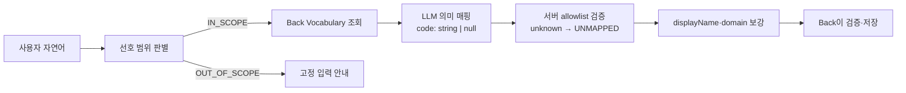

# 발표용 AI 설계 정리

이 문서는 API 명세서가 아니라, 발표에서 **어떤 문제를 발견했고 어떤 기준으로 AI 파이프라인을 설계했는지** 설명하기 위한 자료다. 실제 Back↔AI 요청·응답 계약은 [`api-design2-backend.md`](api-design2-backend.md), 노드별 실행 흐름은 [`ai-pipeline-walkthrough.md`](ai-pipeline-walkthrough.md)를 기준으로 한다.

---

## 1. 카테고리 사전 구성과 의미 기반 매핑

### 발표에서 먼저 말할 한 문장

> 생성형 AI에는 미리 관리하는 계층형 Vocabulary를 기준으로 코드를 선택하게 하고, 최종 결과는 AI 서버가 실제 사전과 대조해 미등록 코드를 `UNMAPPED`/`null`로 정규화한다.

여기서 중요한 점은 **“가장 가까운 단어”를 수학적으로 검색하는 방식은 아니라는 것**이다. 현재 구현에는 임베딩, 코사인 유사도, 편집거리, 벡터 데이터베이스가 없다. 정확한 표현은 다음과 같다.

> 고정 Vocabulary를 후보군으로 제공한 뒤 LLM이 문맥을 해석해 문자열 코드를 선택하고, AI 서버가 allowlist 검증으로 후보군 밖의 코드를 `UNMAPPED`로 정규화하는 **폐쇄형 의미 분류** 방식이다.

LLM이 의미를 판단하는 능력은 사용하되, DB에 저장할 수 있는 값의 범위는 서비스가 통제하는 구조다.

### 1.1 해결하려던 문제

사용자는 같은 취향도 서로 다르게 표현한다.

- “연어 좋아해.”
- “사시미 괜찮아.”
- “날것도 잘 먹어.”
- “회 종류는 다 좋아하는 편이야.”

이 문장들을 원문 그대로만 저장하면 사람은 비슷한 의미라는 것을 알 수 있지만, 시스템은 다음 작업을 안정적으로 수행하기 어렵다.

- 같은 선호를 하나의 기준으로 묶어 조회하기
- 사용자가 같은 선호를 다시 말했을 때 기존 값을 갱신하기
- 여러 참여자의 선호를 같은 기준으로 비교하기
- 추천 결과에 어떤 선호가 반영됐는지 설명하기
- 넓은 선호와 구체적인 예외를 구분하기

반대로 LLM에게 카테고리 이름까지 자유롭게 생성하게 하면 같은 의미가 호출할 때마다 다르게 나올 수 있다.

```text
SALMON
SALMON_FOOD
RAW_SALMON
FISH_SALMON
```

이 값들은 문맥상 모두 이해할 수 있지만, DB의 외래 키나 사용자별 UPSERT 기준으로 사용할 수 있는 안정적인 식별자는 아니다. 그래서 자연어는 유연하게 이해하되, 최종 저장 단위는 미리 합의한 표준 코드로 고정했다.

### 1.2 검토 가능한 방식과 현재 선택

| 방식 | 장점 | 한계 |
| --- | --- | --- |
| 사용자 원문만 저장 | 구현이 단순하고 정보 손실이 적음 | 같은 의미를 집계·비교·갱신하기 어려움 |
| 키워드/동의어 규칙 | 결과가 결정론적이고 설명하기 쉬움 | 부정, 강도, 복합문, 신조어가 늘수록 규칙이 급격히 복잡해짐 |
| 임베딩 최근접 검색 | 큰 사전에서 후보를 빠르게 좁히기 좋음 | 유사하다는 이유만으로 안전하지 않은 카테고리에 강제 매핑될 수 있으며 현재 프로젝트에는 구현돼 있지 않음 |
| LLM이 카테고리도 자유 생성 | 새로운 표현에 유연함 | 저장 코드가 흔들리고 DB·Back·Front 계약을 보장하기 어려움 |
| **고정 Vocabulary + LLM 의미 판단** | 자연어 문맥은 이해하면서 저장값은 통제 가능 | 의미상 올바른 코드 선택은 여전히 LLM 품질에 의존 |

현재 프로젝트는 마지막 방식을 택했다. 초기 기획에서는 자유로운 `target`, 범위 정보, 상위 개념 힌트를 LLM이 함께 만드는 방식도 검토했지만, Back과 안정적으로 연동하고 동일한 선호를 누적하기 위해 **고정 Vocabulary + `mappingType` + 원문 보존** 구조로 정리했다.

### 1.3 Vocabulary를 어떻게 구성했는가

Vocabulary 한 항목은 네 가지 정보로 구성된다.

| 구성 요소 | 역할 | 예시 |
| --- | --- | --- |
| `code` | DB 저장과 서비스 간 연동에 사용하는 안정적인 식별자 | `SALMON` |
| `displayName` | 사용자 화면과 설명에 사용하는 표시명 | `연어` |
| `domain` | 선호의 큰 영역 | `FOOD` |
| `parentCode` | 더 넓은 상위 개념 | `RAW_FISH` |

각 필드를 분리한 이유는 분명하다.

- `code`는 화면 문구가 바뀌어도 유지할 수 있는 기계용 계약이다.
- `displayName`은 사람이 읽는 값이며 저장 기준으로 사용하지 않는다.
- `domain`은 음식, 활동, 분위기처럼 서로 다른 종류의 선호를 1차로 구분한다.
- `parentCode`는 넓은 선호와 구체적인 선호를 같은 계층 안에서 표현한다.

로컬 seed 파일은 총 320개 항목을 목표로 구성돼 있다.

| Domain | 로컬 seed 기준 항목 수 | 다루는 범위 |
| --- | ---: | --- |
| `FOOD` | 200 | 음식 종류, 식재료, 조리 방식, 식단, 알레르기·회피 조건 |
| `ACTIVITY` | 50 | 모임에서 할 수 있는 활동 |
| `MOOD` | 50 | 장소의 분위기와 공간 특성 |
| `DRINK` | 20 | 음주와 음료 종류 |

이 숫자는 저장소의 초기 seed 기준이며, 운영 Back DB에 현재 정확히 320개가 들어 있다는 뜻은 아니다. 런타임의 진짜 기준은 Back이 반환하는 Vocabulary 목록이다.

계층은 다음처럼 여러 단계가 될 수 있다.

```text
FOOD
├─ MEAT (육류)
│  └─ CHICKEN (닭고기)
│     └─ FRIED_CHICKEN (치킨)
├─ SEAFOOD (해산물)
│  ├─ RAW_FISH (회)
│  │  └─ SALMON (연어)
│  └─ SHELLFISH (조개류)
│     └─ OYSTER (굴)
└─ KOREAN_FOOD (한식)
   └─ SAMGYEOPSAL (삼겹살)

DRINK
└─ ALCOHOL (음주)
   ├─ BEER (맥주)
   ├─ SOJU (소주)
   └─ WINE (와인)
```

현재 사전에서 보이는 구성 원칙은 다음과 같다.

1. **추천에 사용할 수 있는 단위인가**: 단순한 감상보다 장소 검색이나 후보 필터링에 연결할 수 있는 항목을 둔다.
2. **넓은 범주와 구체 항목을 함께 둔다**: `SEAFOOD`와 `SALMON`을 모두 둬 “해산물 전반”과 “연어만”을 구분한다.
3. **제약도 선호와 같은 표준 구조에 담는다**: 알레르기, 비건, 매운맛을 못 먹는 조건처럼 추천에서 중요한 회피 조건도 코드화한다.
4. **무한히 세분화하지 않는다**: 모든 표현을 leaf로 만들지 않고, 안전한 상위 범주나 `UNMAPPED`로 빠질 수 있게 한다.

다만 이 원칙이 정량적인 데이터 분석이나 사용자 발화 코퍼스로 검증된 것은 아니다. 현재 사전은 제품 가설을 기준으로 사람이 먼저 구성한 초기 taxonomy다.

### 1.4 실제 매핑 흐름



#### 1단계: 입력을 하나의 발화로 정리한다

`POST /ai/preferences/extract`는 `messages[]`를 받고, AI API 경계에서 공백 항목을 제외한 뒤 하나의 문자열로 합친다. 사용자 식별과 저장은 이 단계에서 하지 않는다.

#### 2단계: 먼저 개인 선호 범위인지 판별한다

Preference Scope Router가 입력을 다음 두 가지로만 분류한다.

- `IN_SCOPE`: 음식, 음료, 음주, 분위기, 활동, 알레르기, 회피 조건 등 개인 선호가 하나라도 있음
- `OUT_OF_SCOPE`: 인사, 날씨, 일반 질문처럼 개인 선호가 없음

여러 문장이 섞여 있어도 선호가 하나라도 명확하면 `IN_SCOPE`로 보내고, Extractor가 그 안에서 선호 부분만 추출한다. 범위 밖 입력에는 잡담을 이어가지 않고 고정 안내를 반환한다.

#### 3단계: Back이 관리하는 Vocabulary를 가져온다

AI는 seed SQL이나 DB를 직접 읽지 않는다. Back의 내부 Vocabulary API를 호출해 그 시점의 `code`, `displayName`, `domain`, `parentCode` 목록을 받고 프로세스 메모리에 캐시한다.

이 역할 분리는 다음과 같다.

| 주체 | 책임 |
| --- | --- |
| Back | Vocabulary의 원본 관리, 사용자 식별, 검증, DB 저장·UPSERT |
| LLM | 자연어에서 선호를 찾고 의미상 적절한 코드·감정·강도·매핑 유형 판단 |
| AI 서버 코드 | 모델 code의 allowlist 검증·정규화, `displayName`·`domain` 파생 |

#### 4단계: 거대한 enum 대신 고정 크기 스키마로 받는다

초기 구현은 Back이 반환한 전체 code를 Gemini 구조화 출력의 enum으로 만들었다.

```python
Literal[전체 Vocabulary 320개] | None
```

Vocabulary가 작을 때는 모델이 목록 밖 코드를 생성하지 못하게 하는 간단한 방식이었다. 하지만 Back에서 사전을 320개로 확장하자 동일한 320개 code가 프롬프트뿐 아니라 JSON Schema enum에도 모두 들어가 스키마가 불필요하게 커졌다. 해결 방법은 RDS의 사전을 줄이는 것이 아니라 **모델 스키마와 최종 검증의 책임을 분리하는 것**이다.

현재 Gemini 내부 DTO는 고정 크기로 유지한다.

```python
vocabulary_code: str | None
```

320개 Vocabulary 목록은 의미 판단을 위해 프롬프트에 그대로 유지한다. 제거한 것은 데이터가 아니라 JSON Schema에 중복되던 거대한 enum이다.

이제 LLM이 `SALMON_FOOD`나 `FISH_CATEGORY`처럼 미등록 코드를 내부 응답으로 만들 가능성은 있다. 대신 AI 서버가 응답 직후 `vocabulary_by_code`에서 정확히 조회하고, 없는 code를 외부 API로 내보내지 않는다.

#### 5단계: LLM이 문맥을 해석한다

LLM은 전체 Vocabulary의 표시명·domain·계층을 보고 다음 값을 판단한다.

- 어떤 표현이 실제 선호인지
- 긍정인지 부정인지: `POSITIVE / NEGATIVE`
- 표현 강도: `WEAK / MODERATE / STRONG`
- 어떤 표준 코드가 의미상 적합한지
- 직접 대응인지, 상위 범주로 일반화한 것인지, 매핑 불가인지

이 때문에 단순 문자열 일치보다 다음과 같은 문장을 다루기 쉽다.

```text
“연어는 진짜 좋아해.”
“매운 건 잘 못 먹어요.”
“해산물은 별론데 조개는 괜찮아.”
```

부정 표현, 강도, 넓은 선호와 구체적인 예외를 문장 전체의 의미로 해석하는 부분은 LLM이 담당한다.

#### 6단계: 서버가 실존 여부를 검증하고 기준 데이터를 붙인다

LLM은 `displayName`과 `domain`을 직접 생성하지 않는다. LLM이 고른 `vocabularyCode`로 AI 서버가 캐시된 원본 Vocabulary를 조회한다.

```text
LLM 선택: SALMON
→ 실제 사전에 존재
→ vocabularyCode=SALMON, displayName=연어, domain=FOOD 유지

LLM 선택: SALMON_FOOD
→ 실제 사전에 없음
→ vocabularyCode=null, displayName=null, domain=null,
  mappingType=UNMAPPED로 정규화
```

모델이 code를 `null`로 반환했거나, 실존 code와 `mappingType=UNMAPPED`를 함께 반환한 경우도 동일하게 `UNMAPPED`/`null`로 정규화한다. 서버가 `EXACT`와 `GENERALIZED` 중 하나를 임의로 추측하지 않는 fail-closed 정책이다.

이렇게 하면 모델이 `SALMON`을 골라 놓고 표시명은 “광어”, domain은 `ACTIVITY`라고 답하는 식의 필드 간 흔들림을 막고, 미등록 non-null code가 AI API 경계를 통과하지 않게 할 수 있다.

#### 7단계: Back이 최종 검증하고 저장한다

AI는 추출 결과만 반환한다. 어떤 사용자의 선호인지 식별하고, Vocabulary 코드의 실존 여부를 다시 확인하고, `(user_id, vocabulary_code)` 기준으로 저장하거나 갱신하는 작업은 Back의 책임이다.

### 1.5 “가장 가까운 항목”을 고르는 실제 원리

현재 구현에서 “가까움”은 숫자로 계산한 거리가 아니라 **문맥상 의미의 포함 관계와 구체성**이다. LLM은 프롬프트에 주어진 목록을 보고 다음 세 가지 중 하나를 선택한다.

#### `EXACT`: 직접 대응하는 기존 코드가 있을 때

문자열이 완전히 같다는 뜻이 아니라, 사용자 표현의 의미가 기존 코드와 직접 대응한다는 뜻이다.

```text
“연어 좋아해”
→ SALMON
→ POSITIVE / MODERATE / EXACT
```

```text
“회는 완전 싫어”
→ RAW_FISH
→ NEGATIVE / STRONG / EXACT
```

#### `GENERALIZED`: 정확한 leaf는 없지만 안전한 상위 범주가 있을 때

사전에 사용자의 구체 표현과 직접 대응하는 코드가 없더라도, 의미를 왜곡하지 않는 상위 범주가 있으면 그 코드로 일반화한다. 원래 표현은 `rawValue`에 그대로 보존한다.

```text
“사슴고기 좋아해”
→ 사전에 VENISON 코드가 없다고 가정
→ 육류라는 상위 의미는 명확함
→ MEAT / GENERALIZED
→ rawValue = “사슴고기”
```

여기서 코드가 존재하지 않는 `VENISON` 노드를 만든 뒤 `parentCode`를 따라 올라가는 것은 아니다. LLM이 전체 목록을 보고 `MEAT`가 안전한 상위 의미라고 판단한다.

#### `UNMAPPED`: 안전하게 대응할 코드가 없을 때

가까워 보이는 항목에 억지로 넣으면 의미가 달라질 수 있는 경우에는 코드 없이 원문만 반환한다.

```text
“고수는 절대 못 먹어요”
→ CORIANDER 코드 없음
→ VEGETABLE로 일반화하면 모든 채소를 싫어한다는 뜻으로 왜곡될 수 있음
→ vocabularyCode = null
→ NEGATIVE / STRONG / UNMAPPED
→ rawValue = “고수”
```

최신 계약에서는 Back이 `UNMAPPED` 항목을 일반 선호 DB와 Front 응답에서 제외한다. AI가 원문을 반환하는 이유는 “매핑에 실패했다”는 사실과 사용자의 실제 표현을 호출 경계까지 잃지 않기 위해서다.

### 1.6 계층 구조가 중요한 이유

다음 문장은 하나의 `SEAFOOD` 값만으로는 정확히 표현할 수 없다.

```text
“해산물은 별로지만 조개는 좋아해.”
```

의도된 추출 결과는 두 선호를 따로 보존하는 것이다.

| 코드 | 원문 | 감정 | 의미 |
| --- | --- | --- | --- |
| `SEAFOOD` | 해산물 | `NEGATIVE` | 넓은 범주의 비선호 |
| `SHELLFISH` | 조개 | `POSITIVE` | 구체적인 예외 선호 |

이 구조 덕분에 후속 후보 판단 단계는 “해산물 비선호” 하나로 조개까지 일괄 제외하지 않고, 더 구체적인 예외가 있다는 사실을 구분할 수 있다. 다만 현재 구현에서 이런 충돌을 수학적으로 해소하는 공정성 알고리즘까지 완성된 것은 아니다. 여기서 확보한 것은 **그 알고리즘이 사용할 수 있는 구조화된 입력**이다.

### 1.7 이 설계로 얻은 효과

#### 1. 저장값이 안정된다

동일한 의미가 표준 코드 하나로 모이기 때문에 Back은 자유 문자열이 아니라 외래 키로 검증하고 저장할 수 있다.

#### 2. 같은 선호를 갱신할 수 있다

사용자와 Vocabulary 코드 조합을 기준으로 UPSERT할 수 있어, 같은 사용자가 선호를 다시 말해도 중복 행을 계속 만들 필요가 없다.

#### 3. 여러 사람의 선호를 같은 기준으로 비교할 수 있다

각자 다른 자연어 표현을 그대로 비교하지 않고 공통 코드와 계층을 기준으로 그룹 선호를 조합할 수 있다.

#### 4. LLM의 환각 범위를 줄인다

LLM이 미등록 코드를 제안하더라도 서버가 `UNMAPPED`로 정규화하고, 표시명과 domain은 원본 사전에서 파생한다.

#### 5. 정보 손실을 완화한다

표준 코드 외에 `rawValue`를 보존하고 `GENERALIZED / UNMAPPED`를 구분해, 정규화 과정에서 어떤 정보가 축약됐는지 알 수 있다.

#### 6. 서비스 간 책임이 명확해진다

자연어 이해는 LLM, allowlist 검증·정규화와 메타데이터 보강은 AI 서버 코드, 원본 관리와 영속화는 Back이 담당한다.

### 1.8 현재 구현의 한계와 개선 방향

이 부분은 발표에서 숨기기보다 “구조적 안전성과 의미 정확도를 구분했다”고 설명하는 편이 좋다.

#### 1. 의미 매핑 정확도는 아직 정량 검증하지 않았다

서버 후처리는 미등록 code가 외부로 나가는 것은 막지만, `SALMON`과 `RAW_FISH`처럼 둘 다 실존하는 code 중 어느 것이 문맥상 더 적합한지는 LLM 판단이다. 현재 테스트는 mock LLM 결과를 중심으로 하며, 실제 사용자 발화 데이터셋으로 code 정확도·감정·강도를 측정하지 않았다.

개선하려면 최소한 다음 평가셋이 필요하다.

- 동의어와 구어체
- 부정문과 이중 부정
- 한 문장 안의 여러 선호
- 넓은 비선호와 구체적인 예외
- 알레르기와 단순 비선호 구분
- 애매해서 `UNMAPPED`여야 하는 문장
- 같은 입력을 반복했을 때 결과 안정성

측정 지표는 code 정확도, `UNMAPPED` 정밀도·재현율, sentiment/strength 정확도, 반복 호출 일치율로 나눌 수 있다.

#### 2. `parentCode`는 현재 강제 규칙이 아니라 LLM의 힌트다

코드가 트리를 탐색해 “가장 가까운 상위 노드”를 계산하지 않는다. `GENERALIZED`가 실제 상위 코드인지, 더 정확한 leaf가 있는데 상위를 골랐는지는 서버가 검증하지 않는다.

다음 단계에서는 선택 코드와 `mappingType`의 관계를 검증하거나, leaf 후보를 먼저 찾고 실패했을 때 실제 ancestor만 허용하는 규칙을 코드로 옮길 수 있다.

#### 3. Vocabulary가 비면 모든 code가 `UNMAPPED`가 된다

새 구조에서는 Vocabulary가 비어 있으면 모델이 어떤 code를 반환해도 서버 조회에 실패하므로 최종 결과는 모두 `UNMAPPED`가 된다. 미등록 code가 유출되지는 않지만, 사전 조회 장애가 정상적인 “매핑 불가” 결과처럼 보일 수 있다.

운영 계약은 최소 한 개의 Vocabulary를 요구하므로, 더 명확한 방식은 빈 목록을 의존성 장애로 보고 Extractor 호출 전에 `VOCABULARY_UNAVAILABLE`로 종료하는 것이다.

#### 4. 필드 간 불변식 검증이 충분하지 않다

서버 정규화로 code와 `UNMAPPED` 사이의 모순은 해소한다. 다만 다음 문제는 아직 남는다.

- 같은 `vocabularyCode`가 한 응답에 여러 번 등장함
- `GENERALIZED`인데 선택 코드가 실제 상위 범주가 아님

이 부분은 LLM 프롬프트가 아니라 Pydantic validator와 후처리 코드로 강제하는 것이 맞다.

#### 5. Vocabulary 캐시 갱신 정책이 없다

Back에서 한 번 받은 목록을 프로세스 메모리에 캐시하지만 TTL, 버전, ETag, 변경 알림이 없다. Back이 사전을 수정해도 실행 중인 AI 프로세스가 이전 목록을 계속 사용할 수 있다.

향후에는 Vocabulary 버전을 응답에 포함하고, 버전 변경 시 캐시를 무효화하거나 짧은 TTL을 두는 방식이 필요하다.

#### 6. 사전이 커질수록 프롬프트 비용이 증가한다

HTTP 조회 결과는 캐시하지만 전체 Vocabulary 텍스트는 Extractor 호출마다 프롬프트에 들어간다. 현재 seed 수준에서는 단순하고 투명한 방식이지만, 항목이 더 늘어나면 다음 2단계 구조를 검토할 수 있다.

```text
1차: domain 또는 관련 상위 범주 선택
2차: 해당 범주의 leaf만 프롬프트 후보로 제공
```

이때 임베딩은 최종 결정을 대신하는 것이 아니라, 큰 사전에서 후보를 좁히는 검색 단계로 사용할 수 있다. 최종 코드 선택과 allowlist 검증은 그대로 유지해야 한다.

#### 7. 알레르기·강한 비선호를 강제 제외하는 후속 규칙은 별도다

현재 Extractor는 알레르기나 강한 비선호를 구조화할 수 있지만, 후보 생성 단계에서 이를 결정론적으로 veto하는 로직까지 이 설계가 자동으로 보장하는 것은 아니다. `STRONG + NEGATIVE`나 알레르기 코드를 강제 제외 조건으로 적용하는 작업은 별도 후속 과제다.

#### 8. 사전 범위와 현재 MVP 범위가 완전히 일치하지 않는다

현재 README는 식사 중심 MVP를 설명하지만 seed에는 스포츠·캠핑 같은 활동 코드도 포함돼 있다. “320개 항목이 현재 추천에 모두 활용된다”고 말하기보다, **확장을 염두에 둔 사전이며 현재 흐름에서 실제 사용하는 범위는 더 좁다**고 설명해야 한다.

### 1.9 발표 시연 예시

한 화면에는 다음 세 입력만 보여주는 것이 가장 이해하기 쉽다.

| 사용자 입력 | 결과 | 보여주는 설계 |
| --- | --- | --- |
| “연어를 정말 좋아해요” | `SALMON / POSITIVE / STRONG / EXACT` | 직접 대응 + 강도 추출 |
| “사슴고기를 좋아해요” | `MEAT / POSITIVE / MODERATE / GENERALIZED` | 안전한 상위 범주 + 원문 보존 |
| “고수는 절대 못 먹어요” | `null / NEGATIVE / STRONG / UNMAPPED` | 억지 매핑 거부 |

두 번째와 세 번째는 LLM의 의미 판단 결과이므로, 실제 데모 전에 사용 모델에서 반복 실행해 의도한 결과가 안정적으로 나오는지 확인해야 한다. 발표 화면에 기대 결과를 고정해서 보여주는 것과 실제 모델 정확도를 검증했다는 주장은 구분해야 한다.

### 1.10 발표용 1분 설명 초안

> 사용자는 같은 선호를 매우 다르게 표현하지만, 그 원문을 그대로 저장하면 여러 사람의 취향을 비교하거나 같은 선호를 갱신하기 어렵습니다. 반대로 카테고리까지 LLM이 자유롭게 만들게 하면 매번 다른 코드가 생겨 Back과 DB가 안정적으로 사용할 수 없습니다. 그래서 음식·활동·분위기·음료 영역의 계층형 Vocabulary를 먼저 구성하고, LLM은 그 목록을 기준으로 의미상 적합한 코드를 고르게 했습니다. 직접 대응하면 EXACT, 정확한 항목은 없지만 안전한 상위 개념이 있으면 GENERALIZED, 억지로 묶으면 의미가 달라지는 경우에는 UNMAPPED로 남깁니다. 320개를 거대한 enum 스키마로 중복하지 않고 code는 문자열로 받은 뒤, AI 서버가 실제 사전과 대조해 미등록 값을 UNMAPPED와 null로 정규화합니다. 표시명과 domain도 LLM이 아니라 서버가 원본 사전에서 붙입니다. 즉 자연어 판단은 AI에 맡기되, 저장 가능한 값과 기준 데이터는 시스템이 통제한 설계입니다.

### 1.11 예상 질문과 답변

**Q. 결국 LLM이 고르는 거라면 잘못 매핑할 수도 있지 않나요?**

그렇다. 서버 allowlist 검증은 미등록 코드 유출을 막는 장치이지 의미 정확도를 100% 보장하는 장치는 아니다. 그래서 구조적 안전성과 의미 정확도를 분리해 보고, 다음 단계로 실제 발화 평가셋과 계층 검증이 필요하다.

**Q. 320개를 그대로 두면서 왜 `Literal`만 제거했나요?**

문제는 RDS의 데이터 수가 아니라 320개 code가 Gemini JSON Schema enum에 한 번 더 들어가는 구조였다. 의미 판단에 필요한 목록은 프롬프트에 유지하고, 스키마는 `string | null`로 고정한 뒤 서버의 딕셔너리 조회로 외부 API 경계의 allowlist 보장을 수행한다. 사전 확장성과 모델 스키마 안정성을 분리한 것이다.

**Q. 왜 임베딩으로 가장 가까운 카테고리를 찾지 않았나요?**

현재 규모에서는 전체 계층과 표시명을 LLM에 제공하는 방식이 구현이 단순하고, 부정·강도·복합문까지 한 번에 해석할 수 있었다. 다만 사전이 더 커지면 임베딩이나 domain 분류를 후보 축소 단계에 사용할 수 있다. 임베딩 결과를 그대로 저장하지 않고 최종 allowlist 검증은 유지하는 것이 안전하다.

**Q. 사전에 없는 신조어나 음식은 어떻게 하나요?**

안전한 상위 범주가 있으면 `GENERALIZED`, 그렇지 않으면 `UNMAPPED`로 두고 `rawValue`에 원문을 남긴다. 잘못된 기존 코드에 강제로 넣는 것보다 매핑하지 못했다는 사실을 명시하는 편이 낫다고 판단했다.

**Q. 카테고리 320개는 어떤 데이터로 검증했나요?**

현재는 제품 사용 범위를 바탕으로 사람이 구성한 초기 seed이며 사용자 코퍼스로 coverage를 검증한 결과는 아니다. 발표에서는 “검증된 완성 taxonomy”가 아니라 “안정적인 저장과 비교를 위해 먼저 정의한 서비스 Vocabulary”라고 표현해야 한다.

**Q. 넓은 비선호와 구체적인 선호가 충돌하면 어떻게 하나요?**

Extractor는 두 값을 서로 다른 계층 코드로 보존해 후속 로직이 구분할 수 있게 한다. 현재 단계에서는 그 입력 구조까지 마련돼 있고, 참여자별 공정성 점수와 강한 비선호 veto는 후속 구현 대상이다.

### 1.12 코드 근거

- Vocabulary seed와 계층: `data/vocabulary_seed.sql`, `data/vocabulary_seed_additions.sql`, `data/vocabulary_seed_additions_2.sql`
- Back Vocabulary 조회·캐시: `app/services/vocabulary_client.py`
- 입력 범위 판별: `app/graph/nodes/n_preference_router.py`, `app/prompts/n_preference_router.py`
- allowlist 검증·정규화와 메타데이터 보강: `app/graph/nodes/n_preference_extractor.py`
- 매핑 지침: `app/prompts/n_preference_extractor.py`
- 출력 DTO와 고정 Enum(`sentiment`, `strength`, `mappingType`): `app/schemas/preference.py`
- 그래프 분기: `app/graph/build_preference_graph.py`
- 저장 구조: `docs/db_schema.md`
- Back↔AI 최종 계약: `docs/api-design2-backend.md`
- 현재 테스트: `tests/graph/test_preference_extractor.py`, `tests/graph/test_preference_graph.py`, `tests/graph/test_preference_router.py`, `tests/api/test_preferences_route.py`
